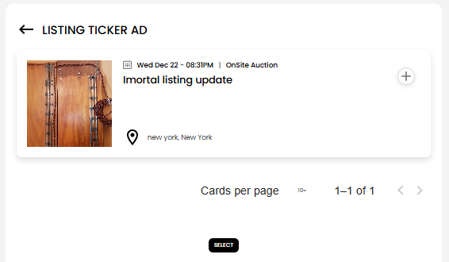
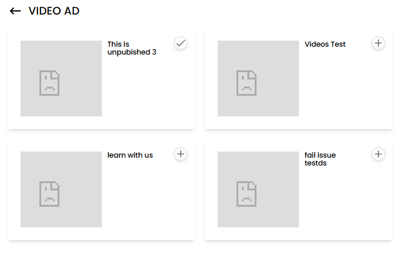
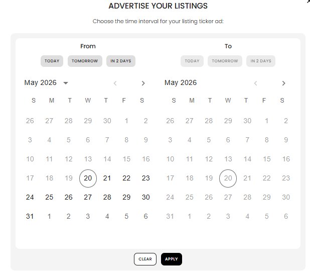
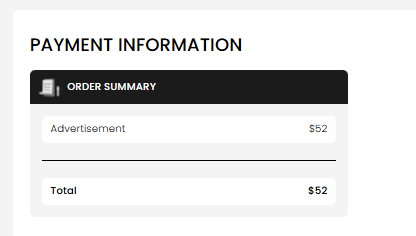

[Auction Journal](../../index.md) · [Advertisement](./index.md)

# How do I create an advertisement?

Use **Advertise With Us** in your auctioneer dashboard to run a paid promotion on the public Auction Journal site.

**Path:** sidebar → **Advertise With Us** (`/dashboard/advertisement`).

---

## Step 1 — Select a category

Choose what you want to promote:

| Category | Use when |
|----------|----------|
| **Advertise your Listings** | You have a **published listing** to boost |
| **Advertise your Business** | Print, poster, banner, blog, or video promotion |
| **Advertise your Auctions** | Not available yet in the dashboard |

*Pick Listings or Business to continue.*

---

## Step 2 — Choose ad type and package

Each ad type shows one or more **packages** (price per number of days). Tap the **+** on a package to select it, then use the main button (**Select Listing**, **Create Ad**, etc.) to continue.

**Listing example:**

**Business example:**

See [What types are available](ad-types.md) for the full list.

---

## Step 3 — Select or build your content

What you do depends on the ad type:

| Mode | Ad types | What you do |
|------|----------|-------------|
| **Select** | Ticker, featured listing, blog ad, video ad | Pick an existing **listing**, **blog**, or **video** |
| **Create** | Print, poster, banner | Upload images and fill in title, link, and related fields |

**Listing ticker / featured — select a listing:**

**Video ad — select a video:**

Details: [Listing ads](listing-ads.md) · [Print, poster, banner](business-create-ads.md) · [Blog and video](blog-video-ads.md)

---

## Step 4 — Choose run dates

After content is ready, a **duration** window opens. Pick **start** and **end** dates for the campaign. The package you bought limits how many days you can run.

*Your ad is scheduled for this date range once it is approved and live.*

---

## Step 5 — State (state ads only)

If you bought a **state** package (featured listing state, state poster, or state banner), you will be asked to **choose the state** where the ad should appear.

---

## Step 6 — Pay at checkout

The dashboard creates your ad record and sends you to **checkout**. Review the line item (advertisement type, dates, price), then complete payment like other Auction Journal purchases.

---

## Step 7 — Confirmation

After payment you typically see a success message that your **advertisement request was submitted**, with the planned run dates.

Your ad is **not shown on the public site immediately**. The Auction Journal team **reviews and approves** paid ads before they go live. See [When ads go live](go-live.md).

---

## Related

- [How ads work](how-it-works.md)
- [Pricing and duration](pricing-and-duration.md)
- [National vs state](national-vs-state.md)
