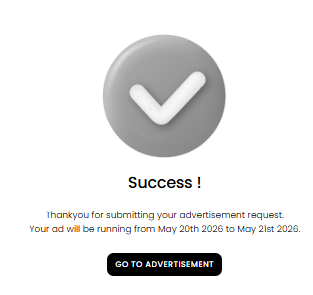

[Auction Journal](../../index.md) · [Advertisement](./index.md)

# When does my paid advertisement go live on Auction Journal?

After you finish the advertisement wizard and **pay at checkout**, your campaign is **submitted** — it does **not** usually appear on the public website right away.

---

## What happens after payment

1. You see a **success** message that your advertisement **request was submitted**, often showing your **start** and **end** dates.

2. The Auction Journal team **reviews** your paid ad (creative, dates, and policy).
3. Once **approved**, your ad can go **live** on auctionjournal.com for the dates you selected.

---

## When visitors actually see it

Your ad runs only during the **date range** you picked in the duration step, and only after **approval**.

| Situation | What to expect |
|-----------|----------------|
| Paid, waiting for review | Not yet on the public site |
| Approved, before start date | Scheduled; not visible until start date |
| Approved, between start and end | Live in the placements for your ad type |
| After end date | Campaign ended |

---

## If something looks wrong

- Confirm payment completed in **billing / invoices**.
- Check that your **start date** has arrived and the ad was **approved**.
- For placement questions, see [where ads appear](public-placement.md).

---

## Related

- [Create an advertisement](create-advertisement.md)
- [Pricing and duration](pricing-and-duration.md)
- [How ads work](how-it-works.md)
