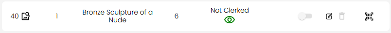
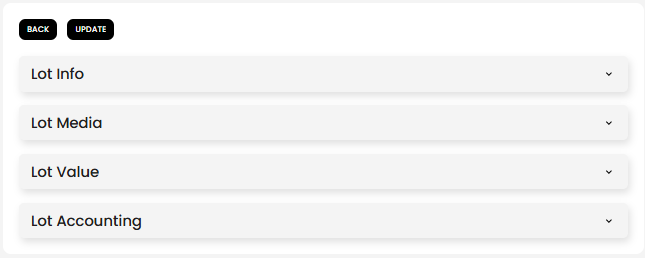
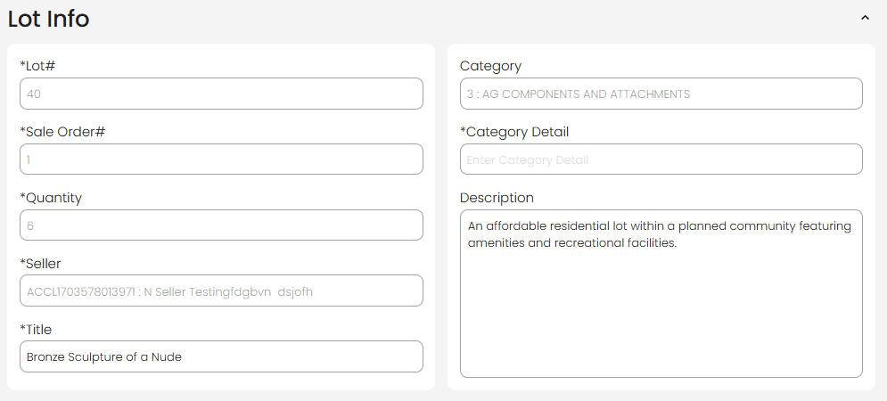
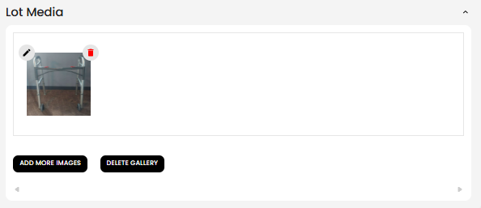
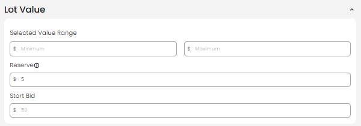
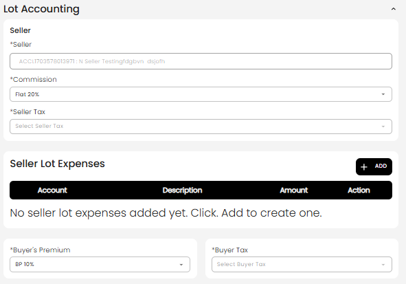

[Auction Lot](./index.md) · [Auction Journal](../index.md)

# How can an auctioneer edit a lot?

Use **Edit Lot** on the auction **Lots** tab to change catalog details, photos, pricing, fees, and per-lot soft-close times after a lot exists. This is the main way to finish incomplete lots (for example after **Import LOTS**, **fast catalog**, or **[bulk image import](import-lot-images.md)**) or to correct mistakes before or during a sale.

To create a new lot from scratch, see [How do I create a lot in an auction?](create-lot.md).

---

## Where to edit

1. Open the auction in the **Auctioneer Dashboard**.
2. Go to the **Lots** tab.
3. Find the lot in the list.
4. Click the **edit (pencil)** icon on that row.

The list is replaced by the full **Edit Lot** screen. Use **Back** to return to the list without saving (you will be prompted if you have unsaved changes).

---

## Before you edit

| Check | Why |
|-------|-----|
| Auction is not **closed** | After the auction **end date**, **Update** is disabled—you cannot save lot edits |
| Lot is not past its **close bidding** time | If the lot’s scheduled close has passed, the form is read-only |
| You know what the auction stage allows | Many fields lock after **publish**, when **bidding opens**, or near **soft close** (see table below) |

When the editor opens, you may see a reminder to **update the lot after editing**—changes are not saved until you click **Update**.

---

## What you can change by auction stage

Auction Journal locks fields as the sale progresses so live bidding data stays consistent. The table below is a practical summary; your auction **type** (online timed, onsite webcast, absentee, and so on) changes which rows apply.

| Auction stage (simplified) | What is usually still editable |
|----------------------------|--------------------------------|
| **Draft** (not published) | All lot sections |
| **Published** (before registration / bidding) | Most fields; **start bid** is locked; **sale order** may be locked on **Onsite With Live Webcast** |
| **Registration or pre-bidding** | Similar to published; more list actions (hide lot, delete, lot options) unlock on online auctions |
| **Bidding open** | **Lot number** is fixed in the form; **sale order**, **quantity**, **seller**, **category**, and related list tools often lock |
| **Near soft close / soft close** (online timed) | **Title**, then **description**, **images**, **value range**, **reserve**, and **accounting** lock in stages |
| **Onsite bidding day** | Bulk import buttons may lock; many catalog fields stay editable longer than on timed online sales |
| **After auction end** | **Update** is disabled—no lot edits |

If a field is grayed out, the auction phase—not your role—is blocking it. Completing a lot (title, category, seller, and so on) can mark it **auction ready** for **catalogued** publish rules.

---

## Edit screen overview

Field reference for all sections: [Explain each auction lot field](fields.md).

At the top:

- **Back** — leave the editor (discard prompt if you changed anything).
- **Update** — save all sections together.

Below that, expandable sections (accordions):

| Section | Shown when |
|---------|------------|
| **Lot Info** | Always |
| **Lot Bidding Time** | **Not** shown for **Onsite With Live Webcast** |
| **Lot Media** | Always |
| **Lot Value** | Always |
| **Lot Accounting** | Hidden for **Absentee Bidding** |

---

## Lot Info

Core catalog text and numbering (except **Lot#** is read-only in the dashboard—you cannot renumber from this screen).

| Field | Notes |
|-------|--------|
| **Lot#** | Display only in edit (set at create) |
| **Sale Order#** | Run order in the sale; may lock by auction stage |
| **Quantity** | Item quantity |
| **Seller** | Customer on the lot; changing seller may refresh commission and seller tax from that customer’s settings |
| **Title** | Shown to bidders |
| **Category** | Search and select lot category |
| **Category Detail** | Optional extra category notes |
| **Description** | Full lot description |

---

## Lot Bidding Time

**Online Timed Auction** and **Online Absolute Auction** only.

| Field | Purpose |
|-------|---------|
| **Soft Close Seconds** | Extra time added to this lot when it receives late bids |
| **Bid Soft Closed Seconds** | Per-bid extension during soft close |

See [soft close](../auction/soft-close.md) for auction-level behavior.

---

## Lot Media

Manage the lot image gallery:

- Thumbnails with **edit** and **delete** on each image.
- **ADD MORE IMAGES** — upload additional files.
- **DELETE GALLERY** — remove all images for the lot.

Images are stored against the auction and lot number. **Click Update** to save media changes—the gallery does not auto-save when you add or remove pictures alone.

---

## Lot Value

| Field | Notes |
|-------|--------|
| **Selected value range (min / max)** | Optional pair; if you enter one, enter both, and max must be greater than min |
| **Reserve** | Not used the same way on **Online Absolute**; optional on other types |
| **Start Bid** | Required for **non-catalogued** onsite; may lock after publish |

---

## Lot Accounting

Seller-side and buyer-side fees for this lot (inherits auction defaults until you override).

| Area | Contents |
|------|----------|
| **Seller** | Commission, seller tax |
| **Seller Lot Expenses** | **+ ADD** rows (account, description, amount) |
| **Buyer** | Buyer’s premium, buyer tax |

Changing **Seller** can pull that customer’s commission and tax settings onto the lot.

---

## Save or leave

1. Change any sections you need.
2. Click **Update**.
3. On success you see **Successfully Edited** and return to the **Lots** list (refreshed).

If **Update** fails, fix required fields (for example **title** and **category** when the lot must be auction ready) and try again.

**Back** with unsaved edits opens **Discard Changes?** — choose **Yes, Discard** or **No, Keep Editing**.

---

## After you update

- The lot row in the list reflects new title, media, and status.
- Completing required fields helps satisfy **auction ready** rules on **catalogued** auctions before **publish**.
- Replacing a **QR-only placeholder** with full data works the same as **New Lot**—see [What are QR lots?](qr-lots.md).

For lots created during live bidding, use the live ring flow first, then **Edit Lot** if you need more changes: [instant lot during live bidding](instant-lot-live.md).

---

## Related

- [How do I create a lot in an auction?](create-lot.md)
- [Ways to create lots in an auction](lot-creation-ways.md)
- [How do I import lots?](import-lots.md)
- [How do I import lot images in bulk?](import-lot-images.md)
- [Auction types](../auction/auction-types.md)
- [Soft close](../auction/soft-close.md)
