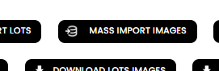
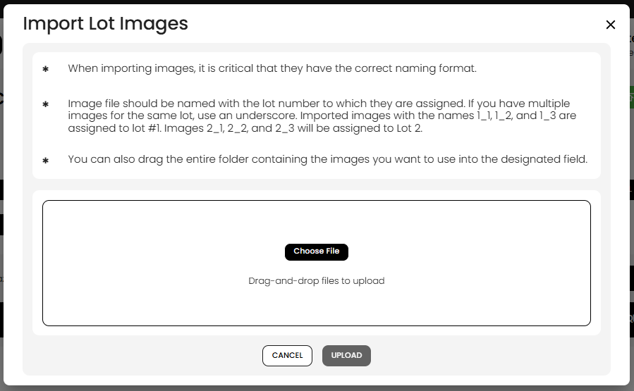
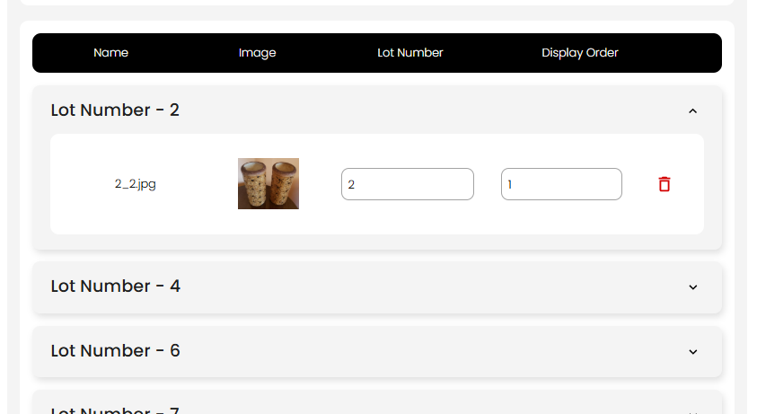

[Auction Lot](./index.md) · [Auction Journal](../index.md)

# How do I import lot images in bulk?

**Mass import images** lets you upload photos for **many lots at once** in a single auction. Each file is matched to a lot by its **file name**, so you can drop a whole folder of pictures instead of opening every lot one by one.

Use this when you skipped images during **New Lot**, when **[Import LOTS](import-lots.md)** brought in catalog lines without photos, or when you need to refresh media after the catalog exists.

For other ways to build a catalog, see [ways to create lots in an auction](lot-creation-ways.md).

---

## Before you start

| Requirement | Why |
|-------------|-----|
| Auction open on the **Lots** tab | Mass import runs from the auction you are building |
| At least **one lot** already in the auction | The button is disabled when the lot list is empty |
| **Lot numbers in file names** match **existing catalog lots** | The tool **updates** images on lots that already exist; it does not create new lot numbers from file names alone |
| **Real catalog lots** (not QR-only placeholders) | Numbers that exist only as **[QR lots](qr-lots.md)** must be completed with **New Lot** or **Import LOTS** before images can attach to them |

**Import LOTS** does not include image files in the CSV. Plan to add photos with mass import (or per-lot **Edit Lot**) after your spreadsheet import.

---

## Open Mass import images

1. Open the auction in the **Auctioneer Dashboard**.
2. Go to the **Lots** tab.
3. Click **Mass import images** (beside **Import LOTS** and other lot actions).

The button is **disabled** when there are no lots yet, when the auction stage blocks lot image changes, or while another lot action is loading.

---

## Name your image files

Correct naming is **critical**. The system reads the **file name** (not the folder path) to decide which lot each image belongs to.

### Underscore format (recommended)

Use: **`{lotNumber}_{displayOrder}.{extension}`**

| File names | Assigned to |
|------------|-------------|
| `1_1.jpg`, `1_2.jpg`, `1_3.png` | Lot **#1** — display orders 1, 2, 3 |
| `2_1.jpg`, `2_2.jpg`, `2_3.jpg` | Lot **#2** — display orders 1, 2, 3 |

- **First number** = lot number in the auction.
- **Second number** (after the underscore) = **display order** (which image appears first, second, and so on on the public catalog).

### Other naming

If the file name has **no underscore**, the part before the first dot is treated as the lot number. This works for a **single image per lot** (for example `5.jpg` → lot 5). For multiple images per lot, use the underscore form so each file has a distinct display order.

### Folder upload

You can **drag an entire folder** of images into the upload area, or use **Choose File** and select many files at once. Only image files are used.

---

## Review before upload

After files are chosen, the dialog groups them by **Lot Number** in expandable sections. For each image you can:

| Column | What you can do |
|--------|-----------------|
| **Name** | Shows the original file name |
| **Image** | Thumbnail preview |
| **Lot Number** | Change which lot receives the image (confirm with the arrow control) |
| **Display Order** | Change sort order within that lot (confirm with the arrow control) |
| **Delete** | Remove an image from this import batch (trash icon) |

If a file name does not match any existing lot, the section may show **Invalid No. (No lot number matched, image will not be uploaded.)** Fix the lot number in the preview or rename the file and upload again.

When the list looks correct, click **Upload**. Use **Cancel** to close without saving.

---

## Upload progress and validation

1. **Validate** — The system checks that each lot number exists and that display orders are valid.
2. If a lot **already has images** at the positions you are importing, you may see an **Overwrite Warning** listing those lot numbers. Choose:
   - **Append Images** — Add new images after existing ones; display positions from your file may be adjusted so nothing is lost.
   - **Overwrite Images** — Replace images at the matching positions with the new files.
3. **Upload to storage** — Each file is uploaded; a progress bar shows **uploaded / total**.
4. On success, the lot list refreshes and the dialog closes.

If validation fails, you will see **Invalid data!** Review lot numbers and display orders in the preview, or remove problem rows.

---

## After upload

- Images appear on the matching lots in the **Lots** list and on the public catalog when the lot is visible.
- Open **Edit Lot** on any line to reorder media, add more photos, or fix titles and descriptions.
- If you still need catalog **rows** (not just photos), use **[Import LOTS](import-lots.md)** or **[New Lot](create-lot.md)** first, then run mass import.

---

## Related

- [How do I import lots?](import-lots.md) — CSV catalog import (no images in file)
- [How do I create a lot in an auction?](create-lot.md) — single lot with images in the form
- [What are QR lots?](qr-lots.md) — placeholders before real catalog lines
- [Ways to create lots in an auction](lot-creation-ways.md)
