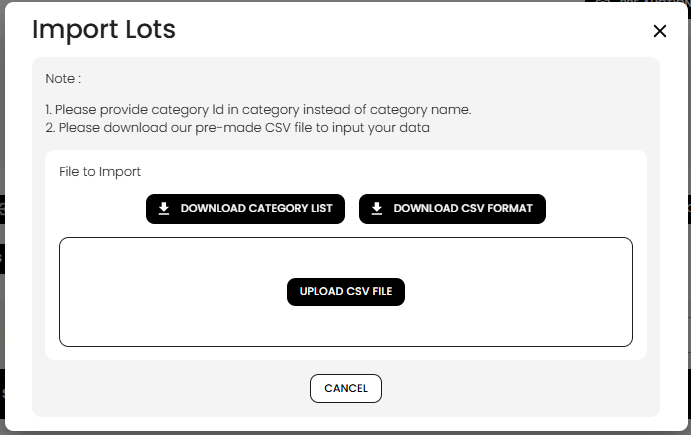
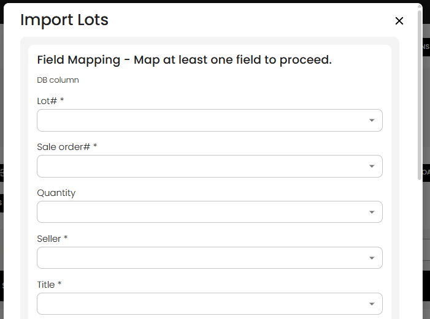
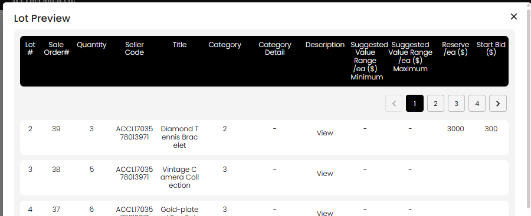
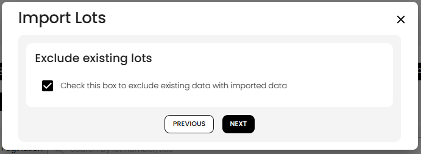
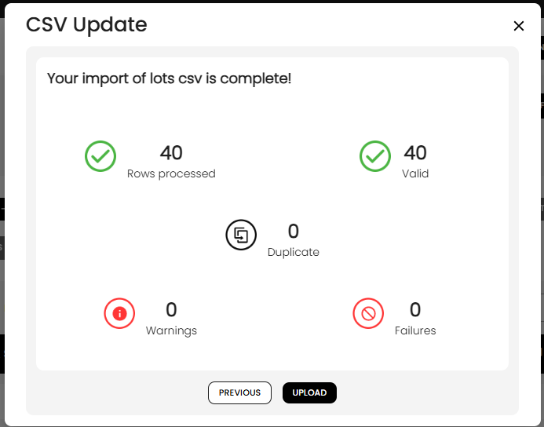

[Auction Lot](./index.md) · [Auction Journal](../index.md)

# How do I import lots?

Importing lots from a **CSV file** is the fastest way to add a **large number of lots** to an auction at once. You upload a spreadsheet, map each column to the right lot field, preview the data, choose how to treat existing lot numbers, and let Auction Journal verify the file before the lots are saved.

For other ways to build a catalog, see [ways to create lots in an auction](lot-creation-ways.md).

---

## Before you start

| Requirement | Why |
|-------------|-----|
| Auction **Lots** tab available | Import runs from the auction you are building |
| **New Lot Default**, **bid increment**, and related auction setup | Imported lots inherit auction defaults (commission, buyer premium, taxes, soft close, start bid, and so on) |
| **Customers** with **seller codes** in your file | Each **Seller** value must match an existing customer code on your account |
| **Category IDs** (not category names) | In the **Category** column, enter only a **positive numeric category ID** (for example `12`). Category names like `ANTIQUES` are not accepted. |
| CSV file with a **header row** and at least **one data row** | The wizard reads column titles from the first row |

On the first screen you can download **DOWNLOAD CATEGORY LIST** and **download csv format** (the template differs for **Online Absolute Auction** vs other auction types).

---

## Open Import LOTS

1. Open the auction in the **Auctioneer Dashboard**.
2. Go to the **Lots** tab.
3. Click **Import LOTS**.

The import wizard has **five steps**. Use **Cancel** or the close control to exit without saving. Use **Previous** to go back one step.

---

## Step 1 — Upload your CSV file

1. Read the notes on the screen:
   - Enter **category ID** in the category column, not the category name.
   - Use the pre-made CSV format from **download csv format** when possible.
2. Optionally click **DOWNLOAD CATEGORY LIST** or **download csv format**.
3. Click **UPLOAD CSV FILE** and choose your `.csv` file.

If the file is valid, the wizard moves to **field mapping** automatically. If not, you will see an error (for example missing rows or required columns).

---

## Step 2 — Map columns to lot fields

The heading is **Field Mapping - Map at least one field to proceed.**

For each **DB column** on the left, open the dropdown and pick the matching column from **your CSV’s first row** (the header). For example, if **Title** is in the fourth column of your sheet, map **Title \*** to that header. Every data row below the header is imported using the same mapping.

### Required mappings

You must map all of these:

| DB column | Maps to |
|-----------|---------|
| **Lot# \*** | Lot number |
| **Sale order# \*** | Sale order (run order in the sale) |
| **Seller \*** | Seller **customer code** |
| **Title \*** | Lot title |
| **Category \*** | Category **ID** |

### Optional mappings

| DB column | Maps to |
|-----------|---------|
| **Quantity** | Quantity |
| **Category Detail** | Extra category notes |
| **Description** | Lot description |
| **Suggested Value Range /ea Minimum** | Low estimate |
| **Suggested Value Range /ea Maximum** | High estimate |
| **Reserve /ea** | Reserve (hidden for **Online Absolute Auction**) |
| **Start bid** | Opening bid |

You cannot map two different fields to the same CSV column. When mapping is valid, click **Next**.

---

## Step 3 — Lot preview

The screen title changes to **Lot Preview**.

Review the table built from your CSV: lot number, sale order, quantity, seller code, title, category, description, value ranges, reserve, and start bid. Use the page controls if there are more than ten rows.

Check that values look correct before continuing. This step is for your review only; the server has not imported yet.

---

## Step 4 — Existing lots (overwrite or exclude)

Choose what happens when a row’s **lot number** already exists in this auction.

| If your auction is… | Section title | When the box is **checked** |
|---------------------|---------------|-----------------------------|
| **Published and bidding has opened** | **Exclude existing lots** | Existing lots with the same lot number are **not** replaced; only new lot numbers are imported |
| **Draft** (not live yet) | **Overwrite existing Data ?** | Existing lots with the same lot number are **updated** with data from the CSV |

When the box is **unchecked**, behavior is the opposite: on a live auction, unchecked means imported data **can** overwrite matching lot numbers; on a draft auction, unchecked means existing lots are **kept** and only new lot numbers are added.

**Important limits:**

- You **cannot overwrite** lots on a **live published** auction—the system blocks that even if the box is unchecked.
- On some **published timed** auctions, import may be **blocked** shortly before the auction’s bidding close time.

Click **Next** to run server verification (this may take a moment while the file is checked).

---

## Step 5 — Verification and import

The title is **CSV Update**. You will see:

**Your import of lots csv is complete!**

and counts for:

| Count | Meaning |
|-------|---------|
| **Rows processed** | Rows read from the file |
| **Valid** | Rows that passed validation |
| **Duplicate** | Duplicate lot numbers within the CSV |
| **Warnings** | Rows with warnings to review |
| **Failures** | Rows that failed validation |

| Result | What to do |
|--------|------------|
| Validation **passed** | Click **Upload** to create and update lots in the auction. The list refreshes when finished. |
| Validation **failed** | Click **Download Report** to get an error CSV, fix your file, and start the wizard again from step 1 |

### What the server checks (summary)

- **Seller** codes exist on your customer list.
- **Category** values are valid category IDs.
- **Lot numbers** are numeric and not duplicated within the file.
- **Sale order** rules for the auction are satisfied where applicable.
- Rows that match existing lot numbers follow your **overwrite / exclude** choice from step 4.

If you had **QR-only placeholder** lots for some numbers, filling those numbers through import replaces them with real catalog lots. See [What are QR lots?](qr-lots.md).

---

## After import

- Imported lots are saved as **auction ready** when validation and commit succeed, so they count toward **publish** rules on catalogued auctions.
- The CSV does not include image files. To add photos for many lots at once, use [How do I import lot images in bulk?](import-lot-images.md).
- Open individual lots from the **Lots** list to edit media, fees, or visibility.
- For a single lot with full detail, you can still use [New Lot](create-lot.md).

---

## Related

- [Ways to create lots in an auction](lot-creation-ways.md)
- [How do I create a lot in an auction?](create-lot.md)
- [What are QR lots?](qr-lots.md)
- [New Lot Default](../auction/build-details.md#new-lot-default)
