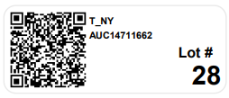

[Auction Lot](./index.md) · [Auction Journal](../index.md)

# What is lot qr labels? how to use it?

Last modified: 2026-05-28

A **lot QR label** is a printed QR ticket for a specific lot (for example Lot #28).  
When scanned, it opens that lot’s page directly on `auctionjournal.com`.

From backend generation (`qrLabelPDF.js`), each label includes:
- QR code (linked to lot page URL)
- auctioneer ticker symbol
- auction ID
- `Lot #` and lot number

---

## How to use lot QR labels

1. Print or place the lot QR label on the lot item/sheet.
2. Open phone camera (or QR scanner app).
3. Point at the QR code.
4. Tap the detected link.
5. Browser opens the exact lot page for that auction.

This helps staff and bidders jump to the lot page without manually searching.

---

## Example label (Lot #28)

---

## Tips

- Keep label clear and high contrast.
- Avoid folded/damaged QR area.
- Place label where camera can capture full code.

---

## Related

- [What are QR lots?](qr-lots.md)
- [How to use lot QR images?](use-lot-qr-images.md)

