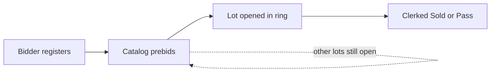

[Auction Lot](./index.md) · [Auction Journal](../index.md)

# How does prebidding work in an Onsite with Livewebcast auction?

*Last modified: 2026-06-01*

**Prebidding** lets registered bidders place bids on the **public catalog** before and between your **live ring** sessions. When you open a lot in a ring, the **latest prebid** becomes the starting point for live bidding. After that lot is **clerked** (sold or pass), prebidding on that lot **ends**.

This applies only to **Onsite With Live Webcast** auctions that you created as **Catalogued** and where you turned **Pre Bidding** on in build.

---

## When prebidding is available

| Requirement | Meaning |
|-------------|---------|
| **Auction type** | **Onsite With Live Webcast** only |
| **Lot type at create** | **Catalogued** — **Non Catalogued** onsite sales do not offer the pre-bidding option |
| **Pre Bidding = Yes** | Under **Build Auction → Upload Settings → Bidding** |
| **Open Pre Bidding** | Date and time when catalog prebids may start (on or after listing date) |
| **Bidder registered** | Bidder must be **approved** (or otherwise allowed) to bid on **your** auction |

If pre-bidding is **off**, bidders can still **register**, but they bid only during **live** ring sessions on the webcast — not on the main catalog beforehand.

---

## What bidders do during prebidding

1. **Register** for your auction on [auctionjournal.com](https://auctionjournal.com/) while registration is open. See [Register for an auction](../bidder/register-for-auction.md).
2. After **Open Pre Bidding**, open the auction **catalog** and bid on lots the same way as a timed online sale ( **bid** button, flat or maximum bidding per your auction settings).
3. Prebidding stays open on each lot until:
   - that lot is **opened live** in a ring (bidding moves to the **live webcast** page for that session), or
   - that lot is **clerked** as **Sold** or **Pass** in any ring, or
   - the lot’s bidding window ends (for example when the overall auction has closed).

While a lot is **live in a ring**, catalog prebids on that lot are **not** accepted — remote bidders compete on the **live webcast** instead.

Between **multiple live days**, prebidding on the catalog can run again on lots that are not live and not yet clerked. The dashboard may show **Prebidding Open** until the next live day starts.

Full schedule context: [Bidding dates](../auction/bidding-dates.md).

---

## What happens when a lot opens in the ring

When you **open** a catalog lot in a live ring:

| Step | What Auction Journal does |
|------|---------------------------|
| **Starting amount** | The lot’s **current winning prebid** (hammer and high bidder from the catalog) is carried into the ring as the opening level |
| **Bidder type** | The high prebidder is shown as **Pre Bidding** until live internet or floor bids take over |
| **Catalog** | That lot is marked **live**; bidders can no longer place new prebids on the catalog for that lot |

You then take **floor** and **internet** bids in the live window. See [Live bidding](../auction/live-bidding.md).

---

## When prebidding closes for a lot

Prebidding on a **specific lot** stops when:

| Event | Result |
|-------|--------|
| **Clerked Sold or Pass** | Lot is finished; catalog bidding for that lot is closed |
| **Lot is live in a ring** | Bidding continues on the webcast, not on the catalog |
| **Auction / lot closed** | No further bids accepted on that lot |

**Sold** lots clerked on an earlier day **cannot** be reopened for prebid on a later day (multi-day onsite rules). Lots marked **Pass** or not yet opened may be opened again on a later live day if you use **multi-date** bidding.

---

## What auctioneers see

| Place | What to check |
|-------|----------------|
| **Auction Dashboard** | Status such as **Prebidding Open**; **Prebids** shortcut when pre-bidding is active ([Dashboard](../auction/auction-dashboard.md)) |
| **Lot Status** tab | **Pre Bidding Open**, **Bidding Closed**, or **Lot Is Live** per lot; click **Bids** for prebid history ([View lot bidding status](view-lot-bidding-status.md)) |
| **Live ring** | Opening bid reflects prebid winner; clerk the lot to finalize |

To turn pre-bidding on or set **Open Pre Bidding**, use **Build Auction → Upload Settings → Bidding** while the auction is still editable. See [Upload Settings](../auction/build-upload-settings.md) and [Auction types — Onsite](../auction/auction-types.md).

---

## Prebidding vs live bidding (summary)

| Phase | Where bidders bid | Auctioneer action |
|-------|-------------------|-------------------|
| **Prebidding** | Public **catalog** | Monitor **Lot Status** / **Prebids** |
| **Live** | **Live webcast** for the open lot | Run ring, floor and internet bids |
| **After clerk** | No more bids on that lot | Settlement path when auction ends |

---

## Related

- [Bidding dates for onsite auctions](../auction/bidding-dates.md)  
- [View bidding status on lots](view-lot-bidding-status.md)  
- [Live bidding](../auction/live-bidding.md)  
- [Rings](../auction/rings.md)  
- [Register for an auction (bidder)](../bidder/register-for-auction.md)  
- [Online bidding on lots](bidding.md)
