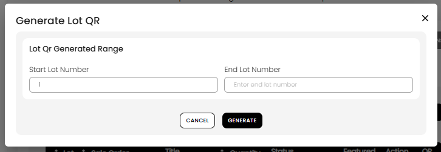

[Auction Lot](./index.md) · [Auction Journal](../index.md)

# What are QR lots?

**QR lots** are **placeholder** lot records in an auction. They reserve **lot numbers** so you can print **QR labels** before you enter full catalog details (title, description, seller, photos, and so on). They are **not** finished catalog lines and are **not** meant for bidders to view or bid on as-is.

---

## When to use QR lots

Use **Generate QR** when you already know the **lot number range** for the sale (for example lots 1–150) and you want to:

- Print QR codes for tags or signage before data entry is done
- Hand labels to a crew or consignors while catalog work continues in the office

QR lots are optional. If you prefer, you can create full lots with **New Lot** or **Import LOTS** instead. See [ways to create lots](lot-creation-ways.md).

---

## Before you generate QR lots

| Requirement | Why |
|-------------|-----|
| Auction is **not published** | **Generate QR** is only available on draft auctions (before publish). |
| Auction **end date** has not passed | The button is hidden after the auction’s scheduled end date. |
| You know your **start** and **end** lot numbers | The range defines which placeholders are created. |

You do **not** need full lot details yet—only the number range.

---

## How to generate QR lots

1. Open the auction in the **Auctioneer Dashboard** and go to the **Lots** tab.
2. Click **Generate QR**.
3. In the **Generate Lot QR** dialog, under **Lot Qr Generated Range**, enter:
   - **Start Lot Number**
   - **End Lot Number** (must be greater than the start)
4. Click **GENERATE** (first time) or **Update** (after placeholders already exist).
5. Click **Cancel** to close without saving a new range.

*Enter the lot number range, then choose **GENERATE** or **Update**.*

### After the first generate

The dialog may show three counts:

| Label | Meaning |
|-------|---------|
| **QR Generated** | Total lot rows tied to this auction (including placeholders and real lots) |
| **Auction Ready Lots** | Lots that are **not** QR-only—full or completed catalog lines |
| **Incomplete Lots** | Lots that are still **QR-only placeholders** (no full catalog data yet) |

You can edit the range later with the pencil (**Action**) control. **Start Lot Number** may be locked once placeholders exist; you can change **End Lot Number** to extend or shrink the QR range, subject to system rules (you cannot shrink the range below an **auction-ready** lot that already exists above your new end).

---

## Get QR images

After placeholders exist:

| Action | Where |
|--------|--------|
| **Download lots qr label** | **Lots** tab toolbar (when at least one lot exists) — downloads a **PDF** of QR labels for the full catalog or a lot-number range you choose |
| View a single lot’s QR | From the lot list, open the QR view for that lot when available (shows lot number, sale order, quantity, and the QR image) |

Print or share the PDF so tags match the lot numbers you will fill in later.

---

## Turn a QR lot into a real catalog lot

A QR lot becomes a normal lot when you add full catalog data for that **same lot number**:

- **New Lot** — enter the same lot number; the placeholder is **replaced** with a complete lot. See [How do I create a lot in an auction?](create-lot.md#qr-placeholder-at-the-same-lot-number).
- **Import LOTS** — spreadsheet import on existing numbers ([How do I import lots?](import-lots.md))
- **Lot-AI fast catalog** — assistant upload on a QR-only number, then finish in the dashboard (see [ways to create lots](lot-creation-ways.md))

The finished lot is **auction ready** when required fields are complete, the same as any other lot.

---

## Before you publish the auction

| Situation | What happens |
|-----------|----------------|
| **QR-only placeholders still left** | On **publish**, Auction Journal **deletes** all remaining QR-only lots automatically. They never appear on the public catalog. |
| **Real lots that are incomplete** (not QR-only, not auction ready) | Publish is **blocked** until you **complete** or **delete** those lots. The dashboard shows how many are incomplete. |

Plan to either fill placeholders with **New Lot** / import before publish, or rely on publish to clear unused QR numbers you no longer need.

---

## What you cannot do after publish

- **Generate QR** — the button is **not shown** on published auctions.
- You cannot add new QR placeholder ranges after the auction is live on the catalog in that way.

---

## Related

- [Ways to create lots in an auction](lot-creation-ways.md)
- [How do I create a lot in an auction?](create-lot.md)
- [How do I import lots?](import-lots.md)
- [How do I import lot images in bulk?](../sample_questions.md) (doc pending)
