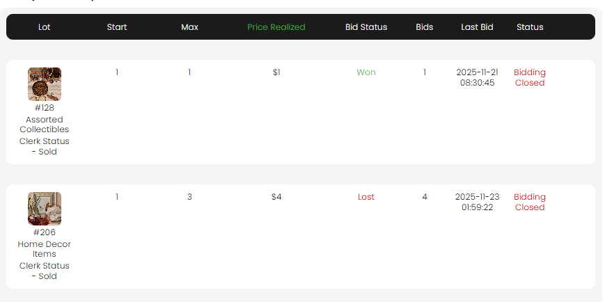

[Auction Lot](./index.md) · [Auction Journal](../index.md)

# How to view and handle bids from a bidder on lots in an auction?

*Last modified: 2026-06-01*

Use **View Bids** on the **Registration** tab to see every lot a **registered bidder** has bid on in **one auction**, and to **accept**, **decline**, or **raise a maximum bid** when the product allows.

**Prerequisite:** [How to see all bidders registered in my auction?](../auction/view-registrations.md)

---

## Open View Bids

1. In the **Auctioneer Dashboard**, go to **Auctions** → **Dashboard** for your auction.
2. Open the **Registration** tab.
3. Find the bidder and click the **chevron** to **expand** their row.
4. Select **VIEW BIDS**.

**View Bids** is **disabled** when that bidder’s **Bids** count on the registration row is **0** (they have not placed any bids in this auction yet).

For a **floor bidder** checked in for an onsite sale, use **View Bids** on their floor-bidder row to see **floor** bids per lot (read-only list; editing follows live-ring rules).

---

## What the Bids window shows

The title is **Bids (First name)**. One row appears for **each lot** this bidder has bid on (hidden lots are excluded).

| Column | Meaning |
|--------|---------|
| **Lot** | Image, lot number, title; **Clerk Status** after the lot’s bidding time has ended |
| **Start** | This bidder’s **first** bid amount on that lot |
| **Max** | Their **maximum bid** ceiling (maximum-bidding auctions) or latest bid on flat bidding |
| **Winning Bid** / **Price Realized** | Current high bid on the lot while the auction is open; **Price Realized** after the auction is **Closed** |
| **Bid Status** | **Winning** or **OutBid** while bidding is open; **Won** or **Lost** (green/red) after close when the lot was clerked **Sold** |
| **Bids** | Total bid count on that lot (all bidders) |
| **Last Bid** | Date and time of this bidder’s most recent bid on the lot |
| **Status** | Bid **acceptance** while the lot is open (**Accepted**, **Declined**, **Pending**); **Bidding Closed** when the lot’s close time has passed |
| **Action** | **Edit** (pencil) while the auction is not **Closed** — see below |

Amounts update while the window is open (lot winning bid and status refresh from the server).

A tooltip appears when a winning bid was **changed during clerking**.

---

## Handle bids — edit acceptance (Accept / Decline)

Use this when a bid needs review (for example over the bidder’s permission cap) or you must remove the **current winning** bid.

1. In **View Bids**, on the lot row, click the **Edit** icon in the **Action** column.
2. In **Edit Status**, choose **Accept** or **Decline**.
3. Select **Save**.

| Rule | Detail |
|------|--------|
| **Who you can decline** | Usually only the **current winning** bid on that lot. You cannot use **Edit** on an **OutBid** row that is already **Accepted**. |
| **When disabled** | After the lot’s **bidding is closed**, or when the auction is **Closed** (no Action column). |
| **After decline** | The catalog high bid typically moves to the previous accepted bidder or the start bid. The bidder may get email. |

Full behavior: [How can an auctioneer edit a bidder's bid?](bidding.md#how-can-an-auctioneer-edit-a-bidders-bid).

---

## Handle bids — raise maximum bid

On **maximum-bidding** auctions only, you can increase a bidder’s **max bid** on a lot they are **winning** with an **Accepted** bid.

1. On the row, click the **Edit** icon beside **Max** (not the Action column).
2. In **Edit Max Bid**, enter an amount **higher** than their current max.
3. Select **Save**.

| Requirement | Detail |
|-------------|--------|
| **Registration** | Bidder must be **Approved** or **Permanently Approved** for this auction |
| **Auction type** | **Maximum bidding** — not available on **flat / fixed** bidding |
| **Bid state** | Row must be **Accepted** and lot bidding still **open** |
| **Onsite live** | Disabled while the lot is **live in a ring** (`Lot Is Live`) |

---

## View Bids vs Lot Status → Bids

| View | Best for |
|------|----------|
| **Registration → View Bids** | All lots **one bidder** bid on in this auction |
| **Lot Status → Bids** (bid count on a lot) | All **bidders** who bid on **one lot** |

See [View bidding status on lots](view-lot-bidding-status.md).

---

## Related

- [See all registered bidders](../auction/view-registrations.md)  
- [Bidder profile details](../auction/view-bidder-registration-details.md)  
- [Registration acceptance](../auction/registration-acceptance.md)  
- [Edit a bidder's bid](bidding.md#how-can-an-auctioneer-edit-a-bidders-bid)  
- [Prebidding (onsite)](prebidding-onsite-livewebcast.md)  
- [Floor bidder check-in](../auction/floor-bidder-check-in.md)
