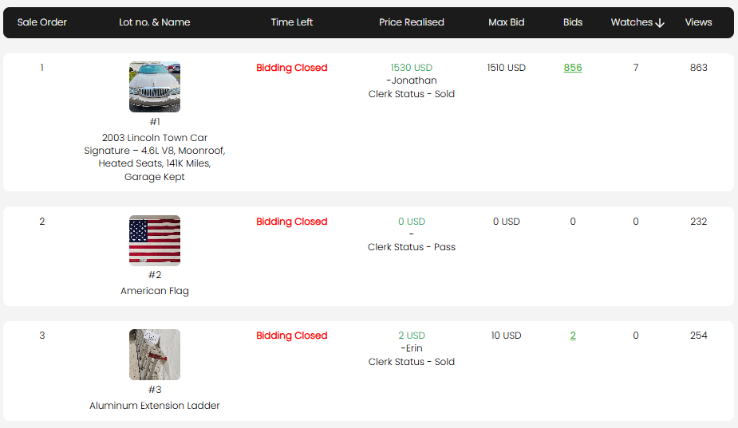

[Auction Lot](./index.md) · [Auction Journal](../index.md)

# How to view bidding status on lots in my auction?

*Last modified: 2026-06-01*

Use the **Lot Status** tab on your auction’s **Auction Dashboard** to monitor every catalog line in one table: time remaining, winning bid, clerk outcome, bid counts, watchlists, and page views. You can drill into **bid history** per lot or see **who is watching** a lot.

**Dashboard overview:** [How do I use the Auction Dashboard?](../auction/auction-dashboard.md#lot-status-tab)

---

## Open Lot Status

1. In the **Auctioneer Dashboard**, go to **Auctions**.
2. Select **Dashboard** on your auction (after it is **published**).
3. Open the **Lot Status** tab.

The list **updates live** while you stay on the tab (amounts, bid counts, and timers refresh without reloading the whole page).

---

## Search, sort, and paging

| Control | What it does |
|---------|----------------|
| **Search** | Find lots by **lot number** or **title** |
| **Sort** | Sale order, lot number, title, bid amount, **view count**, or **watchlist count** (ascending or descending) |
| **Lazy load / Pagination** | Toggle with **Lazy load** switch: scroll to load more rows, or use classic page size controls |
| **Download Lots Watchlist** (mobile button) / **↓** on **Watches** header (desktop) | Export a CSV of watchlist data for the auction |

---

## What each column means

| Column | What you see |
|--------|----------------|
| **Sale Order** | Catalog sale sequence for the lot |
| **Lot no. & Name** | Thumbnail, **#** lot number, and title |
| **Time Left** | Bidding phase for this lot (see table below) |
| **Current Winning Bid** or **Price Realised** | **Current Winning Bid** while the sale is open; **Price Realised** after the auction is **Closed** — amount in **USD**, high bidder as **bid card – name**, and **Clerk Status** (for example **Sold** or **Pass**) when clerking is recorded. A tooltip appears if the winning bid was **changed during clerking**. |
| **Max Bid** | Highest **maximum bid** placed on the lot (for maximum-bid auctions) |
| **Bids** | Total bid count. **Green underlined** number is clickable when the count is greater than zero — opens **bid details** for that lot |
| **Watches** | How many bidders added the lot to a **watchlist**. Click the count (when greater than zero) to open the watchlist list |
| **Views** | How many times the lot detail page was viewed |

### Time Left — common labels

| Label | Meaning |
|-------|---------|
| **Draft** | Auction or lot not published for bidding yet |
| **Bidding yet to start** / **Pre-bidding starts in** | Before the lot or pre-bid window opens (countdown when pre-bidding is enabled) |
| **Pre Bidding Open** | Pre-bidding window is active — see [Onsite prebidding](prebidding-onsite-livewebcast.md) |
| **Countdown timer** | Timed lot is open; timer shows time until **close bidding** |
| **Bidding Open** / **Lot Is Live** | Onsite or live webcast lot is open for bidding in the ring |
| **Bidding Closed** | Bidding time has ended for this lot |

For **public reserve** auctions, the winning-bid column can also show **Reserve Met** with a green check or red X when a reserve is set.

### Hidden lots

If you **hid** a lot from bidding, the row appears **blurred** with a note: *Auctioneer has hidden this lot from bidding.* Bid and watchlist links are disabled on hidden lots.

---

## View bid details on a lot

1. On **Lot Status**, click the green underlined number in the **Bids** column.
2. A bid popup opens for that lot (lot image, title, current winning bid or price realised, and **Clerk Status** when the lot is closed).

| Column (typical online timed sale) | Meaning |
|-----------------------------------|---------|
| **Bidder** | Bidder name; **Lot Status – Winning** or **OutBid** |
| **Start** | Their opening bid on this lot |
| **Max** | Their highest maximum bid |
| **Bids** | Number of bid records from that bidder on this lot |
| **Last** | Date and time of their last bid |
| **Status** | Bid acceptance (**Accepted** / **Declined** / **Pending**) where applicable |
| **Edit** (pencil) | Change acceptance status while the lot is still open and rules allow |

The bid list **refreshes about every five seconds** while the popup is open.

**Onsite With Live Webcast** after a lot closes may show a simplified live-bid layout (bidder type, start/max, counts) instead of online proxy-bid status columns.

To change hammer or winner after the sale, use **clerking** — not this screen. See [How does clerking work?](../auction/clerking.md) and [Edit clerking](../auction/edit-clerking.md).

For editing bids from the dashboard, see [How can an auctioneer edit a bidder's bid?](bidding.md#how-can-an-auctioneer-edit-a-bidders-bid) (open from **Lot Status** → **Bids** on the lot).

---

## View watchlist on a lot

1. Click the number in the **Watches** column (when greater than zero).
2. The watchlist popup lists each bidder who is watching the lot:

| Field | Content |
|-------|---------|
| **Bidder Name** | First name on file |
| **Bidder Score** | Score with latest change badge |
| **Email** | Contact email |
| **Phone No.** | Phone on profile |
| **Address** | Street address on profile |

If nobody is watching, you see **Watchlist is empty.**

---

## Related

- [Auction Dashboard — Lot Status tab](../auction/auction-dashboard.md#lot-status-tab)  
- [Online bidding on auction lots](bidding.md)  
- [Clerking](../auction/clerking.md)  
- [Auction stages](../auction/auction-stages.md)
