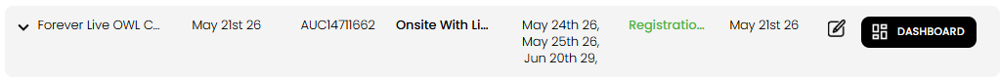
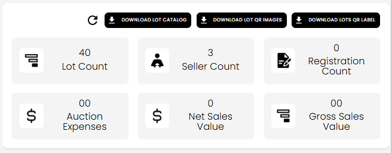
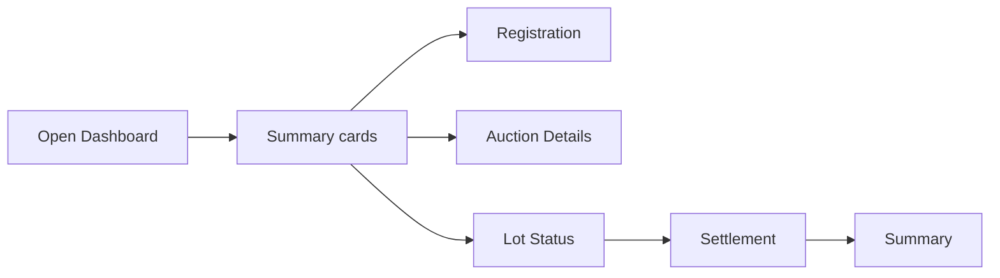
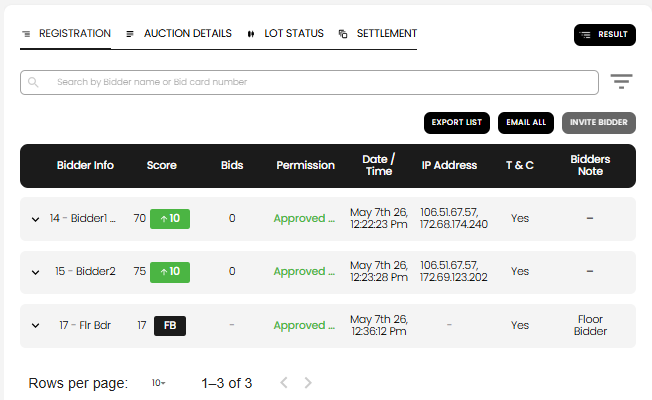
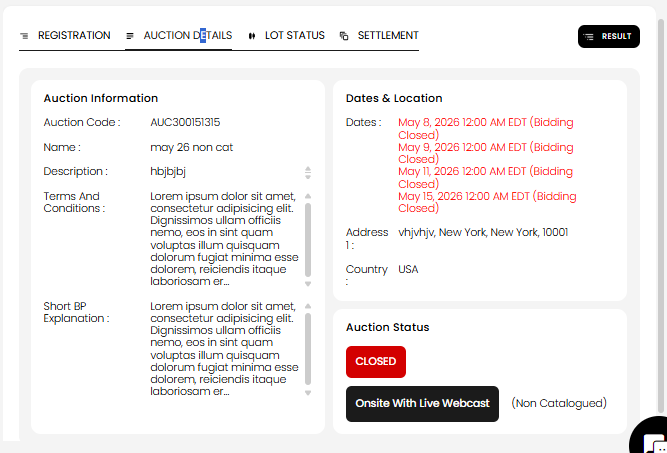
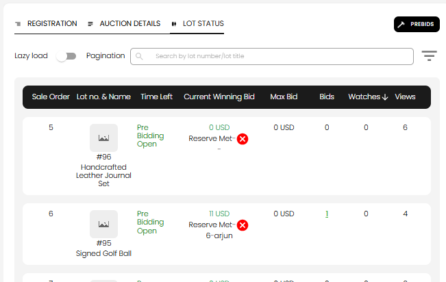
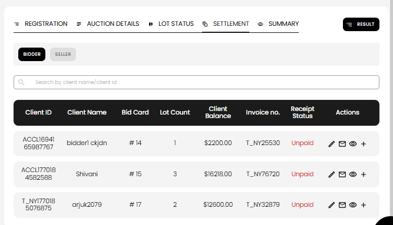

[Auction](./index.md) · [Auction Journal](../index.md)

# How do I use the Auction Dashboard?

---

## What it is

The **Auction Dashboard** is where you **run** a published auction day to day. From one screen you can:

- See **summary counts** and sale totals
- Review **auction status** and core details
- Manage **bidder registrations**
- Monitor **every lot** and **edit bids** when allowed
- **Generate and manage settlement** (invoices and payments) after the sale

Building the auction (lots, settings, publish) stays on the **Build Auction** screen. The dashboard is for **operations** after publish.

---

## Open the dashboard

1. Go to **Auctions** in the Auctioneer Dashboard.
2. Find your auction in the list. The row shows name, dates, type, and a **status** label (for example **Registration Open**, **Live**, **Closed**).

3. Click **Dashboard** on that row.

**Note:** **Dashboard** is available only after the auction is **published**. Draft auctions use **Edit** (pencil) to open build instead.

4. You land on **Auction Dashboard** for that auction (`/dashboard/auctions/{auctionId}/dashboard`). Use **Back** to return to the auctions list.

---

## Top of the dashboard

### Refresh and downloads

- **Refresh** (circular arrow) — reload stats and tab data.
- **Download lot catalog** — PDF catalog of lots.
- **Download lot QR images** — QR assets for lots.
- **Download lots QR label** — printable QR labels.

### Summary cards

Six metrics give a quick snapshot:

| Card | Meaning |
|------|---------|
| **Lot Count** | Number of lots in the auction |
| **Seller Count** | Distinct sellers; click the card to see seller list |
| **Registration Count** | Bidders registered for this auction |
| **Auction Expenses** | Total from [inhouse expenses](auction-expenses.md) |
| **Net Sales Value** | Net sales total |
| **Gross Sales Value** | Gross hammer-related total |

### Live auction (Onsite With Live Webcast)

For **onsite live webcast** auctions on an active bidding day, **START YOUR LIVE AUCTION** appears below the cards. That opens ring selection and live clerking — see [Rings](rings.md).

### Report

After the auction **end date**, **Report** links to the auction report page.

---

## Tabs

Use the tabs (or the mobile dropdown) to switch sections.

| Tab | When visible | Purpose |
|-----|----------------|---------|
| **Registration** | Always (published) | Bidders, permissions, invites |
| **Auction Details** | Always | Read-only auction info and status badge |
| **Lot Status** | Always | All lots, bidding state, bid edits |
| **Settlement** | After close rules met | Generate invoices; payers and sellers |
| **Summary** | After settlement generated | Financial summary (separate page) |

**Settlement** tab appears when:

- **Onsite With Live Webcast:** all rings are **completely closed**, or
- **Other types (not Absentee):** current time is **after** auction **end date**.

**Summary** appears after settlement is generated (not for Absentee Bidding in the current UI).

### Onsite-only actions (top right of tab bar)

- **Prebids** — when pre-bidding is enabled and open (catalogued onsite).
- **Result** — after close bidding time (onsite results / prebid flows).

---

## Registration tab

Manage who can bid on this auction. For a full walkthrough of the table and columns, see [See which bidders registered](view-registrations.md).

| Action | Use |
|--------|-----|
| **Search** | Find by bidder name or bid card number |
| **Sort / filter** | Order by name, date, score, etc. |
| **Export list** | Download registrations |
| **Email all** | Message all registrants |
| **Invite bidder** | Invite a bidder (disabled after auction end) |
| **Check-in floor bidder** | Onsite only — register floor bidders |

**Table columns (examples):** bidder info, score, bid count, **permission** (approved / pending), date/time, IP, terms accepted, notes.

Expand a row to open **bidder profile**, change **bid permission**, or related tools. Floor bidders may show **FB** and notes such as **Floor Bidder**.

Registration rules (windows, one row per bidder, approval): [Registration acceptance](registration-acceptance.md) · [Auction registration](../../auction/registration.md) (developer reference).

---

## Auction Details tab

Read-only view of what bidders and staff need at a glance:

- **Auction Information** — code, name, description, terms, buyer’s premium explanation
- **Dates & Location** — listing/bidding dates (onsite shows each **bidding day**; closed days marked **Bidding Closed**), address, country
- **Auction Status** — same stage label as the list (for example **Closed**, **Registration Open**) plus **auction type** and catalogued / non-catalogued

Status labels match [auction stages](auction-stages.md) (`getAuctionStatus` in the app).

To **change** settings, use **Edit** from the auctions list → **Build Auction**.

---

## Lot Status tab

Monitor every lot during and after bidding.

| Control | Purpose |
|---------|---------|
| **Search** | Lot number or title |
| **Sort** | Sale order, lot number, bid amount, views, watchlist, etc. |
| **Lazy load / pagination** | Load more lots or page through the list |
| **Prebids** (onsite) | Shortcut when pre-bidding applies |

**Columns (typical):** sale order, lot image and title, **time left** / phase (for example **Pre Bidding Open**, soft close countdown), **current winning bid**, reserve met indicator, max bid, **bids** (click to open bid list), watches, views.

### Edit bidding on a lot

1. Click the **bids** count (or open bid details for that lot).
2. In the bid popup, use **edit** on a bid row when the auctioneer edit path is allowed.
3. Adjust bid amount or status per product rules (online vs closed onsite lots may differ).

Clerking outcomes (sold / pass / hold) are updated in **live webcast** during onsite sales or on **Auction Day** clerking after close — see [Clerking](clerking.md) and [Edit clerking](edit-clerking.md). The **Lot Status** tab focuses on **bid history** and monitoring.

---

## Settlement tab

After the auction has ended (and the tab is visible), see **[How is a settlement generated for an auction?](generate-settlement.md)** for the full flow (eligibility, confirm dialogs, hold lots, and what gets created).

### Before settlement exists

- Click **Generate Invoice** to create buyer and seller settlements from clerked sold lots.
- If lots are still on **Hold**, you may need to resolve holds or confirm ignoring them.

### After settlement is generated

- Toggle **Bidder** vs **Seller** lists.
- **Search** by client name or ID.
- Table shows client, bid card, lot count, balance, invoice number, **receipt status** (for example **Unpaid**).
- **Actions per row:** edit settlement, email invoice, view detail, add receipt / payment.

Then collect **buyer payments** and process **seller payouts** per your payment setup. See [auction stages — after close](auction-stages.md#after-the-auction-is-closed) · [Generate settlement](generate-settlement.md) · dev [Settlement](../../auction/settlement/index.md).

**Summary** tab (when shown) opens a separate financial summary page for the auction.

---

## Typical workflow

| Phase | On the dashboard |
|-------|------------------|
| Before bidding | Registrations tab — approve bidders, invite, floor check-in (onsite) |
| During bidding | Lot Status — watch bids; onsite — **Start live auction** |
| After close | Lot Status — review lots; Settlement — generate invoices, collect payment |
| Done | Report; Summary (if generated) |

---

## Related

- [Create an auction](create-auction.md) · [Build Details](build-details.md) · [Upload Settings](build-upload-settings.md)
- [Auction stages](auction-stages.md) · [Rings](rings.md) · [Soft close](soft-close.md)
- [Auction expenses](auction-expenses.md)
- Registration and settlement rules (dev): [Registration](../../auction/registration.md) · [Settlement](../../auction/settlement/index.md)
