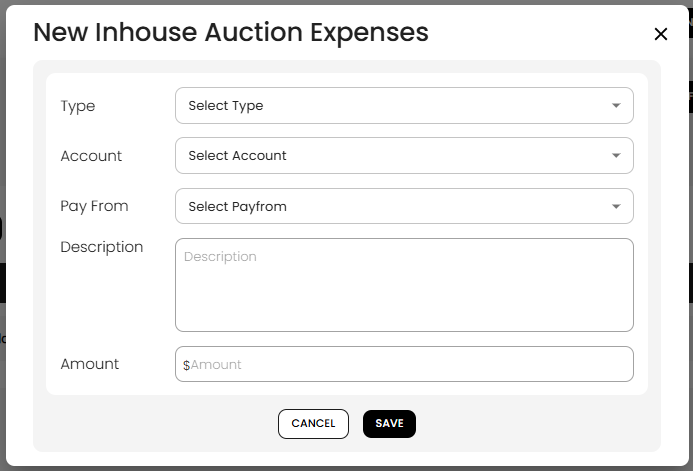
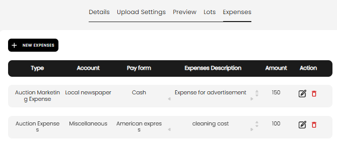

[Auction](./index.md) · [Auction Journal](../index.md)

# What are auction expenses? How do I create them?

---

## What are auction expenses?

**Auction expenses** (shown in the dashboard as **Inhouse Auction Expenses**) are the **out-of-pocket costs you incur to conduct the auction**—for example advertising, cleaning, supplies, or other event costs. They are **not** the same as buyer premium or commission on sold lots (those come from lot results and formulas).

You record them on the auction **Expenses** tab while building the auction. These costs are part of how you track the true cost of running the sale and they **appear on settlement invoices** under **Auction Charges** when you bill buyers or sellers after the auction closes.

---

## Where to open it

1. Open the auction in **Auction** build (after you create a draft).
2. Select the **Expenses** tab (alongside Details, Upload Settings, Preview, and Lots).

You can add expenses **any time** while the auction exists (draft or published). Deleting the whole **draft** auction also removes its expense rows.

---

## Add a new expense

1. Click **+ NEW EXPENSES**.
2. Fill in the **New Inhouse Auction Expenses** form.
3. Click **SAVE**.

| Field | Required | What to enter |
|-------|----------|----------------|
| **Type** | Yes | Category of expense (see types below) |
| **Account** | Yes | Sub-account under that type (from **Miscellaneous → Account**) |
| **Pay From** | Yes | How the expense was paid (accounts under the main “money in/out” style parent) |
| **Description** | Yes | Short note (e.g. “Expense for advertisement”, “cleaning cost”) |
| **Amount** | Yes | Dollar amount (**whole dollars**, no cents) |

### Expense types

| Type in the list | Typical use |
|------------------|-------------|
| **Auction Expenses** | General auction running costs |
| **Auction Marketing Expenses** | Ads, newspaper, promotion |
| **Auction Lot Expenses** | Costs tied to the lot catalog (when you use this type) |

After you pick **Type**, the **Account** dropdown loads sub-accounts for that parent. **Pay From** lists payment-source accounts (configured under Miscellaneous).

---

## Manage the list

The table shows **Type**, **Account**, **Pay form**, **Expenses Description**, **Amount**, and **Action**.

| Action | What it does |
|--------|----------------|
| **Edit** (pencil) | Opens **Edit Inhouse Auction Expenses** with the same fields |
| **Delete** (trash) | Removes that row |

If there are no rows yet, you see **No expenses available.**

---

## How this connects to settlement

| Stage | What happens |
|-------|----------------|
| **During build** | You keep a complete list of inhouse costs on the **Expenses** tab for this auction. |
| **After the auction closes** | You **Generate Invoice** (settlement) for the auction. |
| **On the settlement invoice (PDF)** | Auction-level costs show in the **Auction Charges** section (account, description, amount) for each buyer or seller settlement. |

Use the same **accounts** and descriptions you use in Miscellaneous so settlement lines match your books. If you need to add or change auction charges on a generated settlement, open **Settlement** → edit that buyer or seller → **ADD … AUCTION EXPENSES**.

For the full settlement flow, see [Auction settlement](../../auction/settlement/index.md) (developer mirror) and sample question [different stages of an auction](../sample_questions.md).

---

## Tips

- Set up **Miscellaneous → Account** before you add expenses so **Account** and **Pay From** lists are populated.
- Enter expenses as you pay them during setup so nothing is missed at settlement time.
- Amounts here are for **tracking and invoicing**; they do not replace lot-level buyer premium, tax, or commission lines on settlement.

---

## Related

- [Create an auction](create-auction.md)
- [Miscellaneous accounts](../auctioneer-misc/account.md)
- [Initial setup](../auctioneeer/initial-setup.md)
- [Help and Support](../help-and-support/index.md)
