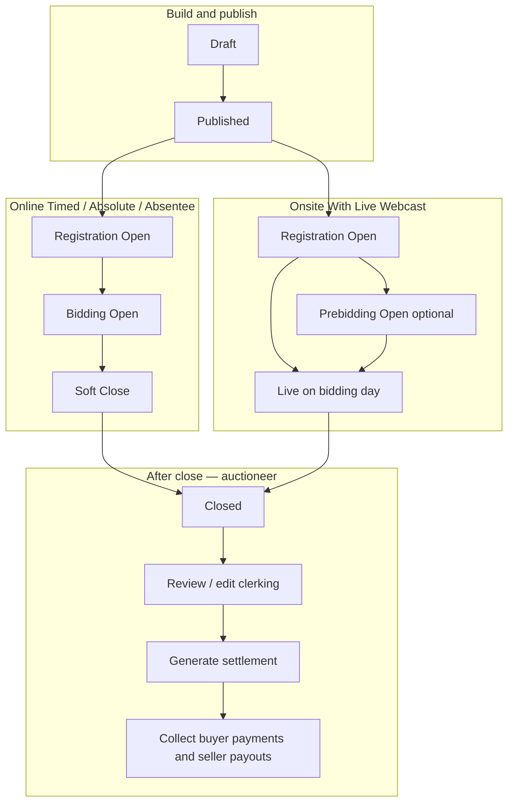

[Auction](./index.md) · [Auction Journal](../index.md)

# What are the different stages of an auction?

---

## Overview

An auction moves through **time-based stages** from the moment you create it until buyers and sellers are paid. On the **Auctioneer Dashboard**, the current stage appears as a **status label** on the auction (for example **Draft**, **Registration Open**, **Bidding Open**, **Closed**). That label comes from your auction’s **listing date**, **bidding dates**, and **auction type**.

After the auction is **Closed**, you finish **clerking** if needed, **generate settlement**, then **collect payment** from buyers and pay sellers.

---

## Status labels you see (dashboard)

These are the main labels shown while the auction is running:

| Status | Typical meaning |
|--------|-----------------|
| **Draft** | Created but not published. You can save progress and publish when ready. |
| **Published** | Published; **listing date** has not arrived yet. Bidders usually cannot register until registration opens. |
| **Registration Open** | Listing date has passed; bidders can **register** before online bidding or onsite live days (see your [Upload Settings](build-upload-settings.md) times). |
| **Bidding Open** | **Online** timed/absolute: internet bidding is active between **Open Bidding** and **Close Bidding**. |
| **Soft Close** | **Online** timed/absolute: main close time has passed; lots close **one by one** and may **extend** on late bids — see [soft close](soft-close.md). |
| **Prebidding Open** | **Onsite With Live Webcast** only: pre-bidding window is active before the first **bidding day**. |
| **Live** | **Onsite With Live Webcast** only: a **bidding day** is in progress; you can **start live auction** and clerk in rings. |
| **Closed** | The auction has ended for bidders; you move to clerking review, settlement, and payments. |

Badge colors on the dashboard (gray, black, green, red) match these stages so you can scan many auctions quickly.

---

## Stage diagram (full journey)

**Absentee Bidding** follows the same **registration → bidding window → close** idea as online auctions on the dashboard; clerking and settlement rules differ slightly (for example **High Bid** outcomes). See [auction types](auction-types.md).

---

## Online auctions (Timed, Absolute, Absentee)

Timeline is driven by **Listing Date**, **Open Bidding**, **Close Bidding**, **Soft Close** settings, and **End Date** in [Upload Settings](build-upload-settings.md).

| Stage | When it starts | What happens |
|-------|----------------|--------------|
| **Draft** | You create the auction | Edit all build tabs; **Publish** when validation passes. |
| **Published** | After publish, before listing date | Auction is on the system; registration not open yet. |
| **Registration Open** | On or after **listing date**, before **Open Bidding** | Bidders register; you can manage registrations. |
| **Bidding Open** | From **Open Bidding** until **Close Bidding** | Online bidding on lots. |
| **Soft Close** | After **Close Bidding**, before **End Date** | Lots close in order; late bids extend lots — [soft close](soft-close.md). |
| **Closed** | After **End Date** | Bidding stops; platform may apply default clerking on lots still without a clerk result. |

Fewer build fields can be changed as the auction advances (for example listing and bidding times lock after registration starts).

---

## Onsite With Live Webcast

Timeline uses **listing date**, optional **pre-bidding**, **bidding day** timings, and **end date**. Rings are configured under [Details → Ring Option](rings.md).

| Stage | When it starts | What happens |
|-------|----------------|--------------|
| **Draft / Published / Registration Open** | Same idea as online | Before pre-bid or first bidding day. |
| **Prebidding Open** | If pre-bidding is enabled, after pre-bid start and before first bidding day | Remote bidders can pre-bid. |
| **Live** | On an active **bidding day** (per your schedule) | **START YOUR LIVE AUCTION**, enter a ring, stream, clerk lots. Between days you may see **Registration Open** or **Prebidding Open** again until the next day. |
| **Closed** | After **end date**, or when all bidding days are marked closed | No more live rings; proceed to post-close work. |

Onsite auctions often clerk lots **during** live rings; after close you mainly **correct** outcomes if needed.

---

## After the auction is Closed

This is the **post-close** workflow for the auctioneer. For what runs **automatically** vs what you start yourself, see **[What happens automatically when an auction closes?](after-auction-closes.md)**.

### 1. Review and edit clerking

- Confirm each lot’s outcome (**Sold**, **Pass**, **Hold**, etc.) and hammer / buyer.
- The system may set defaults on lots that had no clerk decision when the auction ended.
- You can **edit clerking** after close if you need to fix hammer, status, or winner (until payment rules block further edits on that buyer’s settlement).

### 2. Generate settlement

- When the auction has ended and clerking is ready (no blocking **Hold** lots unless you choose to ignore them), run **generate settlement** once per auction. Step-by-step: **[How is a settlement generated for an auction?](generate-settlement.md)**.
- This creates **buyer** and **seller** settlement documents (invoices) from sold lots, premiums, taxes, and auction charges.

### 3. Collect payments

- **Buyers** pay their settlement balances (card / configured payment flow).
- **Sellers** receive payouts through your connected payment setup.
- Track receipts and paid status on settlements; starting payment on a settlement can limit further clerking changes for that buyer.

Developer detail: [After the auction closes](../../auction/post-close.md), [Clerking](../../auction/clerking.md), [Settlement](../../auction/settlement/index.md), [Payment](../../payment/index.md).

---

## Quick reference — what to do when

| You see | Typical auctioneer actions |
|---------|----------------------------|
| **Draft** | Build lots, settings; **Publish**. |
| **Published** | Final checks before listing date. |
| **Registration Open** | Promote sale; approve registrations. |
| **Bidding Open / Prebidding Open / Soft Close** | Monitor bidding; support bidders. |
| **Live** | Run rings; clerk; stream. |
| **Closed** | Edit clerking → generate settlement → collect payments. |

---

## Related

- [Create an auction](create-auction.md)
- [Upload Settings](build-upload-settings.md)
- [Auction types](auction-types.md)
- [Rings](rings.md) (onsite)
- [What happens automatically when an auction closes?](after-auction-closes.md)
- Dev mirror: [Auction lifecycle](../../auction/lifecycle.md)
