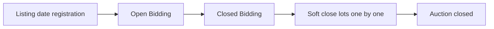
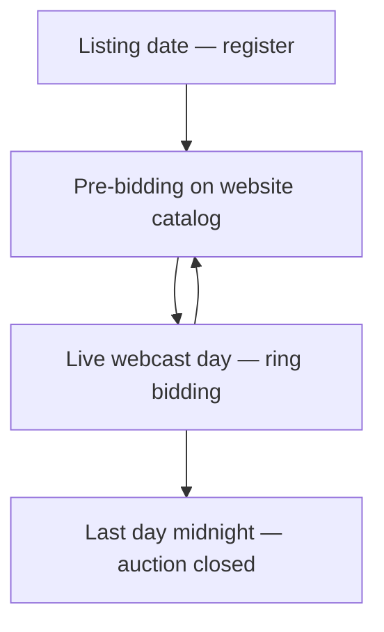

[Auction](./index.md) · [Auction Journal](../index.md)

# Explain bidding dates of an auction

Last modified: 2026-05-29

Auction dates control when your sale appears on [auctionjournal.com](https://auctionjournal.com/), when bidders can register, when they can bid online, and when the auction ends. You set most schedule fields under **Upload Settings** when building an auction in the **Auctioneer Dashboard**.

The **Dates** subsection (Preview, Auction, Checkout) is **information for bidders** only. The real schedule for registration and bidding is under **Bidding** (online types) or the onsite **pre-bidding** and **live webcast day** fields.

For dashboard status labels (**Registration Open**, **Bidding Open**, **Soft Close**, **Live**, and so on), see [What are the different stages of an auction?](auction-stages.md). For draft → publish → close → settlement, see [Auction lifecycle](lifecycle.md).

---

## Listing date

**Listing date** is set when you create the auction (same as **start date** in the system).

| When | What happens |
|------|----------------|
| After you **publish**, before listing date | Auction is in the system; bidders usually **cannot register** yet. Dashboard may show **Published**. |
| On or after listing date | Your auction is visible on Auction Journal; bidders can **register** for the sale (until online bidding or your first live day opens, depending on type). Dashboard shows **Registration Open** when registration is the active window. |

---

## Online Timed and Online Absolute auctions

Set these under **Upload Settings → Bidding** (with **Timezone**):

| Field | What it means |
|-------|----------------|
| **Open Bidding** | Internet bidding **starts**. Bidders can place bids on lots on the website. |
| **Closed Bidding** | Main online bidding period **ends**. **Soft close** begins — lots do not all stop at once. |
| **Soft Close Seconds** | Time between each lot **starting** to close, in **sale order**, after Closed Bidding. |
| **Bid Soft Closed Seconds** | Extra time added to a **single lot** when someone bids on it **after** Closed Bidding while that lot is still open. |

**End date** is calculated for you when you publish (from Closed Bidding, soft close settings, and your lots). The auction is fully **Closed** after the **last lot** finishes closing.

### Timeline (online)

1. **Listing date** — auction on the site; registration open until Open Bidding.
2. **Open Bidding → Closed Bidding** — all lots accept bids (**Bidding Open** on the dashboard).
3. **After Closed Bidding until the auction ends** — **Soft Close**: lots close **one by one** by sale order; late bids can extend individual lots ([Soft close and bid soft close](soft-close.md)).
4. **After the last lot closes** — auction **Closed**; you proceed to clerking and settlement.

---

## Onsite With Live Webcast auctions

These auctions use **live webcast days** (and optional **pre-bidding**), not Open Bidding / Closed Bidding / soft close on the auction.

### Listing date

Same as online: after listing date, bidders can register on Auction Journal.

### With pre-bidding enabled

| Setting | What it means |
|---------|----------------|
| **Pre-bidding start** | When bidders can start placing bids on the **website catalog** before the first live day. |
| **Live webcast day(s)** | One or more **bidding days** when you run the sale in the **live ring** (stream, floor bids, clerk). |

While pre-bidding is on, bidders can bid on [auctionjournal.com](https://auctionjournal.com/) from pre-bidding start until the **auction ends** (see end date below), except when a lot is **live in a ring** (then bidding moves to the live webcast page).

Between multiple live days, pre-bidding on the catalog can continue overnight or on off-days if you enabled pre-bidding. The dashboard may show **Prebidding Open** again until the next live day.

### Without pre-bidding

Bidders can **register** after listing date, but **cannot** place catalog bids on the website until you run **live** bidding in a ring. All competitive bidding happens during your live webcast sessions.

### Single or multiple live days

- You can schedule **one** or **several** live webcast **bidding days**.
- Each day has a **start** time you configure when building the auction.
- The **auction ends at midnight** (in your chosen **Timezone**) on the **last** live webcast day you scheduled.
- The auction does **not** fully close at midnight after every intermediate day — only after the **last** scheduled day.

When every live day is marked complete in the system, the auction can show **Closed** even before that final midnight.

### Timeline (onsite, with pre-bidding)

**Live** on the dashboard means a scheduled **bidding day** has started — use **Start Your Live Auction** and enter a ring ([Live bidding](live-bidding.md), [Rings](rings.md)).

---

## Quick comparison

| | Online Timed / Absolute | Onsite With Live Webcast |
|---|-------------------------|---------------------------|
| Registration after listing date | Yes | Yes |
| Main internet bidding window | Open Bidding → Closed Bidding | Optional pre-bidding; live days in rings |
| Lots close one-by-one after close time | Yes (soft close) | No — clerk lots during live; auction ends on last day |
| Closed Bidding / Soft Close fields | Yes | No |

---

## Where to set dates

| Auction type | Where in build |
|--------------|----------------|
| Online Timed / Absolute | **Upload Settings → Bidding** (Open / Closed Bidding, soft close, timezone) |
| Onsite With Live Webcast | **Upload Settings → Bidding** (pre-bidding, bidding day timings, timezone) |
| Marketing text only | **Upload Settings → Dates** |

See [Upload Settings](build-upload-settings.md) and [Create an auction](create-auction.md).

---

## Related

- [Auction stages](auction-stages.md)
- [Soft close and bid soft close](soft-close.md) (online only)
- [Live bidding](live-bidding.md) (onsite)
- [Auction types](auction-types.md)
