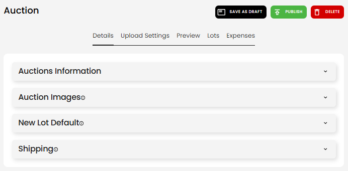
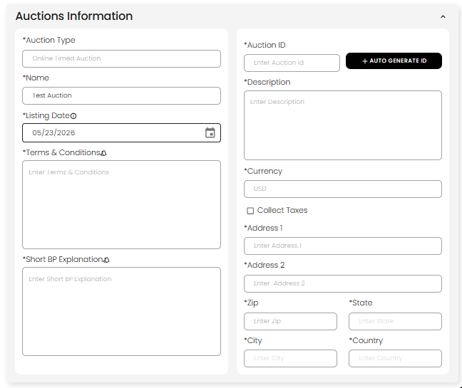
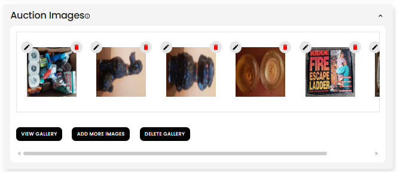
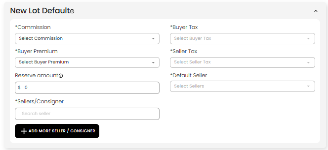
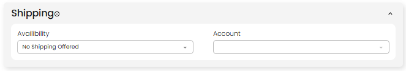

[Auction](./index.md) · [Auction Journal](../index.md)

# How do I fill in the Details section when creating an auction?

---

## Overview

Field-by-field reference for the whole auction: [Explain each auction field](fields.md).

On the **Auction** build screen, open the **Details** tab. Expand each subsection (accordion), fill in the fields, and use **SAVE AS DRAFT** at the top when you want to save progress.

| Subsection | What it is for |
|------------|----------------|
| **Auctions Information** | Title, ID, description, listing date, terms, address |
| **Auction Images** | Photos for the auction |
| **New Lot Default** | Default commission, premium, taxes, sellers for new lots |
| **Shipping** | Whether you offer shipping and which account to use |
| **Ring Option** | **Onsite With Live Webcast** + multi-ring only |

**Locked after create:** **Auction Type** (and **lot type** for onsite webcast). Other fields stay editable on draft until the auction phase advances after publish.

---

## Auctions Information

| Field | Draft | Publish |
|-------|-------|---------|
| **Auction Type** | Shown; locked | Locked |
| **Name** | Required for a useful draft | Required |
| **Listing Date** | Editable on draft; editable after publish until listing date passes | Required |
| **Terms & Conditions** | Optional until publish | Required |
| **Short BP Explanation** | Optional until publish | Required (buyer’s premium explanation) |
| **Auction ID** | Optional on draft; use **+ AUTO GENERATE ID** | Required (unique, letters and numbers) |
| **Description** | Optional until publish | Required |
| **Currency** | Usually USD | Required |
| **Collect Taxes** | Optional | If on, tax formulas required at publish for some setups |
| **Address** | Optional until publish | Required for publish (used for location on the public site) |

**Templates:** Bell icons on some fields let you apply saved templates from **Miscellaneous → Templates**.

---

## Auction Images

1. Add images with **ADD MORE IMAGES** or drag into the gallery.
2. **VIEW GALLERY** — browse all uploads.
3. Per image: edit or delete.
4. **DELETE GALLERY** — remove all images (use with care).

Image changes may auto-save the auction (draft or published, depending on state).

**Publish:** At least one image is required.

**Preview tab:** Use [Preview](create-auction.md#step-3--preview-gallery-optional) to reorder which images appear first in the featured gallery.

---

## New Lot Default

Defaults apply to **new lots** you add and can update existing lots when you change auction-level formulas (see lot documentation).

Full guide: [How to set default setting for all lots in Auction?](default-lot-settings.md)

| Field | Notes |
|-------|--------|
| **Commission** | Formula from Miscellaneous |
| **Buyer Premium** | Formula |
| **Reserve amount** | Default reserve (optional on draft) |
| **Sellers / Consigner** | Search and add sellers; **+ ADD MORE SELLER / CONSIGNER** |
| **Buyer Tax / Seller Tax** | Formulas when you collect taxes |
| **Default Seller** | One of the selected sellers |

**Publish:** Online Timed/Absolute typically require commission and buyer premium; onsite **non-catalogued** auctions require commission, premium, and sellers even without lots.

---

## Shipping

| Field | Purpose |
|-------|---------|
| **Availability** | e.g. **No Shipping Offered**, or options when you ship |
| **Account** | Shipping account when availability requires it |

**Publish:** Shipping availability is required.

---

## Ring Option (Onsite With Live Webcast only)

For **Onsite With Live Webcast**, open **Auctions Information** and check **Auction Will Have Multiple Rings** if the sale runs in more than one ring.

When multiple rings are enabled, **Ring Option** appears under **Details**. Set **Assign Ring By** (lot# or sale order), add rings, and enter each **Range Begins** / **Range Ends**. Full behavior, live-day steps, and screenshots: [How does Ring work in an auction?](rings.md).

Screenshots in this guide use **Online Timed Auction**; onsite forms add bidding dates, pre-bidding, and ring fields under **Upload Settings** and Details.

---

## After you publish

Fewer Details fields stay editable as the auction moves from published → registration open → bidding → close. **Auction ID**, **currency**, and **listing/end dates** lock once registration has started. See [create auction](create-auction.md#listing-date-after-you-create-the-auction).

---

## Related

- [Create an auction](create-auction.md)
- [Upload Settings](build-upload-settings.md)
- [Formulas](../auctioneer-misc/formulas.md)
- [Add a customer / seller](../auctioneer-client/add-customer.md)
