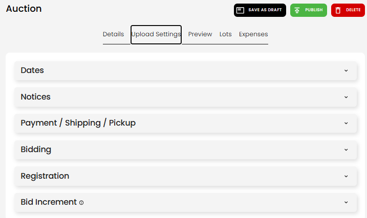
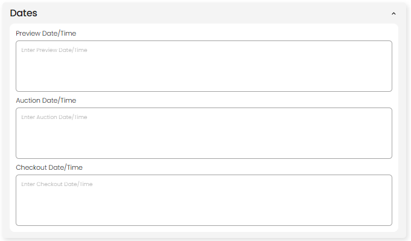
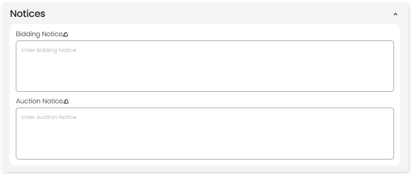
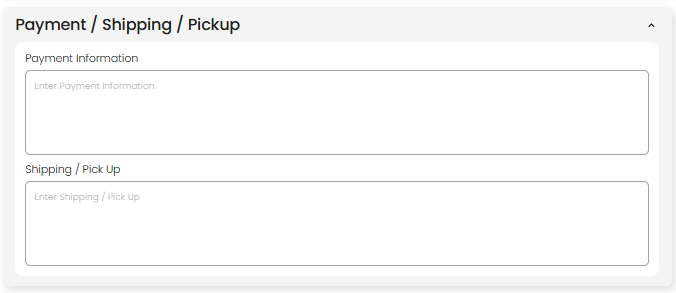
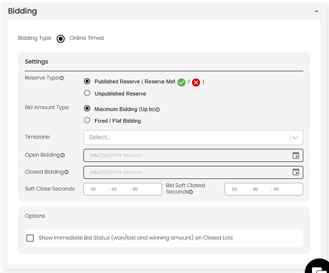
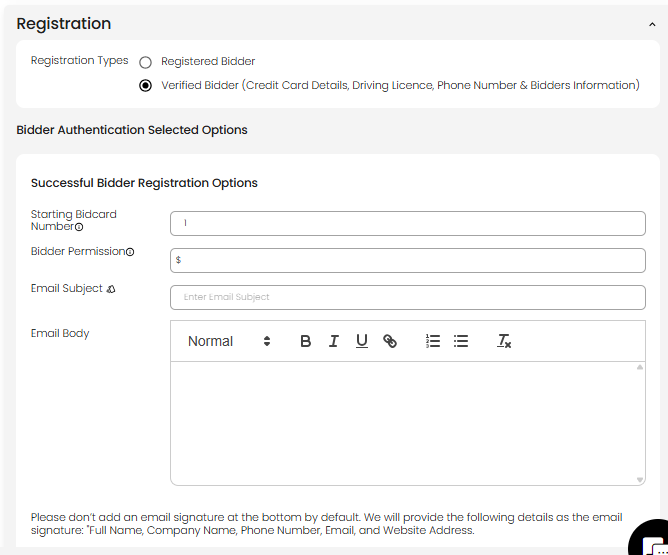
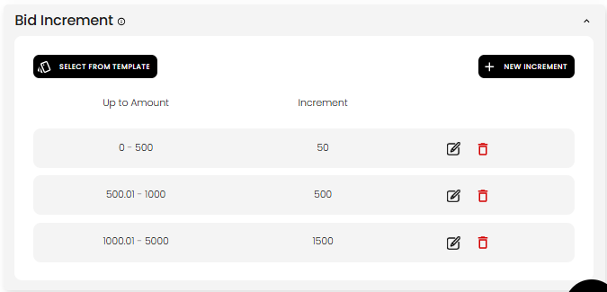

[Auction](./index.md) · [Auction Journal](../index.md)

# How do I fill in the Upload Settings section when creating an auction?

---

## Overview

Open the **Upload Settings** tab on the **Auction** build screen. Six subsections control schedule text, notices, payment and pickup instructions, bidding behavior, bidder registration, and bid increments.

Save progress with **SAVE AS DRAFT** at the top. Many fields are optional on draft but **required at Publish** depending on auction type.

Screenshots below show **Online Timed Auction**. **Onsite With Live Webcast** adds pre-bidding, bidding day timings, timezone, and related fields in **Bidding** and **Dates**.

---

## Dates

Free-text schedule lines bidders read (preview, main auction, checkout).

| Field | Purpose |
|-------|---------|
| **Preview Date/Time** | When buyers can preview items |
| **Auction Date/Time** | Main auction timing (marketing copy) |
| **Checkout Date/Time** | Payment or pickup window |

For timed online auctions, precise **open/close bidding** datetimes are set under **Bidding**, not only here.

---

## Notices

| Field | Purpose |
|-------|---------|
| **Bidding Notice** | Rules and alerts about bidding (template bell may apply) |
| **Auction Notice** | General auction announcements |

Use clear language bidders will see on the public auction page.

---

## Payment / Shipping / Pickup

| Field | Purpose |
|-------|---------|
| **Payment Information** | How winners pay (cards, wire, etc.) |
| **Shipping / Pick Up** | Pickup location hours, shipping policy |

Complements **Details → Shipping** (availability/account) with narrative instructions.

---

## Bidding

Controls how online timed (and similar) auctions open and close. Onsite webcast uses additional options (pre-bid, bidding days).

| Field | Purpose |
|-------|---------|
| **Bidding Type** | e.g. **Online Timed** (set from auction type) |
| **Reserve Type** | Published vs unpublished reserve indicator for bidders |
| **Bid Amount Type** | **Maximum Bidding** vs **Fixed / Flat Bidding** |
| **Timezone** | Reference zone for open/close times |
| **Open Bidding** | When online bidding starts (must be on or after listing date at publish) |
| **Closed Bidding** | When bidding ends (must be after open bidding) |
| **Soft Close Seconds** | Stagger between lots closing one-by-one after **Closed Bidding** (format `hh:mm:ss`) |
| **Bid Soft Closed Seconds** | Extra time added to a lot when bid after **Closed Bidding** during soft close |

Full behavior: [Soft close and bid soft close](soft-close.md). **Onsite With Live Webcast** does not use these fields.
| **Show Immediate Bid Status…** | Show won/lost on closed lots when enabled |

**Publish (Online Timed / Absolute):** Open and close times and timezone are validated; commission and buyer premium come from **Details → New Lot Default**.

For **soft close** behavior, see sample question [Explain soft close](../sample_questions.md).

---

## Registration

Who may register and what email they receive when approved.

| Field | Purpose |
|-------|---------|
| **Registration Types** | **Registered Bidder** vs **Verified Bidder** (ID, card, phone, etc.) |
| **Starting Bidcard Number** | First bidder card number assigned |
| **Bidder Permission** | Default bid permission / limit for auto-approved registrations |
| **Email Subject / Email Body** | Message sent on successful registration |

Do **not** add your own email signature — the system appends name, company, phone, email, and website from your profile.

---

## Bid Increment

Tiered minimum bid increases by current price.

1. **SELECT FROM TEMPLATE** — apply a saved increment table from Miscellaneous.
2. **+ NEW INCREMENT** — add a row: **Up to Amount** range and **Increment** value.
3. Edit or delete rows with the row actions.

**Publish:** A valid increment schedule is required.

---

## Publish checklist (this tab)

At **Publish**, the server checks Upload Settings fields together with Details and lots. If something fails, icons highlight the subsection — complete the fields and publish again.

| Common publish needs | Subsection |
|----------------------|------------|
| Open/close bidding, timezone | Bidding |
| Registration email | Registration |
| Increment table | Bid Increment |
| Notices and payment text | Notices, Payment / Shipping / Pickup |

---

## Related

- [Create an auction](create-auction.md)
- [Details section](build-details.md)
- [Registration (developer)](../../auction/registration.md)
- [Help and Support](../help-and-support/index.md)
