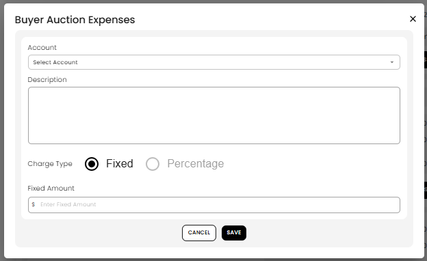

[Auction](./index.md) · [Auction Journal](../index.md)

# What are buyer auction charges in settlement? How do I add them?

Last modified: 2026-05-27

**Buyer auction charges** are extra fees you add to a **buyer’s whole invoice** after settlement is generated. They are **not** tied to a single lot. Typical uses: delivery, admin fee, or other costs that apply once for everything that buyer won in that auction.

**Prerequisite:** [How is a settlement generated for an auction?](generate-settlement.md). For per-lot lines (hammer, premium, tax), see [Buyer invoice — each won lot](buyer-lot-calculation.md).

---

## Buyer auction charges vs other invoice lines

| Item | Applies to | When it appears |
|------|------------|-----------------|
| **Lot lines** | Each sold lot | When you **Generate Invoice** |
| **Buyer auction charges** | **Entire buyer invoice** | You add them when **editing** settlement |
| **Extra lot charges** | **One lot** only | Edit settlement — on that lot |
| **Adjustment** | **Entire invoice** (one line) | Separate adjustment action — [Settlement adjustments](settlement-adjustments.md) |

Auction charges use your **Miscellaneous → Account** chart (same account list as other auction money lines). They are **not** the same as the single **adjustment** discount or surcharge.

---

## How to add a buyer auction charge

1. Open **Auctions** → **Dashboard** for the auction.
2. Go to the **Settlement** tab and choose **Bidder**.
3. Open the buyer invoice you need.
4. Start **add auction charge** (the form title is **Buyer Auction Expenses**).
5. Fill in the form:
   - **Account** — pick a sub-account from your chart of accounts ([Miscellaneous accounts](../auctioneer-misc/account.md)).
   - **Description** — short note that appears on the invoice (for example “Delivery fee”).
   - **Charge Type** — **Fixed** (dollar amount) or **Percentage**.
   - **Fixed Amount** (or percentage field when **Percentage** is selected) — enter the charge value.
6. Select **SAVE**.



*Add buyer auction charge from settlement edit.*

7. The buyer invoice **total increases** by that charge. **Grand total** updates (including any existing adjustment).

You can **edit** or **remove** auction charges until that settlement is marked **Paid**.

---

## What happens to the buyer total

Each buyer auction charge **adds** to what the buyer owes:

```text
Invoice total (before adjustment) = Lot charges total + Sum of buyer auction charges
```

Lot charges are the sum of every won lot (hammer + buyer’s premium + buyer tax). Auction charges sit **on top** of that subtotal.

---

## Charge type: Fixed vs Percentage

| Type | What you enter | Tip |
|------|----------------|-----|
| **Fixed** | A dollar amount for the fee | Use for flat fees (for example $75 delivery). |
| **Percentage** | A numeric value saved as the charge | Enter the amount the product expects for that field; it is **not** auto-calculated from the lot subtotal on save. If you need a true “% of invoice” discount or surcharge, use [Settlement adjustments](settlement-adjustments.md) instead. |

---

## When you cannot add or change them

- Settlement must already exist (**Generate Invoice** completed for that buyer).
- You **cannot** edit if the invoice is **Paid** — finish fee changes before recording full payment.
- Use **clerking** to fix hammer, sold/pass, or winner — not auction charges.

---

## Related

- [Edit settlement](edit-settlement.md)
- [Full buyer settlement calculation](buyer-settlement-calculation.md)
- [Settlement adjustments](settlement-adjustments.md)
- [Seller auction expenses](seller-auction-expenses.md) (seller side — reduces payout)
- Dev: [Buyer auction charges](../../auction/settlement/buyer-auction-charges.md) · [Edit settlement (dev)](../../auction/settlement/edit.md)
