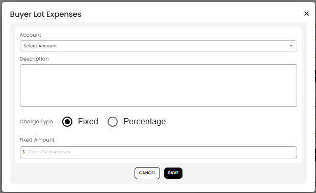

[Auction](./index.md) · [Auction Journal](../index.md)

# What are buyer lot expenses? How do I add an expense under a lot?

Last modified: 2026-05-27

**Buyer lot expenses** are extra charges on **one sold lot** on a **buyer’s settlement invoice**—for example rigging, storage, or a per-lot handling fee. They are **not** added when you first **Generate Invoice**; you add them while **editing** that buyer’s settlement, on the specific lot line.

**Prerequisite:** [Generate settlement](generate-settlement.md). Lot math at generate: [Buyer invoice — each won lot](buyer-lot-calculation.md).

---

## Buyer lot expenses vs other fees

| Fee type | Applies to |
|----------|------------|
| **Lot line** (hammer, premium, tax) | That lot — at generate |
| **Buyer lot expenses** | **That lot only** — you add in settlement edit |
| **Buyer auction charges** | **Whole buyer invoice** — [Buyer auction charges](buyer-auction-charges.md) |
| **Adjustment** | Whole invoice — [Settlement adjustments](settlement-adjustments.md) |

---

## How to add a buyer lot expense

1. Open **Auctions** → **Dashboard** → **Settlement** → **Bidder**.
2. Open the buyer settlement to edit.
3. Find the **lot** (lot number / title in the list).
4. In that lot’s **Entries** section, select **ADD BUYER LOT EXPENSES**.
5. In **Buyer Lot Expenses**:
   - **Account** — chart-of-accounts sub-account ([Miscellaneous accounts](../auctioneer-misc/account.md)).
   - **Description** — what the charge is for.
   - **Charge Type** — **Fixed** or **Percentage** of that lot’s **hammer**.
   - Enter the **Fixed Amount** (or percentage when selected).
6. Select **SAVE**.

7. The expense appears under that lot’s entries. The **lot total** and **buyer invoice total increase**.

You can **edit** or **delete** each extra line from the same lot section until the settlement is **Paid**.

---

## Fixed vs Percentage

| Type | Meaning |
|------|---------|
| **Fixed** | Flat dollar amount for that lot |
| **Percentage** | Calculated from **that lot’s hammer** (same base as buyer premium on the line) |

---

## When to use lot expenses vs auction charges

| Use **buyer lot expense** when… | Use **buyer auction charge** when… |
|----------------------------------|-------------------------------------|
| The fee applies to **one lot** only | The fee applies to the **whole purchase** (one buyer, all lots) |

---

## Related

- [Edit settlement](edit-settlement.md)
- [Full buyer settlement calculation](buyer-settlement-calculation.md)
- [Seller lot expenses](seller-lot-expenses.md) (seller side)
- Dev: [Buyer lot expenses](../../auction/settlement/buyer-lot-expenses.md)
