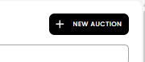
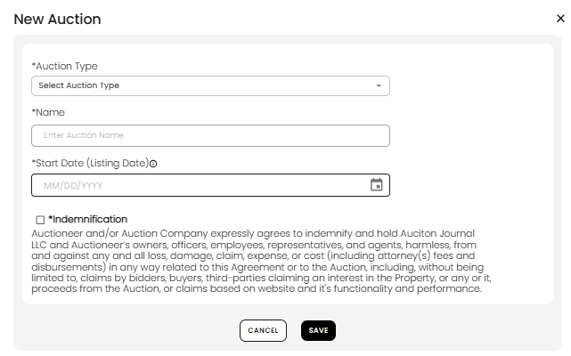
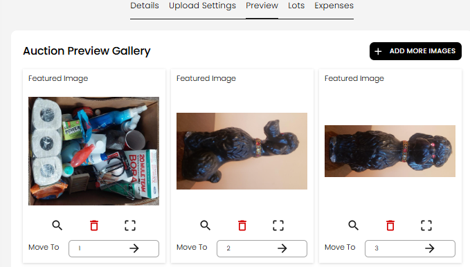

[Auction](./index.md) · [Auction Journal](../index.md)

# What is an auction? How do I create one?

---

## What is an auction?

An **auction** in the Auctioneer Dashboard is the **operational event** you run in your CRM: lots, bidding rules, bidder registration, clerking, and settlement. Bidders bid on **lots** inside this auction according to the schedule and rules you configure.

This is **not** the same as a public **listing** on Auction Journal’s website. A listing **promotes** an upcoming sale; an auction is where you **run** the sale. See [What is a listing?](../listing/create-listing.md).

| State | What it means for you |
|-------|------------------------|
| **Draft** | Only you see it while building — use **Save as Draft** as you go |
| **Published** | Auction is committed; rules apply; you can still change **allowed** fields until the auction advances |
| **After listing date (`startDate`)** | Bidders can register; more fields become read-only over time |

---

## Before you start

- Sign in to the **Auctioneer Dashboard**.
- Meet [prerequisites for your auction type](auction-prerequisites.md) (or [initial setup](../auctioneeer/initial-setup.md) for the full checklist).
- Open **Auctions** and locate **+ NEW AUCTION**.

---

## Step 1 — Create a draft (New Auction)

Click **+ NEW AUCTION**. In the **New Auction** window fill in:

| Field | Required | Notes |
|-------|----------|--------|
| **Auction Type** | Yes | Cannot change later in the build screen |
| **Name** | Yes | Auction title |
| **Start Date (Listing Date)** | Yes | Today or a future date — when the auction becomes visible for registration on the public side |
| **Indemnification** | Yes | Check the box to accept the legal terms |

For **Onsite With Live Webcast**, you also choose **lot type** (Catalogued or Non Catalogued) in this step.

- **CANCEL** — close without saving.
- **SAVE** — creates a **draft** and opens the full **Auction** build screen.

You only need these few fields to start. Everything else can wait until you **Save as Draft** section by section or **Publish** when complete.

---

## Step 2 — Build screen overview

After save, you work on the **Auction** page with five tabs:

| Tab | Purpose |
|-----|---------|
| **Details** | Core information, images, default lot fees, shipping — [Details guide](build-details.md) |
| **Upload Settings** | Dates, notices, payment/pickup text, bidding, registration, bid increments — [Upload Settings guide](build-upload-settings.md) |
| **Preview** | Reorder images in the **Auction Preview Gallery** (featured order) |
| **Lots** | Add and manage lots *(documented separately)* |
| **Expenses** | Inhouse costs to run the auction — [Auction expenses](auction-expenses.md) |

**Top buttons (draft):**

| Button | Action |
|--------|--------|
| **SAVE AS DRAFT** | Saves your work — you do **not** need every field filled |
| **PUBLISH** | Validates everything required for your auction type and goes live |
| **DELETE** | Removes this **draft** auction (and its lots/images) |

**After publish:** **Save as Draft** and **Delete** are no longer shown. Use **Save Changes** to update fields the system still allows (fewer fields lock as registration and bidding start).

---

## Step 3 — Preview gallery (optional)

Open the **Preview** tab to set the order of featured photos bidders see first.

- **+ ADD MORE IMAGES** — add photos (you can also manage images under **Details → Auction Images**).
- Use **Move To** on each card to change display order.

---

## Listing date after you create the auction

- While the auction is a **draft**, you can change **Start Date (Listing Date)** in **Details → Auctions Information**.
- After **Publish**, you can still change it **until** the listing date arrives.
- **On or after** the listing date, start and end dates are locked so bidders see a stable schedule.

If you publish with a start date in the past, the system may adjust it to a few minutes from now so registration can open safely.

---

## Publish vs save as draft

| | Save as Draft | Publish |
|---|---------------|---------|
| **When** | Any time while draft | When ready to run the sale |
| **Required fields** | Only what you entered (no full checklist) | Full rules for your auction type (address, images, bidding times, lots for catalogued auctions, etc.) |
| **Errors** | Fewer checks | Red alert icons on sections that fail validation |

If publish fails, fix fields marked with errors, then try **Publish** again.

---

## Related

- [Details section](build-details.md)
- [Upload Settings section](build-upload-settings.md)
- [Listing vs auction](../listing/create-listing.md)
- [Help and Support](../help-and-support/index.md)
