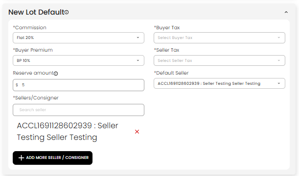

[Auction](./index.md) · [Auction Journal](../index.md)

# How to set default setting for all lots in Auction?

Last modified: 2026-05-28

Use **New Lot Default** in Auction Details to set default values used for lots in that auction.

These defaults are used while creating new lots, and can also flow to existing lots that are still using default values.

Setting **New Lot Default** is mandatory before creating lots in that auction.

---

## Where to set defaults

1. Open auction build screen.
2. Go to **Details** tab.
3. Open **New Lot Default**.
4. Set values and **Save**.

---

## Default fields for lots

Common defaults include:

- Commission
- Buyer Premium
- Reserve amount
- Sellers / Consigner
- Default Seller

If **Collect Taxes** is enabled for the auction, also set:
- Buyer Tax
- Seller Tax

---

## How this affects new lots

When auctioneer creates a new lot, these default values are pre-filled from auction defaults.

Auctioneer can still change values for a specific lot if needed.

---

## If defaults are changed later

When auction defaults are updated and saved:

- Lots that still use previous default values are updated to the new defaults.
- Lots that were customized with non-default values are kept as-is for those customized fields.

So default update works like a selective sync, not a forced overwrite of every custom lot setting.

---

## Related

- [How do I fill in the Details section?](build-details.md)
- [How do I create a lot in an auction?](../auction-lot/create-lot.md)
- [How do I import lots?](../auction-lot/import-lots.md)
- Dev: [Default settings for lots](../../auction/default-lot-settings.md)

