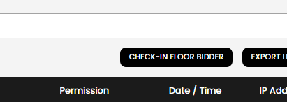
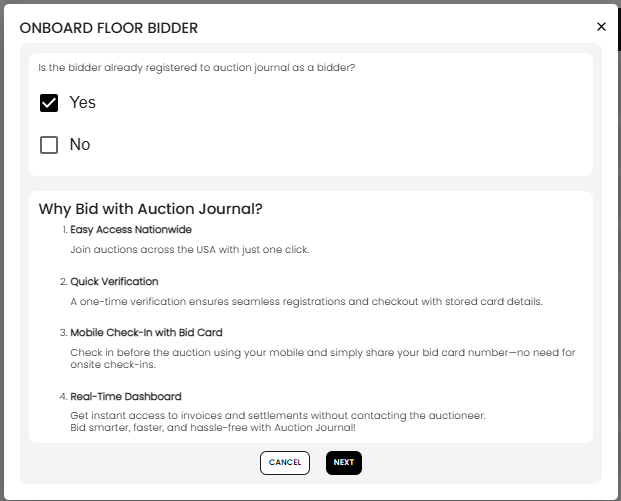
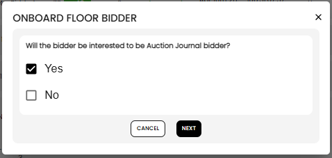
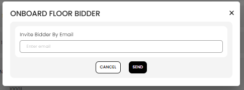
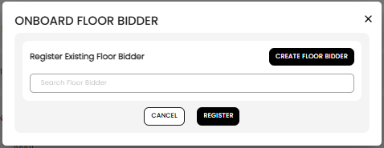

[Auction](./index.md) · [Auction Journal](../index.md)

# How do I check in a floor bidder for an auction?

**Check-in** adds someone to **this auction** so they can participate **on the floor** during an **Onsite With Live Webcast** sale. You enter their bids during live bidding; they do not use the public bidder website like online registrants.

Check-in is separate from creating a **floor bidder customer** in **Customers**. If the person is not in your client list yet, create them first—see [Who is a floor bidder? How do I onboard one?](../auctioneer-client/floor-bidder/index.md).

---

## When you can check in

| Requirement | Detail |
|-------------|--------|
| **Auction type** | **Onsite With Live Webcast** only |
| **Timing** | While the auction is within its **start** and **end** dates (registration window) |
| **Where** | **Auction Dashboard** → **Registration** tab → **Check-in Floor Bidder** |

The button is hidden for other auction types and after the auction **end date**.

---

## Open the wizard

Select **Check-in Floor Bidder**. The **Onboard Floor Bidder** wizard guides you through one of three paths.

---

## Step 1 — Is they already an Auction Journal bidder?

Answer: **Is the bidder already registered to Auction Journal as a bidder?**

- Select **Yes** or **No**, then **Next**.
- The screen also explains benefits of bidding through Auction Journal (nationwide access, verification, mobile check-in, dashboard).

### If you select **Yes**

You go to **Invite Bidder By Email** (see [Path A — invite existing bidder](#path-a--already-an-auction-journal-bidder-invite-only) below). You do **not** check them in as a floor client on this path—you email them to **register for this auction** online.

### If you select **No**

You go to Step 2.

---

## Step 2 — Will they become an Auction Journal bidder? (only if No at Step 1)

Answer: **Will the bidder be interested to be Auction Journal bidder?**

- **Yes** → **Invite Bidder By Email** ([Path B](#path-b--invite-to-sign-up-as-a-bidder)).
- **No** → **Register Existing Floor Bidder** ([Path C](#path-c--register-a-floor-bidder-client-immediate-check-in)).

---

## Path A — Already an Auction Journal bidder (invite only)

1. Enter the bidder’s **email** (must match an existing Auction Journal bidder account).
2. Select **Send**.

**What happens:** They receive an email to **register for this auction** on the public site. They are **not** checked in automatically—you will see them on the Registration list only **after** they complete online registration.

**If it fails:** Email not found, or they are **already registered** for this auction.

Similar to [Invite bidder](invite-bidders.md), but started from check-in.

---

## Path B — Invite to sign up as a bidder

Same **Invite Bidder By Email** screen as Path A.

1. Enter their **email**.
2. Select **Send**.

**What happens:** They receive an invitation to **create a bidder account** on Auction Journal. They are **not** registered on this auction until they sign up and register for the sale.

**If it fails:** The email already belongs to an existing bidder (use Path A instead).

---

## Path C — Register a floor bidder client (immediate check-in)

Use this when the person will bid **on the floor** through you, not via a bidder login.

1. Under **Register Existing Floor Bidder**, search and select a **floor bidder** customer (clients already registered for this auction are excluded).
2. If you need a new person, select **Create Floor Bidder** to add a floor client, then return and search again.
3. Select **Register**.

**What happens immediately:**

- They are added to **this auction** with a **bid card number**.
- Permission is **approved** for floor participation.
- Their note shows as **Floor Bidder**.
- They appear in the **floor bidders** area on the Registration tab (separate from online registrants).

During **live webcast**, you select them and enter bids on their behalf.

---

## Compare the three paths

| Path | Step 1 | Step 2 | Button | Checked in on this auction now? |
|------|--------|--------|--------|-------------------------------|
| **A** | Yes | — | **Send** | No — must register online after email |
| **B** | No | Yes | **Send** | No — must sign up as bidder first |
| **C** | No | No | **Register** | **Yes** — floor registration created |

---

## After check-in (Path C)

- Review them on [View registrations](view-registrations.md) (floor bidder section).
- Bid card and buyer permission come from the client profile and auction defaults.
- For permission changes, see [Registration acceptance](registration-acceptance.md).

---

## Tips

- Use **Path C** for in-room participants without an Auction Journal login.
- Use **Path A** when someone already has a bidder account but has not registered for this sale.
- Create the **floor bidder customer** under **Customers** before Path C if they are new to your CRM.
- Do not use the same email for a floor-only client and an active bidder account—see [floor bidder vs online bidder](../auctioneer-client/floor-bidder/index.md#when-to-use-a-floor-bidder-vs-an-online-bidder).

---

## Related

- [Who is a floor bidder? (create customer)](../auctioneer-client/floor-bidder/index.md)
- [See which bidders registered](view-registrations.md)
- [Invite bidders to an auction](invite-bidders.md)
- [Registration acceptance](registration-acceptance.md)
- [How do I use rings?](rings.md) · [Auction Dashboard](auction-dashboard.md#registration-tab)
