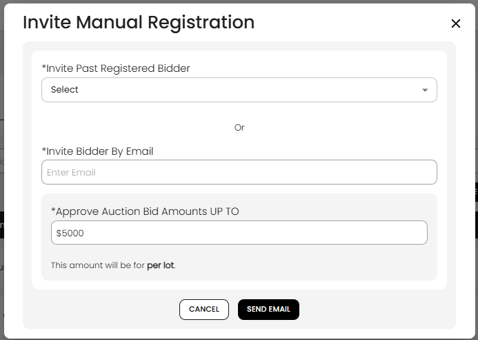

[Auction](./index.md) · [Auction Journal](../index.md)

# How can an auctioneer invite bidders to an auction?

Use **Invite bidder** on the **Auction Dashboard → Registration** tab to email known bidders and offer a **maximum bid amount** for when they register. The invite does **not** register them by itself—they still complete [registration on the public site](../bidder/register-for-auction.md).

The amount you set here is a **starting cap stored with the invitation**. Their final **approval status** (approved, pending, or declined) and permission on the auction still follow normal rules (bidder score, customer bid permission, auction defaults). See [Registration acceptance](registration-acceptance.md).

---

## When you can invite

| Rule | Detail |
|------|--------|
| **Where** | **Auctions** → **Dashboard** → **Registration** → **Invite bidder** |
| **Auction open** | Button is **disabled after the auction end date** |
| **Already registered** | If you invite **by email**, someone already registered for this auction cannot be invited again (you get an error) |

---

## Open the invite form

1. Open the auction **Dashboard** and the **Registration** tab.
2. Select **Invite bidder**.

---

## Choose who to invite

Use **one** of these methods (not both at once in the same send):

### Invite past registered bidders

1. Under **Invite Past Registered Bidder**, open the dropdown.
2. Pick one or more bidders (labels show name, bidder ID, and **Past bidder** when they registered for your other auctions before).
3. **Select all past bidders** adds everyone still in the list.
4. Selected names appear below the dropdown; use **X** to remove one, or **Clear All** when many are selected.

The list combines:

- Bidders who registered for **your other auctions** but are **not** already registered for **this** auction, and  
- Other bidders from your auctioneer bidder list (excluding those already on this auction).

### Invite by email

1. Under **Invite Bidder By Email**, enter the bidder’s **email**.
2. The email must match an **existing Auction Journal bidder account** for the standard invite and stored cap. If no account exists, the system may still send a generic invitation email without saving the bid cap for registration (they must sign up as a bidder first).

**Note:** The email field is disabled while you have **past bidders** selected in the list—you clear selections to use email instead.

---

## Set the bid permission amount

| Field | Meaning |
|-------|---------|
| **Approve Auction Bid Amounts UP TO** | Dollar cap you are offering with this invite (defaults from the auction’s **Bidder Permission** in build settings). |
| **Per lot** | The helper text under the field applies this limit **per lot**, not as one total across the whole auction. |

Enter an amount greater than zero, then select **Send Email**.

---

## What happens after you send

| Step | What occurs |
|------|-------------|
| 1 | Auction Journal saves an **invitation** for each bidder (auction + offered cap), if they did not already have one for this sale. |
| 2 | Each bidder receives an **invite email** with a link to register for the auction. |
| 3 | When they register, the invited cap can apply as their **bid permission** (`bidderPermissionFrom` = invitation), **unless** customer-level approve/decline or score rules override the **status** (for example pending or declined). |
| 4 | They appear on your **Registration** tab only **after** they complete registration—not when you send the invite. |

---

## Invite vs other Registration actions

| Action | Purpose |
|--------|---------|
| **Invite bidder** | Ask specific bidders to **register**; stores offered cap on invitation |
| **Email all** | Message people **already registered** for this auction |
| **Export list** | Download current registrants |
| **Check-in floor bidder** | Onsite only—[check in a floor bidder](floor-bidder-check-in.md) |

---

## Tips

- Set a realistic **per-lot** cap; bidders see effective limits after registration rules run.
- Invite early so bidders have time to register before bidding opens.
- For repeat buyers you always trust, use [customer bid permission](../auctioneer-client/bid-permission.md) in addition to or instead of one-off invites.

---

## Related

- [How to see all bidders registered in my auction](view-registrations.md)
- [Registration acceptance](registration-acceptance.md)
- [How bidders register for an auction](../bidder/register-for-auction.md)
- [Check in a floor bidder](floor-bidder-check-in.md)
- [Auction Dashboard — Registration](auction-dashboard.md#registration-tab)
