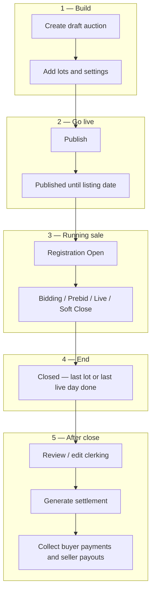
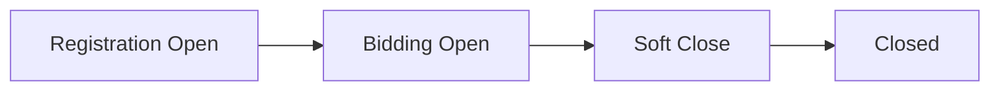
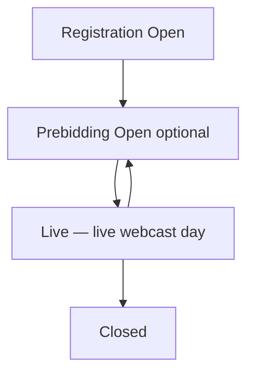
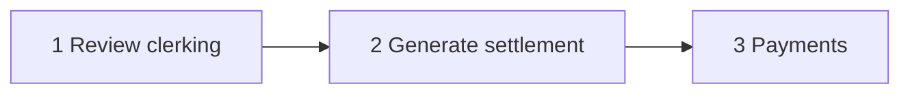

[Auction](./index.md) · [Auction Journal](../index.md)

# Explain the auction lifecycle

Last modified: 2026-05-29

An auction in Auction Journal moves from **draft** (only you see it) through **publish**, **running** (registration and bidding), **closed**, then **clerking**, **settlement**, and **payments**. This page is the full journey; for status labels while the sale runs, see [Auction stages](auction-stages.md). For date fields and clocks, see [Bidding dates](bidding-dates.md).

---

## Lifecycle at a glance

---

## 1. Create a draft auction

1. In the **Auctioneer Dashboard**, open **Auctions** and click **+ NEW AUCTION**.
2. Choose **auction type**, **name**, and **listing date** (when the sale becomes visible and registration can open).
3. The system saves a **draft** (`Draft` on the dashboard). Only your company sees it.

You can **Save as Draft** anytime while building. Details: [Create an auction](create-auction.md), [Prerequisites](auction-prerequisites.md).

---

## 2. Build the auction (still draft)

Before publish, complete the build tabs:

| Tab | Purpose |
|-----|---------|
| **Details** | Identity, images, default lot fees, shipping, rings (onsite) |
| **Upload Settings** | Schedule, bidding rules, registration email, increments |
| **Lots** | Catalog (required for most types) |
| **Expenses** | Optional in-house auction charges |

Add and mark lots **auction ready** when your type requires a catalog. See [Upload Settings](build-upload-settings.md), [Create a lot](../auction-lot/create-lot.md).

---

## 3. Publish

When validation passes, click **Publish**.

| What changes | Meaning |
|--------------|---------|
| Auction is **published** | Sale is committed under your rules; bidders will see it on schedule |
| Dashboard may show **Published** | Listing date not reached yet — promotion and registration follow your dates |
| QR-only lots removed | Publish cleanup |
| Online types with lots | **End date** and each lot’s close time may be calculated from closed bidding and soft close |

After publish you use **Save Changes** instead of Publish. Some fields lock as time advances. Dev detail: [Auction build](../../auction/build.md).

---

## 4. Running sale (after listing date)

Clocks drive dashboard labels via your **listing date**, **bidding dates**, and **auction type**. See [Bidding dates](bidding-dates.md).

### Online Timed / Online Absolute / Absentee

| Stage | What happens |
|-------|----------------|
| **Registration Open** | Bidders register on Auction Journal |
| **Bidding Open** | Internet bidding on lots |
| **Soft Close** | After closed bidding time; lots end one by one ([soft close](soft-close.md)) |
| **Closed** | After **end date** (last lot finished) |

### Onsite With Live Webcast

| Stage | What happens |
|-------|----------------|
| **Registration Open** | Bidders register |
| **Prebidding Open** | Optional catalog bids on the website before or between live days |
| **Live** | You **Start Your Live Auction**, enter a ring, stream, clerk ([live bidding](live-bidding.md)) |
| **Closed** | After **last live day** (midnight in your timezone) or all bidding days marked complete |

More detail: [Auction stages](auction-stages.md).

---

## 5. Auction closes

The sale is **Closed** when:

- **Online:** current time is past **end date** (after soft close finishes on the last lot).
- **Onsite:** **end date** passed and/or every scheduled **bidding day** is marked closed.

Bidding stops for bidders on the public site. The platform may apply **default clerking** on lots that never got an outcome. See [What happens automatically when an auction closes?](after-auction-closes.md).

---

## 6. After close — your workflow

These steps are **auctioneer-driven** (not all run the instant the clock hits closed):

| Step | You do | Notes |
|------|--------|--------|
| **Clerking** | Confirm **Sold**, **Pass**, **Hold**, hammer, buyer on each lot | Fix mistakes before settlement when possible — [Clerking](clerking.md), [Edit clerking](edit-clerking.md) |
| **Settlement** | Run **generate settlement** once when ready | Buyer and seller invoices — [Generate settlement](generate-settlement.md) |
| **Payment** | Buyers pay balances; sellers receive payouts | Stripe Connect — [Settlement payment](settlement-payment.md) |

**Order:** Clerking should be correct **before** generate when you expect accurate invoices. Starting payment on a buyer’s settlement can limit further clerking changes for that buyer.

---

## Quick reference — dashboard status vs your work

| Dashboard status | Typical auctioneer focus |
|------------------|---------------------------|
| **Draft** | Build lots and settings; **Publish** when ready |
| **Published** | Final checks before listing date |
| **Registration Open** | Promote sale; approve registrations |
| **Bidding Open / Prebidding Open / Soft Close / Live** | Monitor bidding; run live rings (onsite) |
| **Closed** | Clerking → settlement → payments |

---

## Related

- [Create an auction](create-auction.md)
- [Bidding dates](bidding-dates.md)
- [Auction stages](auction-stages.md)
- [Soft close](soft-close.md) (online)
- [After the auction closes](after-auction-closes.md)
- [Auction types](auction-types.md)
