[Auction](../index.md) · [Auction Journal](../index.md)

# Live bidding (onsite webcast)

Last modified: 2026-06-02

These answers apply to **Onsite With Live Webcast** auctions when you run a **live ring** in the Auctioneer Dashboard. For timed catalog bidding on the public site, see [Online bidding on auction lots](../auction-lot/bidding.md).

---

## How do I start live bidding?

1. Open a **published** onsite live webcast auction in the **Auctioneer Dashboard**.
2. Confirm the auction’s **live bidding day** has started (you cannot enter a ring before the scheduled start).
3. Click **Start Your Live Auction**.

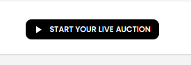

*Use this button to begin the live-ring setup flow.*

4. If the auction has **multiple rings**, choose which **ring** to open for bidding. Each row shows the ring number, current status, and lot range.

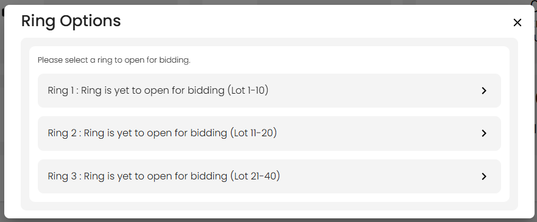

*Choose the ring you want to run. Closed or already-live rings may be disabled.*

5. In **Device Testing**, choose your **Camera** and **Audio** device. Use **Open Camera** and **Test Recording** to check the setup, then select **Enter Ring**.

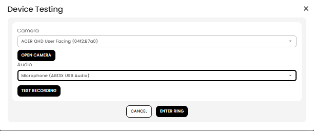

*Camera and audio are required before entering the live ring.*

6. A **new browser tab** opens to the live ring screen. If you see **Go Live With Webcast**, click **Play** to start the webcast bidding session for that ring.

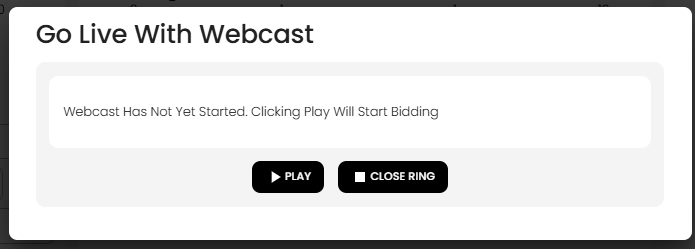

*Play starts the ring session; Close Ring should only be used when you do not want to run that ring.*

7. After the ring is live, use the live bidding window to open lots, stream, chat, take floor/internet bids, and clerk lots.

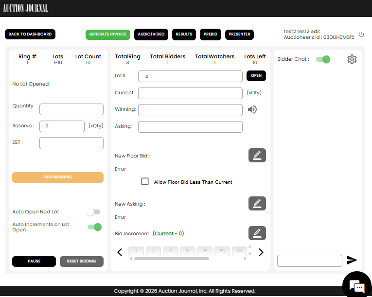

*The live ring window is where the auctioneer opens lots, controls bidding, and manages the webcast.*

**Before you start**

- The auction must be **published** and not past its end date.
- The ring must not be **completely closed** (all lots in that ring already clerked sold or pass).
- The **live webcast service** must be running — if the system reports the server is down, contact support; you cannot start until it is healthy.
- Your browser must allow the dashboard to open a **new tab**. If popups are blocked, allow popups for Auction Journal and try again.

**If you disconnect**

- If you close the live tab without closing the ring properly, the dashboard may show a **reconnect** countdown. Return within that window or another auctioneer action may be needed.

See also [How does Ring work in an auction?](rings.md).

---

## How to reopen a ring?

If a ring was already opened earlier (for example **Ring 1**), you can reopen it and continue work as long as either condition is true:

- The auction is still open (not closed).
- That ring still has lots pending to be clerked.

### Steps

1. Return to the auction dashboard and click **Start Your Live Auction** again.
2. In **Ring Options**, select the previously opened ring you want to continue.
3. Enter the ring and reopen the next pending lot.

Once the ring is restarted, the auctioneer can continue opening remaining lots and complete clerking for them.

---

## How do bid increments work in live bidding?

During a live ring, bid steps are controlled from the **price / bidding panel** on the live screen — not from the catalog “bid $X” button alone.

### What the auctioneer controls

- **Current increment** — the step size used for the next **asking** price and for standard floor bids.
- **Increment grid** — quick picks from your auction’s increment schedule (same ladder idea as catalog bidding, but you choose the active step live).
- **Custom increment** — enter a one-off step when needed (unless increment changes are locked).
- **Auto increment on lot open** — when enabled, opening a new lot can set asking from the current increment automatically.

### What bidders see

- **Internet bidders** on the public **live webcast** page bid at the **asking** amount shown (one click = one step at the current increment unless they use max bid where allowed).
- **Floor bidders** do not click online; you record their bids at the increment or a **custom amount** you enter.

### Pre-bidding increments

Before the ring goes live, internet prebids on the catalog use the auction’s normal **catalog increment ladder**. When the live ring opens, live increment controls take over for that session.

---

## How do I stream during live bidding?

### When you start the ring

During **Start Live**, you choose which **camera** and **microphone** to use. Those choices are saved for the ring session.

### In the live ring tab

1. Use **AUDIO** or **VIDEO** in the top toolbar to open device selection again or adjust inputs.
2. Start the **video stream** when you are ready for bidders to watch (Amazon IVS under the hood).
3. You can **stop streaming** at any time without necessarily closing the ring.

**Tips**

- Test devices before the sale if possible.
- The **Presenter** window is for displaying lot information to the room — it does not replace your stream setup on the clerk screen.

---

## How does chat work in live bidding?

### Bidder chat

- A **chat panel** on the live ring screen shows messages from registered bidders watching the stream.
- You can **turn bidder chat off** so bidders cannot send or see chat during the ring.
- **Canned messages** are shortcuts you define (up to four) to reply quickly during the sale.
- **Viewer count** reflects how many people are watching the stream.

### System and auctioneer messages

The chat stream also shows structured events such as **floor bids**, **asking price**, **sold**, **fair warning**, **pause**, and **reserve not met** warnings.

### Push notifications to bidders

You can send a **title** and **message** that appear as an instant popup on bidders’ live webcast screens (for example “Next lot is heavy equipment — stay tuned”).

### Warning banners

Separate from chat text, the ring can show **fair warning**, **reserve not met**, **bidding paused**, and **asking price** style alerts to bidders.

---

## What are canned messages used for, and how do I set them?

Canned messages are **fast message buttons** in live webcast chat. They help the auctioneer post repeated alerts quickly (for example: “10 min remaining”, “Bid fast”, or “Bidding paused”) without typing each time.

### What they do during live bidding

- The configured canned messages appear as quick buttons in the auctioneer chat panel.
- Clicking a button immediately sends that text to the bidder chat stream as an auctioneer announcement.
- They are useful for high-speed moments when you need consistent, repeatable updates.

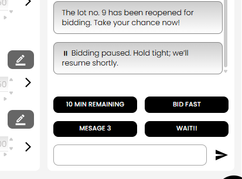

*The quick buttons let the auctioneer send preset alerts instantly to bidders in chat.*

### How to set or change canned messages

1. Enter the live ring and open the **Chat** panel.
2. Click the **Settings** icon in chat.
3. Select **Modify Canned Messages in bidder’s chat for quick reply**.
4. Enter your text in **Canned Message 1** to **Canned Message 4**.
5. Click **Save**.

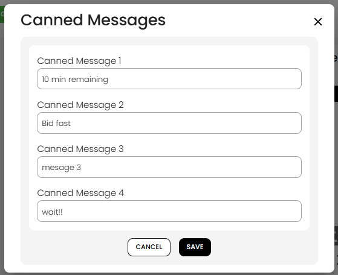

*Use this settings dialog to create or update up to four canned quick-reply messages.*

You can edit these messages anytime while running the ring, based on your sale pace and communication style.

---

## How to send a custom push notification to registered bidders?

In a live ring, the auctioneer can send a custom push notification to bidders watching that ring on [auctionjournal.com](https://auctionjournal.com/). This is useful for urgent updates or reminders (for example, “Ring is open now”, “Lot reopened”, or “Bidding resumes shortly”).

### Steps

1. Open the live ring and go to the **Chat** panel.
2. Click the **Settings** icon.
3. Select **Send custom Push Notification to registered bidder’s**.
4. Enter a **Title** and **Description** (both are required).
5. Click **Save** to send the notification.

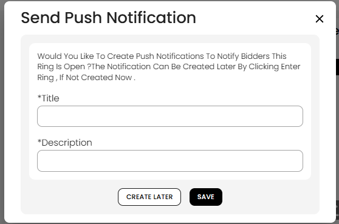

*Use this popup to send a custom alert to bidders currently associated with the live ring.*

If you click **Create Later**, the popup closes without sending a notification.

---

## How to show bidding information to onsite bidders?

In live auctions, online bidders watch and bid from [auctionjournal.com](https://auctionjournal.com/). For floor (onsite) bidders, the auctioneer should open the **Presenter** view and display it on a large screen in the hall so everyone can follow live bidding status.

### Why use Presenter for floor bidders

- It gives onsite bidders a clean, read-only live view without clerk controls.
- It shows key lot details and bidding values while the auctioneer continues controlling bids in the live ring tab.
- It helps the floor crowd track asking, current winning amount, ring number, and reserve status in real time.

### How to show the Presenter screen

1. Start and enter your live ring from the Auctioneer Dashboard.
2. In the top toolbar, click **PRESENTER**.
3. Open that Presenter window/tab on a projector or large display visible to floor bidders.
4. Keep running the auction from your main live ring screen; the Presenter updates as lot and bid data changes.

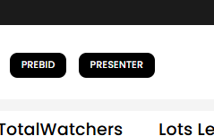

*Use the Presenter button to open the floor display view from the live ring toolbar.*

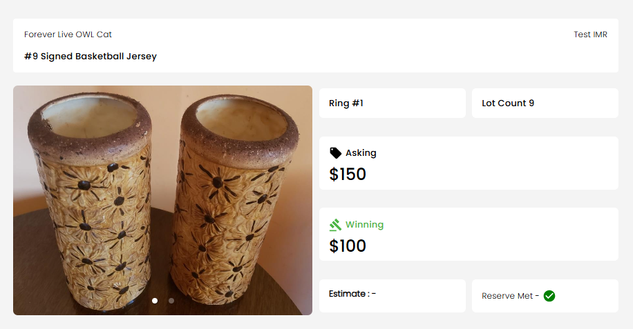

*The Presenter screen shows lot image, lot number, ring, lot count, asking, winning amount, estimate, and reserve status for floor bidders.*

### Practical setup tips

- Keep the Presenter on a dedicated full-screen display in the hall.
- Use the main clerk/auctioneer screen separately to accept and register floor bids.
- Floor bidders bid offline (verbally/signals), and the auctioneer records those bids in the live ring.

---

## How to accept a floor bidder's bid?

Floor bidders in the hall do not place bids directly in Auction Journal. They watch the presenter/bidding screen onsite and call out or signal bids, then the auctioneer accepts those bids in the live ring controls.

### Ways to accept a floor bid

1. **Use increment-pattern values (New Floor Bid)**  
   In **New Floor Bid**, choose one of the suggested values based on your current increment pattern.

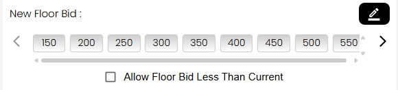

*Use quick floor-bid values for fast, increment-based bidding.*

2. **Enter a custom floor bid amount**  
   Open the **New Floor Bid** input modal, type any valid bid amount, then click **Set**.

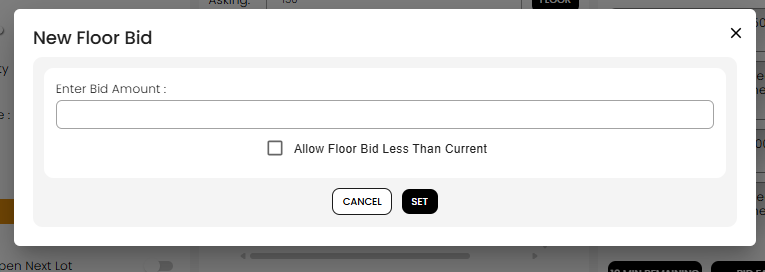

*Use this modal when the floor bid amount is not one of the quick preset values.*

3. **Allow lower-than-current floor bids (override mode)**  
   Enable **Allow Floor Bid Less Than Current** when you intentionally need to accept a lower floor bid, then place that bid by quick value or custom amount.

4. **Use FLOOR WINNING to switch winner to floor at current amount**  
   If an internet bidder is currently winning, click **FLOOR WINNING {amount}** to make the floor bidder the winner at that same current amount.

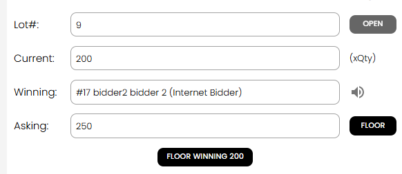

*This action keeps the amount the same but changes the current winning side to floor bidder.*

### Notes

- Floor bids are entered by the auctioneer on behalf of onsite bidders.
- The live ring and presenter update so both onsite and online participants can see the latest bidding state.

---

## How to reopen a clerked lot?

Yes. A lot that was already clerked (for example **Lot 9 sold at $200**) can be reopened in live bidding when the auctioneer intentionally confirms reopening.

### Reopen flow

1. In the live ring, enter the lot number and click **OPEN**.
2. If that lot was previously clerked as sold, a warning confirmation appears.
3. Click **YES** only if you want to reopen the clerked lot.
4. The lot reopens and bidding continues from the previously clerked amount (for example **$200**).
5. Continue bidding as normal, then clerk the lot again at the final amount/result.

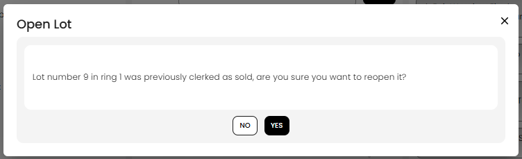

*The system asks for explicit confirmation before reopening a previously clerked sold lot.*

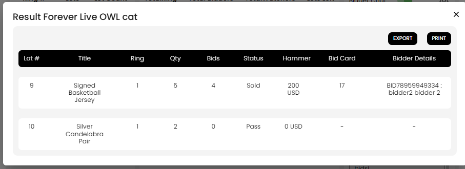

*After reopening, bidding can continue and the lot can be clerked again with an updated final result.*

### Important note

- Reopening a clerked lot is a deliberate override action. Use it only when you intentionally need to continue bidding on that lot.

---

## How to open a lot in another ring?

Yes. In a multi-ring onsite live webcast auction, you can open a lot from another ring while staying in the current ring.

Example:

- **Ring 1 range:** Lot 1-10
- You can still open **Lot 11** (normally in Ring 2) from Ring 1 after confirmation.

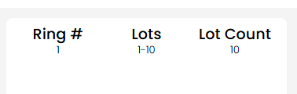

*This example shows Ring 1 configured for lots 1-10.*

### Steps

1. In your current live ring, enter the lot number from another ring (for example **11**) and click **OPEN**.
2. A warning appears asking if you are sure you want to open that lot in the current ring.
3. Click **YES** to proceed.
4. The lot opens in the current ring and bidding continues from there.

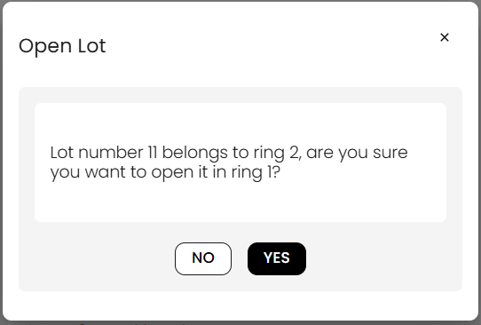

*Use Yes only when you intentionally want to run that lot in this ring.*

### What changes after cross-ring open

- The current ring’s lot count/lots-left increases for that lot.
- The original ring’s lot count/lots-left decreases accordingly.
- This behavior applies regardless of whether that lot was previously clerked or not (with additional confirmations where applicable).

---

## How does reset bidding work?

The auctioneer can reset bidding at any time for the currently opened live lot.

### What reset bidding does

- It resets only the **live webcast bidding** on that open lot.
- The lot’s live bids/counters are cleared for the current live run.
- Bidding starts again from the lot’s pre-bidding baseline state.

### What it does not do

- It does **not** erase pre-bidding history itself.
- Pre-bidding values remain the baseline used to restart bidding.

### Typical use

Use **Reset Bidding** when the auctioneer wants to restart live bidding flow on the open lot without deleting pre-bid setup.

After reset, bidders see the lot continue with a fresh live bidding run from the pre-bid baseline.

---

## How does bidding work in live bidding?

In live bidding, two groups can bid on the same open lot:

- **Online bidders** — bidders with an Auction Journal account who join from [auctionjournal.com](https://auctionjournal.com/).
- **Floor bidders** — bidders physically present at the auction location. They watch the bid status screen and call out or signal bids to the auctioneer.

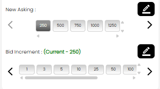

*The live display identifies the active lot before bidding starts or continues.*

### Internet bidders (online)

- Sign in to [auctionjournal.com](https://auctionjournal.com/) with a bidder account.
- Open the auction’s **live webcast** page and watch the current lot.
- Click to bid at the **asking** amount (or enter a **maximum bid** when the auction uses max bidding).
- Bids are validated against **registration** and **bid permission** like catalog bidding.
- If they were **outbid** during **pre-bidding**, they can bid again live once the lot is open.

### Floor bidders (in the room)

- Present the live bid status screen to floor bidders so they can see the active lot, asking amount, current winning amount, and reserve/estimate information.

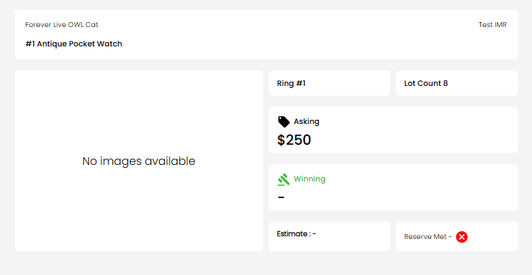

*Floor bidders can follow the same live lot status while bidding in the room.*

- When a floor bidder bids, the auctioneer notes the amount and enters it in the live ring using **New Floor Bid**.
- You can choose one of the suggested amounts, use the current increment, or edit a custom amount when the sale requires it.
- Select **FLOOR** / floor bid controls to record that the floor bidder is currently winning.

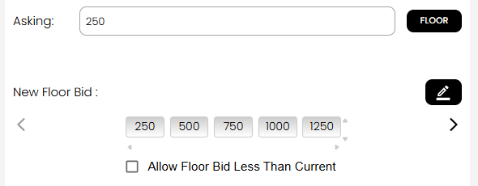

*The auctioneer records floor bids from the live bidding controller.*

### Closing the lot

- Run **fair warning** when you are about to sell.
- **Sold** — to the current internet high bidder or to a **floor bidder** (you may enter a floor bidder card number).
- **Pass** — no sale on the lot.

After clerking, the lot leaves the live ring and catalog updates for settlement later. See [How does clerking work in an auction?](clerking.md).

---

## How are lots opened for live bidding?

1. In the live ring tab, type the **lot number** you want to open in the **Lot#** field.
2. Click **OPEN**.

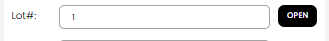

*Type a lot number directly and select **OPEN** to bring that lot into the live ring.*

3. Confirm any **warnings** (for example lot in another ring, already clerked, or not auction ready).
4. For **non-catalogued** sales, if the number does not exist, you may be prompted to **create an instant lot** first.

**After open**

- If the lot has no asking price yet, you may need to set **asking** or confirm **increment** before bidding starts (`Set next bid` flow).
- **Auto Open Next Lot** (optional) opens the following lot automatically after you clerk the current one.

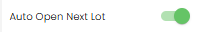

*Turn this on when you want the system to open the next suggested lot after the current lot is sold or passed.*

**Ring rules**

- Lots are normally opened within that ring’s **lot number** or **sale order** range. Opening a lot from another ring can move it into the current ring (with a warning).

---

## What are the different controllers in live bidding?

On the live ring screen, controls are grouped by job:

| Area | What you use it for |
|------|---------------------|
| **Price / bidding panel** | Asking price, floor bid, increment step, custom amounts |
| **Lot column (left)** | Lot photos, title, **Sold / Pass**, fair warning, auto-open and auto-increment toggles |
| **Ring column (center-right)** | Lot number, **OPEN**, current bid, winning bidder |
| **Chat** | Bidder messages, canned replies, notifications |
| **Top toolbar** | Stream, presenter link, prebid/results, pause/close ring, back to dashboard |

Engineers: see dev [Architecture and controllers](../../auction/onsite-livewebcast/architecture-controllers.md).

---

## What is the difference between pre-bidding and live bidding?

| | **Pre-bidding** | **Live bidding** |
|---|-----------------|------------------|
| **When** | Before you **start** the live ring (if enabled on the auction) | After you **enter** the ring and **open** a lot |
| **Where** | Public **catalog** (lot pages) | **Live webcast** page + your live ring tab |
| **Who drives price** | Bidders place flat or max bids online | Auctioneer **opens** lots; floor + internet bids in real time |
| **Starting amount** | Highest prebid becomes the **opening** bid when the lot is opened live | Continues from that opening; max bids may still auto-bid up to their ceiling |

Use **Prebid** from the live toolbar to review prebid activity. Internet bidders who only prebid still need to watch live or accept that the auctioneer may sell to others in the room.

---

## Explain live bidding window. How to use it?

The **live bidding window** is the full-screen tab opened after **Start Live**.

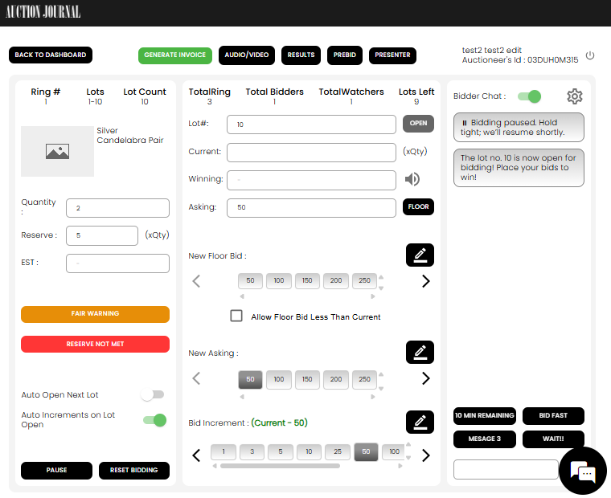

*The live bidding window is split into lot details on the left, bidding controllers in the middle, and chat on the right.*

### Layout

| Area | What you do there |
|------|-------------------|
| **Top bar** | Go **Back to Dashboard**, generate invoice, manage **Audio/Video**, open **Results**, view **Prebid**, open **Presenter**, and see auctioneer account details. |
| **Left panel — lot details** | See the active ring number, lot range, lot count, current lot image/title, quantity, reserve, estimated value, **Fair Warning**, **Reserve Not Met**, **Auto Open Next Lot**, **Auto Increments on Lot Open**, **Pause**, and **Reset Bidding**. |
| **Middle panel — live bidding controllers** | Open a lot by number, see current / winning / asking amounts, set **New Floor Bid**, set **New Asking**, choose **Bid Increment**, and allow or block floor bids lower than the current amount. |
| **Right panel — chat window** | Turn **Bidder Chat** on/off, read bidder/system messages, use canned quick-message buttons, type announcements, and send them to bidders. |

### Live ring control buttons

- **Back to Dashboard** — leaves the live tab and returns to the auction dashboard.
- **Generate Invoice** — prepares invoice documents without leaving the live ring.
- **Audio/Video** — changes or tests streaming devices and starts/stops streaming.
- **Results** — opens live results for the auction.
- **Prebid** — reviews pre-bids before or during the ring.
- **Presenter** — opens the display-friendly presenter view in a separate window.
- **Pause** — temporarily pauses ring bidding.
- **Reset Bidding** — resets bidding on the currently open lot when you need to restart the lot’s live bidding state.

### Presenter window

Open **Presenter** for a second display (projector or second monitor) showing lot number, title, current bid, and asking — without duplicating clerk controls.

### Pause and close

- **Pause** — temporarily stops live bidding on the ring (bidders see a paused state).
- **Close ring** — ends the ring session when you are finished for the day (cannot close while a lot is still open without addressing it).

### Typical flow

```text
Start Live → select devices → live tab opens → OPEN lot → set asking if needed
→ take floor and internet bids → fair warning → Sold or Pass → next lot
```

When every lot in the ring is clerked, the ring can be **completely closed** and you cannot re-enter it for that auction.

**Related:** [Rings](rings.md) · [Clerking](clerking.md) · [Instant lot during live](../auction-lot/instant-lot-live.md)
