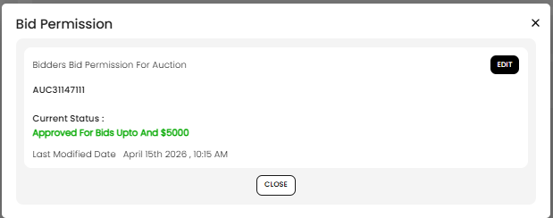
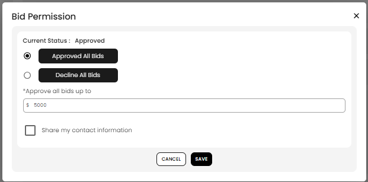

[Auction](./index.md) · [Auction Journal](../index.md)

# How does bidder registration acceptance work in an auction? Can the auctioneer change it manually?

When a bidder registers for your auction, Auction Journal assigns a **permission status** for that sale: **approved**, **pending** (needs your review), or **declined**. You can change that status **manually** from the **Auction Dashboard**. You can also set rules on the **customer** profile so future registrations are handled automatically.

---

## How a bidder registers (before you review them)

On the public auction page, the bidder opens **Auction Registration**, confirms their profile details, and submits the form. That call creates the registration row and runs the automatic acceptance rules below.

| Step | What the bidder does |
|------|----------------------|
| **Payment methods** | Shown when your auction uses **Verified Bidder** registration. They **select a saved card** from the dropdown or choose **Add new card details**. The card id is sent as `paymentMethodID` and stored on the registration. |
| **Special note to auctioneer** | Optional message (saved as their note on the registration). |
| **Terms & conditions** | Reads your auction terms (from **Build Auction → Upload Settings → Registration**) and checks the acknowledgment box. |
| **Accept** | Submits registration. If terms are not checked, they see an error and cannot register. |

If the auction uses **Registered Bidder** registration (not verified), the payment block is not shown on this form; the bidder still accepts terms and selects **Accept**.

After submit, they may see **success**, **pending** (contact you), or **declined** depending on score and customer bid permission—see the table in the next section.

---

## Where you see registrants

The full list is on **Auction Dashboard → Registration**. Step-by-step and column reference: [How do I see which bidders registered for my auction?](view-registrations.md).

---

## What the bidder sees after they register

| Status | Meaning for the bidder |
|--------|-------------------------|
| **Approved** | They can bid when bidding is open (up to the dollar cap shown). |
| **Pending** | Registration is on hold until you approve or decline. They are told to contact you. |
| **Declined** | They cannot bid on this auction. They are told to contact you about bid permission. |
| **Permanently approved / permanently declined** | Same as approved/declined, but driven by your **customer bid permission** (applies across your auctions). |

There is no extra “enable bidding” step after you approve—approval is what allows bidding for that auction.

**Bidder help:** [Why was my registration rejected or still pending?](../bidder/registration-rejected-or-pending.md)

---

## How acceptance is decided automatically

When a bidder completes **online registration** for your auction, the system:

1. Confirms the auction is in the **registration window** (between your auction **start** and **end** dates).
2. Confirms they meet your auction’s **registration tier** (registered vs verified bidder, if you required verification).
3. Links them to a **customer** record under your account (created or updated automatically).
4. Sets **permission for this auction** using, in order:

| Source | Result |
|--------|--------|
| Customer **Approved all bids** | Registration is **permanently approved** with your cap. |
| Customer **Decline all bids** | Registration is **permanently declined** with your reason and notes. |
| Customer **Default permission** and bidder **score below zero** | Registration is **pending** until you act. |
| Customer **Default permission** and score not negative | Registration is **approved** with your auction’s default bid cap. |
| You **invited** them with a specific cap | That invited cap is used when it applies. |

Your auction’s **default bid permission** (maximum bid amount) is set under **Build Auction → Upload Settings → Registration**. See [Upload Settings — Registration](build-upload-settings.md).

For customer-level rules before they register, see [Set bid permission for a customer](../auctioneer-client/bid-permission.md).

---

## Can you change acceptance manually?

**Yes.** Use **View Permission Status** on the Registration tab (steps above).

### Approve or decline for this auction only

Use this when someone is **pending** or you want to change approval for **one sale** without changing their standing on every auction.

1. Expand the bidder’s row → **View Permission Status**.
2. Review **Current Status** (for example approved up to a dollar cap, or pending).

3. Select **EDIT**.
4. Choose **Approved All Bids** or **Decline All Bids**, fill in the cap or decline reason, and optionally **Share my contact information**.

5. Select **Save**.

The bidder receives an email when you approve or decline.

### Set permanent permission (all your auctions)

Use this when you want the same rule every time this person registers for **any** of your auctions.

1. On the same registration row, expand → **View Profile**.
2. In **Bidders Permanent Permission for all auction**, select **Edit**.
3. Choose **Default permission**, **Approved all bids**, or **Decline all bids** (same options as on the customer profile).
4. Select **Save**.

This updates their **customer** bid permission and the current registration’s permanent-style status. See [Set bid permission for a customer](../auctioneer-client/bid-permission.md).

---

## Pending registrations

**Pending** is not cleared automatically. It usually happens when:

- The customer uses **default permission**, and  
- The bidder’s **score is negative** at registration time.

**What to do:** Open **View Permission Status** for that row and **approve** or **decline**. Until you do, they should not be treated as approved bidders for that auction.

---

## One registration per bidder per auction

After a bidder has registered once for an auction (any status), they **cannot** submit a second online registration for that sale. If you need a different outcome, change permission manually as above—not by asking them to register again.

---

## Tips

- Set **customer bid permission** early for repeat buyers you always trust or always block.
- Review the **permission** column on the Registration tab for orange **pending** rows before bidding opens.
- Use **per-auction** approval/decline for one-off decisions; use **permanent permission** when the rule should apply to every future sale.

---

## Related

- [Auction Dashboard — Registration tab](auction-dashboard.md#registration-tab)
- [Set bid permission for a customer](../auctioneer-client/bid-permission.md)
- [Upload Settings — Registration defaults](build-upload-settings.md)
- [What is bidder score?](../bidder-score/score.md)
- Developer reference: [Registration acceptance](../../auction/registration-acceptance.md) · [Auction registration](../../auction/registration.md)
