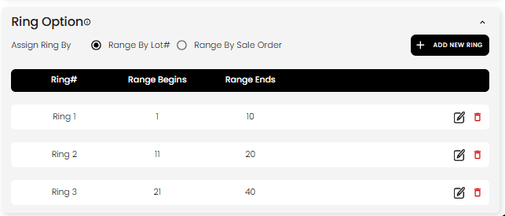
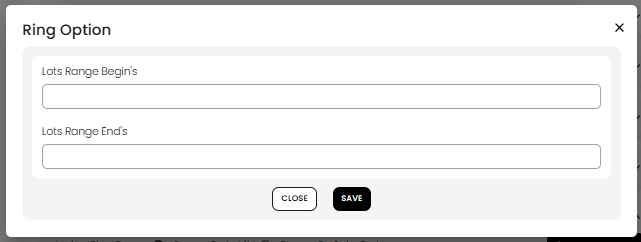

[Auction](./index.md) · [Auction Journal](../index.md)

# How does Ring work in an auction?

---

## When rings apply

**Rings** are used only for **Onsite With Live Webcast** auctions. They let you split the sale into one or more **rings** (for example Ring 1 for lots 1–10, Ring 2 for lots 11–20). On live bidding day you **open one ring at a time**, clerk lots in that ring, then **close** the ring when you are done with those lots.

Online Timed, Online Absolute, and Absentee auctions do **not** use rings.

---

## Single ring vs multiple rings

In **Details → Auctions Information**, onsite auctions show **Auction Will Have Multiple Rings**.

| Setting | What you configure |
|---------|-------------------|
| **Unchecked** (default) | One implicit ring. You do **not** see the **Ring Option** table. The system assigns all auction-ready lots to one range when you publish (based on min/max lot# or sale order). |
| **Checked** | **Ring Option** appears under **Details**. You define each ring’s **range begin** and **range end** and how ranges are assigned. |

Turning multiple rings **on** clears any ring rows you had saved, so set ranges after you enable the checkbox.

---

## Assign ring by (multiple rings)

Under **Ring Option**, choose **Assign Ring By**:

| Option | Each ring covers |
|--------|------------------|
| **Range By Lot#** | Lot numbers from **Range Begins** through **Range Ends** (inclusive). |
| **Range By Sale Order** | Sale order numbers in that inclusive range. |

Example: Ring 1 with begins **1** and ends **10** includes every lot whose lot# (or sale order, depending on the radio) falls between 1 and 10.

**Publish rules (multiple rings):** Ranges must cover all lots with **no gaps** between rings, and every lot must fall in exactly one range. Empty rings and lots outside any range block publish.

---

## Build: Ring Option table

Open **Auction** build → **Details** → **Ring Option** (multiple rings only).

1. Choose **Range By Lot#** or **Range By Sale Order**.
2. Click **+ ADD NEW RING** to add a row (Ring 1, Ring 2, …).
3. For each ring, set **Range Begins** and **Range Ends** in the modal, then **Save**.

**Tips:**

- Ranges must **not overlap** (the form shows an error if a number is already in another ring).
- **Begin** must be less than **End**.
- You can **edit** any ring; **delete** is only allowed on the **last** ring row (keeps ranges in order).
- Tooltip: you may open lots across rings in some cases, but a lot already marked **Sold** cannot be reopened in any ring.

Save the auction with **SAVE AS DRAFT** or **SAVE CHANGES** / **Publish** so ring settings are stored.

---

## Live bidding day

When the auction is on an active **bidding day** (per your **Upload Settings** bidding timings), use **START YOUR LIVE AUCTION** on the auction dashboard.

### Multiple rings

1. **Ring Options** — pick a ring that is not already live or **completely closed**. Each line shows the lot range (for example `Lot 1-10`) and status (not opened, open, closed, completely closed).
2. **Device Testing** — choose camera/microphone, then continue.
3. The system opens a **live webcast** tab for that ring. Clerk lots in that ring only (next lot suggestions respect the ring range).

### Single ring

You skip the ring picker when there is only one ring; you go straight to device testing, then into the live clerking screen.

### Ring states (what you will see)

| Status | Meaning |
|--------|---------|
| Not opened yet | Ring has never been started this sale day. |
| **Open for bidding** | Ring is live; clerking and bidding run in that ring. |
| **Closed** | Ring session ended; you may reopen later if lots remain (catalogued auctions may show lots not yet opened). |
| **Completely closed** | All lots in that ring are clerked (**Sold** or **Pass**). That ring cannot be opened again. |

Close the ring from the live webcast clerking UI when you finish that segment. When **all** lots in the ring are clerked, the ring becomes **completely closed**.

Only **one ring** should be **live** at a time for a given auction. If a ring is already live, starting again shows an error until you close or reset it.

---

## How lots belong to a ring

- At **publish** (and when lots change), the system counts how many lots fall in each range and stores **lot count** / **lots left** per ring.
- During live bidding, opening the **next lot** in a ring prefers lots in that ring’s range that are not yet clerked.
- Clerking a lot as **Sold** or **Pass** reduces **lots left** for that ring; when **lots left** reaches zero on a multi-ring auction, the ring can be marked **completely closed** on close.

---

## Related

- [Auction types — Onsite With Live Webcast](auction-types.md)
- [Details section](build-details.md)
- [Upload Settings — bidding days](build-upload-settings.md)
- [Onsite live webcast](onsite-livewebcast/index.md) (live clerking topics)
- Dev mirror: [Ring operations](../../auction/onsite-livewebcast/ring.md)
