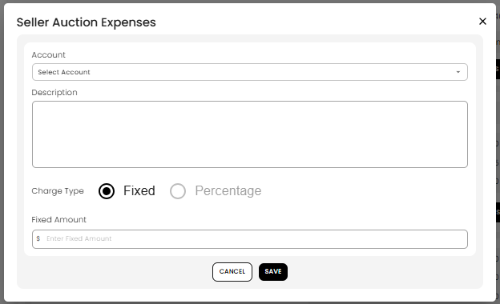

[Auction](./index.md) · [Auction Journal](../index.md)

# What are seller auction expenses in settlement? How do I add them?

Last modified: 2026-05-27

**Seller auction expenses** are amounts you **withhold from a seller’s whole payout invoice** after settlement is generated. They apply to the **entire seller statement**, not to one lot. The dashboard form is titled **Seller Auction Expenses**.

**Prerequisite:** [How is a settlement generated for an auction?](generate-settlement.md). For per-lot seller math (commission, tax, lot expenses on the lot), see [Seller invoice — each sold lot](seller-lot-calculation.md).

---

## Seller auction expenses vs other seller invoice lines

| Item | Applies to | When it appears | Effect on payout |
|------|------------|-----------------|------------------|
| **Lot lines** | Each sold lot | **Generate Invoice** | Net per lot (hammer minus commission, tax, lot expenses on the lot) |
| **Seller auction expenses** | **Entire seller invoice** | **Edit settlement** after generate | **Lowers** what you pay the seller |
| **Extra lot charges** | **One lot** | Edit settlement on that lot | **Lowers** that lot and the invoice |
| **Adjustment** | **Entire invoice** (one line) | Separate action — [Settlement adjustments](settlement-adjustments.md) | Discount or surcharge for the whole statement |

**Seller lot expenses** you entered on the lot when building the catalog are included automatically on each lot line at generation. **Seller auction expenses** are separate: you add them on the **seller settlement** screen for invoice-wide withholdings (for example a sale-wide marketing fee).

Auction expense lines use **Miscellaneous → Account** sub-accounts ([chart of accounts](../auctioneer-misc/account.md)).

Compare with **buyer** side: [Buyer auction charges](buyer-auction-charges.md) **increase** what the buyer owes; seller auction expenses **decrease** what you pay out.

---

## How to add a seller auction expense

1. Open **Auctions** → **Dashboard** for the auction.
2. Go to the **Settlement** tab and choose **Seller**.
3. Open the seller (consignor) invoice you need.
4. Start **add auction expense** (form title **Seller Auction Expenses**).
5. Fill in:
   - **Account** — chart-of-accounts sub-account.
   - **Description** — note on the statement (for example “Catalog advertising”).
   - **Charge Type** — **Fixed** or **Percentage**.
   - **Fixed Amount** (or percentage field when **Percentage** is selected).
6. Select **SAVE**.



*Add seller auction expense from settlement edit.*

7. The seller’s **payout total goes down** by that expense. **Grand total** updates if you already have an adjustment on the invoice.

You can **edit** or **remove** these lines until the settlement is **Paid**.

---

## What happens to the seller total

```text
Payout total (before adjustment) = Sum of lot nets − Sum of seller auction expenses
```

Each seller auction expense **reduces** the amount due to the seller. Lot nets are already hammer minus commission, tax, and any **lot-level** seller expenses from the lot setup.

---

## Charge type: Fixed vs Percentage

| Type | What you enter | Tip |
|------|----------------|-----|
| **Fixed** | Dollar amount to withhold | Flat fees (for example $200 marketing). |
| **Percentage** | Numeric value saved as the charge | Not auto-calculated from lot subtotal on save; for invoice-wide % adjustments use [Settlement adjustments](settlement-adjustments.md). |

---

## When you cannot add or change them

- Seller settlement must exist (**Generate Invoice** run for that auction).
- Not allowed when the invoice is **Paid**.
- Use **clerking** to change hammer or sold status — not auction expenses for invoice-wide fixes on lot outcome.

---

## Related

- [Edit settlement](edit-settlement.md)
- [Full seller settlement calculation](seller-settlement-calculation.md)
- [Buyer auction charges](buyer-auction-charges.md)
- [Settlement adjustments](settlement-adjustments.md)
- Dev: [Seller auction expenses](../../auction/settlement/seller-auction-expenses.md) · [Edit settlement (dev)](../../auction/settlement/edit.md)
