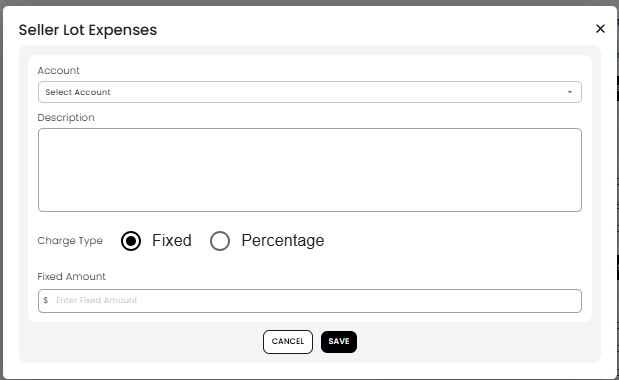

[Auction](./index.md) · [Auction Journal](../index.md)

# What are seller lot expenses? How do I add an expense under a lot?

Last modified: 2026-05-27

**Seller lot expenses** are amounts **withheld from one sold lot** on a **seller’s settlement** (payout statement). Some expenses are copied from the **lot** when you generate settlement; you can add **more** (or new ones) when **editing** settlement on that lot line.

**Prerequisite:** [Generate settlement](generate-settlement.md). Per-lot seller math: [Seller invoice — each sold lot](seller-lot-calculation.md).

---

## Two ways seller lot expenses get on the invoice

| Source | When |
|--------|------|
| **Expenses on the lot** (when you built the lot) | Included automatically when you **Generate Invoice** |
| **Add on settlement edit** | **ADD SELLER LOT EXPENSES** on that lot after generate |

Both show under the lot’s **Entries** as extra lines and **lower** the seller’s net for that lot.

---

## Seller lot expenses vs other withholdings

| Fee type | Applies to |
|----------|------------|
| Commission / seller tax on line | That lot — at generate (or **Update Entries**) |
| **Seller lot expenses** | **That lot** — lot setup and/or settlement edit |
| **Seller auction expenses** | **Whole seller invoice** — [Seller auction expenses](seller-auction-expenses.md) |
| **Adjustment** | Whole invoice — [Settlement adjustments](settlement-adjustments.md) |

---

## How to add a seller lot expense on settlement

1. Open **Auctions** → **Dashboard** → **Settlement** → **Seller**.
2. Open the seller (consignor) settlement.
3. Find the **lot** in the list.
4. Under **Entries**, select **ADD SELLER LOT EXPENSES**.
5. In **Seller Lot Expenses**:
   - **Account**
   - **Description**
   - **Charge Type** — **Fixed** or **Percentage** of that lot’s **hammer**
   - Amount
6. Select **SAVE**.

7. The line appears under that lot. The **lot net** and **seller payout total go down**.

Edit or delete extras on the lot until the settlement is **Paid**.

---

## Fixed vs Percentage

| Type | Meaning |
|------|---------|
| **Fixed** | Flat amount withheld from that lot’s net |
| **Percentage** | Based on **that lot’s hammer** |

---

## Lot expenses on the lot vs on settlement

| Enter expense when… | Best for |
|---------------------|----------|
| **Building/editing the lot** (`sellerLotExpenses` on lot) | Standard consignor fees you know before settlement (marketing, photo) — they flow in at **generate** |
| **Settlement edit** | Fees you decide **after** the sale on that lot only |

---

## Related

- [Edit settlement](edit-settlement.md)
- [Full seller settlement calculation](seller-settlement-calculation.md)
- [Buyer lot expenses](buyer-lot-expenses.md)
- Dev: [Seller lot expenses](../../auction/settlement/seller-lot-expenses.md)
