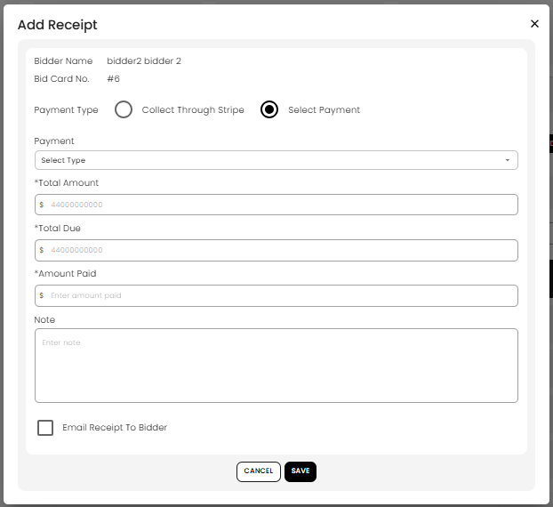

[Auction](./index.md) · [Auction Journal](../index.md)

# How does payment work after auction settlement?

After you **generate invoices** for an auction, you collect money from **buyers** and pay **sellers** by adding **receipts** on each settlement. A receipt records how much was paid, which payment type was used, and optional notes. When the amount paid equals the invoice **grand total**, the settlement is marked **Paid** and further edits to that invoice are locked.

**Prerequisites:** [Generate settlement](generate-settlement.md) · [Stripe Connect](../auctioneeer/stripe-connect.md) (to collect buyer card payments into your account)

---

## Where to record payment

1. Open **Auctions** → **Dashboard** for the auction.
2. Go to the **Settlement** tab.
3. Choose **Bidder** (buyer invoices) or **Seller** (seller payouts).
4. Find the client row and select **Add Receipt** (plus icon).

**Add Receipt** is disabled when **Receipt Status** is already **Paid**.

You can also open **View** on a row to see settlement detail, receipts, and PDFs.

---

## What you see on Add Receipt

*Use **Add Receipt** to choose the payment method, enter the amount paid, add an optional note, and decide whether to email the receipt.*

| Field | Meaning |
|-------|---------|
| **Total Amount** | Invoice **grand total** (what they owe or you owe them) |
| **Total Due** | Remaining balance (`grand total` minus payments already recorded) |
| **Amount Paid** | What you are recording on this receipt (manual path) |
| **Note** | Optional text stored with the receipt |
| **Email Receipt To Bidder / Seller** | Sends a settlement receipt email when you save |

You can record **partial payments**. Save multiple receipts until **Total Due** reaches zero; then status becomes **Paid**.

---

## Buyer payment — card (Stripe)

For **buyer** settlements, if the bidder is **verified** (card on file) or the row is a **floor bidder**, you can choose **Collect Through Stripe**:

| Option | When to use |
|--------|-------------|
| **Charge card** | Charge the bidder’s **card on file** for the full **Total Due** (not shown for floor bidders) |
| **Collect Payment** | Enter a **different card** (Stripe checkout in the dialog) |

After Stripe succeeds, Auction Journal saves a receipt with payment type **Stripe** and notes *Payment collected through stripe*, for the remaining balance.

Funds are processed through **your Stripe Connect** account ([Stripe Connect setup](../auctioneeer/stripe-connect.md)).

If the bidder is **not verified**, use **Select Payment** and record cash, check, or another method from your **Money in or out** accounts (Miscellaneous → Account).

---

## Buyer or seller — manual payment

1. Choose **Select Payment** (instead of Stripe for buyers).
2. In **Payment**, pick a type from your chart of accounts (for example **Cash**, **Check written** under **1000 : Money in or out**).
3. Enter **Amount Paid** (can be less than **Total Due** for a partial payment).
4. Add a **Note** if needed.
5. Optionally check **Email Receipt**.
6. Select **Save**.

Use the same flow for **seller** payouts when you pay the seller outside Stripe.

---

## Paid status and what it locks

| When | What happens |
|------|----------------|
| **Partial receipt** | **Receipt Status** stays **Unpaid**; **Total Due** decreases |
| **Full payment** | **Receipt Status** → **Paid**; **Add Receipt** and **Edit Settlement** are no longer available |
| **After Paid** | You cannot change auction charges, adjustments, or lot lines on that invoice, and clerking changes for that buyer may be blocked |

Correct the invoice with [Edit settlement](edit-settlement.md) or [clerking](generate-settlement.md#after-you-generate) **before** the buyer settlement is fully paid when possible.

---

## Email receipt

If you enable **Email Receipt To Bidder** (or **Seller**), Auction Journal emails a settlement receipt when the receipt is saved. The buyer or seller receives the message; you are copied (BCC) as the auctioneer.

This is separate from **Email** on the settlement list, which sends the **invoice PDF**.

---

## Seller settlements

Seller rows use the same **Add Receipt** dialog. **Stripe** options appear for **buyer** invoices only (verified or floor). For sellers, record how you paid them (check, wire, etc.) under **Select Payment**.

---

## Typical errors

| Message | What to do |
|---------|------------|
| **The amount you entered is more than due amount** | Lower **Amount Paid** so total paid does not exceed **grand total** |
| **Recipt can't be updated…** | Invoice is already **Paid** — no further receipts |
| **Bidder is not verified** (Stripe) | Bidder needs a saved card / verification, or use manual payment |
| **Amount error** | Enter a valid dollar amount (system stores whole cents) |

---

## Related

- [Generate settlement](generate-settlement.md)
- [Edit settlement](edit-settlement.md)
- [Settlement adjustments](settlement-adjustments.md)
- [Buyer settlement calculation](buyer-settlement-calculation.md) — **Grand total**, **Paid / balance due**
- [Stripe Connect](../auctioneeer/stripe-connect.md)
- Dev: [Settlement payment](../../auction/settlement/payment.md)
