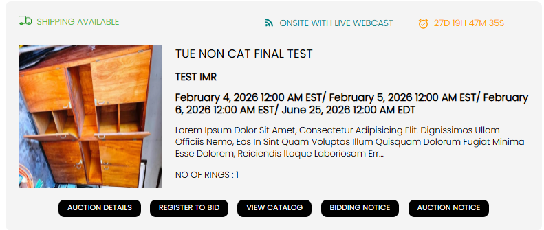
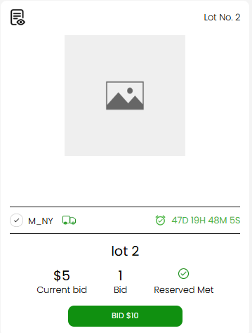

[Auction](./index.md) · [Auction Journal](../index.md)

# Explain how shipping works in Auction

Last modified: 2026-05-28

Shipping in Auction can be configured in three ways:

1. **Shipping available on all lots** in the auction.
2. **Shipping available only on specific lots** (auctioneer chooses lot-by-lot).
3. **Shipping not available** for any lot.

The shipping status is shown in both places:
- on the **auction card**
- on each **lot card**

---

## Shipping indicator colors

| Color | Meaning |
|---|---|
| **Green** | Shipping available |
| **Red** | Shipping not available |

So if you see a green shipping icon, that auction/lot supports shipping. If it shows red, shipping is not available.

---

## Where you see it on auction

On auction listing/detail cards, shipping status appears near the top as a shipping indicator label (for example **SHIPPING AVAILABLE** in green).

---

## Where you see it on lot

On lot cards, the shipping icon appears with other lot status indicators (for example near location/timer indicators).

---

## Practical behavior for bidders

- If auctioneer enables shipping globally, lots in that auction show shipping available.
- If auctioneer enables shipping only for selected lots, check each lot card icon.
- If shipping is disabled, you should plan local pickup/collection based on auction terms.

Always verify the lot-level indicator before bidding if shipping is required for your purchase.

---

## Related

- [How do I fill in the Details section?](build-details.md)
- [What is an auction? How do I create one?](create-auction.md)

