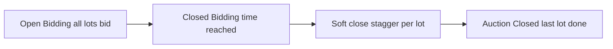

[Auction](./index.md) · [Auction Journal](../index.md)

# Explain soft close in an auction. How do bid soft close and soft close work?

---

## When soft close applies

**Soft close** is used for **online** auctions where bidding has a fixed **Open Bidding** and **Closed Bidding** schedule — mainly **Online Timed Auction** and **Online Absolute Auction**.

**Onsite With Live Webcast** auctions do **not** use soft close or bid soft close. Those sales close lots during **live rings** on bidding days, not on a staggered online close schedule.

Set auction-level values under **Upload Settings → Bidding**. See [Upload Settings](build-upload-settings.md) and [auction stages](auction-stages.md) (**Soft Close** status on the dashboard).

---

## Two settings (auction and lot)

| Setting | Also called in UI | What it controls |
|---------|-------------------|------------------|
| **Soft Close Seconds** | Soft close | How long **between** each lot **starting** its close countdown after **Closed Bidding** — lots close **one by one**, not all at once. |
| **Bid Soft Closed Seconds** | Bid soft close | How much **extra time** a lot gets when someone **places a bid** on it **after Closed Bidding**, while that lot is still in the soft-close window. |

Both use duration format **`hh:mm:ss`** (for example `00:00:30` for 30 seconds). Each value can be at most **72 hours** at publish validation.

### Auction default → lots

When you save auction settings or create lots, **Soft Close Seconds** and **Bid Soft Closed Seconds** on the auction are copied onto **each lot** in that auction.

You can override either value **on an individual lot** when needed (for example a featured lot with a longer soft close). Changing a lot’s values stops that lot from using the auction default for that field.

---

## How closing works (big picture)

1. **Open Bidding** — all lots accept bids.
2. **Closed Bidding** — the main online bidding period ends for the auction as a whole.
3. **Soft close** — lots stop accepting bids **in order** (by **sale order**), each at its own **`closeBidding`** time.
4. **Auction end** — when the **last** lot’s close time passes, the auction is fully **Closed** (see [stages](auction-stages.md)).

---

## Soft Close Seconds — one-by-one lot closing

At **publish** (or when you change **Closed Bidding** or auction **Soft Close Seconds** on a published auction), the system calculates each lot’s **`closeBidding`** datetime:

- Lots are ordered by **sale order**.
- The **first** lot closes at: **Closed Bidding** + that lot’s **Soft Close Seconds** (or the auction default if the lot has none).
- Each **next** lot closes at: **previous lot’s close time** + **its own** Soft Close Seconds.

So if **Closed Bidding** is 6:00 PM, soft close is 30 seconds, and you have three lots:

| Sale order | Lot closes at (example) |
|------------|-------------------------|
| 1 | 6:00:30 |
| 2 | 6:01:00 |
| 3 | 6:01:30 |

The auction **end date** is set to the **last** lot’s close time so the whole sale ends when the final lot finishes.

During soft close, bidders still see lots that have not reached their close time yet; each lot’s timer counts down to **its** `closeBidding`.

---

## Bid Soft Closed Seconds — extending a lot when bid late

After **Closed Bidding** has passed, the auction is in the **soft close** phase. If a bidder places a bid on a lot that is **still open** (its `closeBidding` is in the future):

- That lot’s **`closeBidding`** is pushed later by **Bid Soft Closed Seconds** (from the lot, or the value copied from the auction).
- If the new close time is **after** the auction **end date**, the auction **end date** is extended to match.

So active bidding on a lot that is about to close **extends** that lot only — typical “anti-sniping” behavior.

**Note:** Extension runs only **after** the auction’s **Closed Bidding** time. Bids before that time follow normal open bidding rules.

The dashboard tooltip: if **Bid Soft Closed Seconds** is empty at auction level, lots should still have values from defaults when created; set both fields clearly at publish for predictable behavior.

---

## Onsite With Live Webcast

No **Soft Close Seconds** or **Bid Soft Closed Seconds** on the auction build form. Lot closing is driven by **live clerking** and ring schedule, not `updateLotCloseBidding`.

---

## Related

- [Upload Settings — Bidding](build-upload-settings.md)
- [Auction stages](auction-stages.md) — **Bidding Open** vs **Soft Close**
- Dev mirror: [Soft close](../../auction/soft-close.md)
