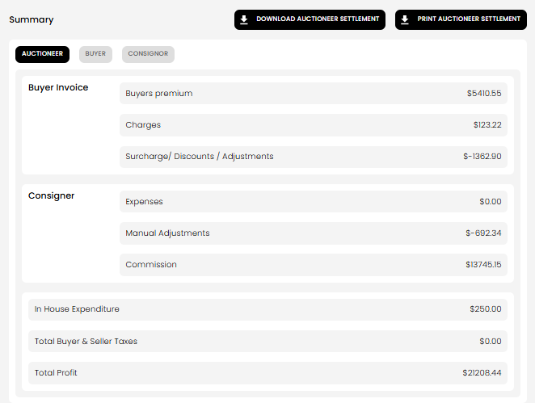
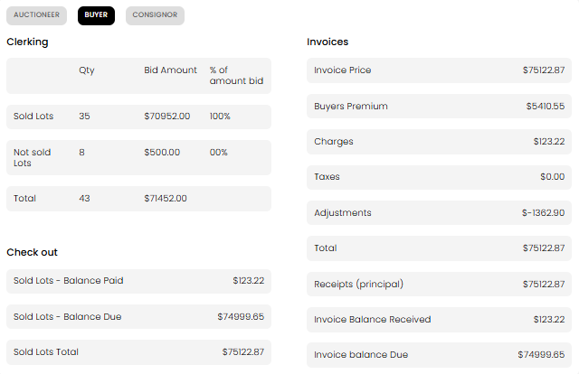
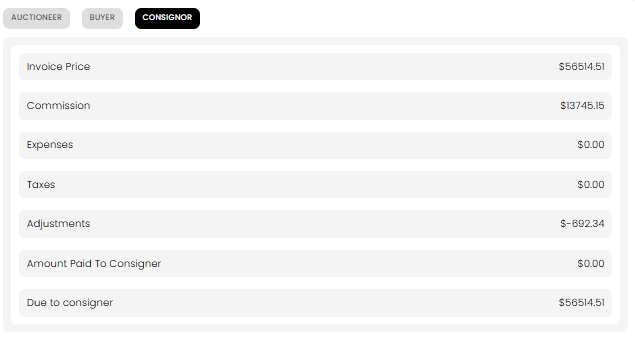

[Auction](./index.md) · [Auction Journal](../index.md)

# Explain Auction Summary

Last modified: 2026-05-28

Auction Summary gives you a quick financial and clerking snapshot of one auction after activity has started/finished. It combines values from settlements, lot clerking, and in-house expenses in one place.

You can switch between:
- **Auctioneer** tab (overall business view)
- **Buyer** tab (buyer-side totals)
- **Consignor** tab (seller payout view)

---

## How to open Auction Summary

1. Open **Auctions** in the dashboard.
2. Open the target auction.
3. Go to the **Summary** section/tab.

At the top, you can:
- **Download** summary PDF
- **Print** summary PDF

---

## Auctioneer tab (overall snapshot)

This tab shows:
- **Buyer Invoice** section:
  - Buyers premium
  - Charges
  - Surcharge / Discounts / Adjustments
- **Consigner** section:
  - Expenses
  - Manual Adjustments
  - Commission
- Auction-wide totals:
  - In House Expenditure
  - Total Buyer & Seller Taxes
  - Total Profit

---

## Buyer tab (buyer-facing totals)

This tab includes:
- **Clerking**:
  - Sold lots / Not sold lots quantities
  - Bid amounts
  - Totals
- **Check out**:
  - Sold lots balance paid
  - Sold lots balance due
  - Sold lots total
- **Invoices**:
  - Invoice price
  - Buyers premium
  - Charges
  - Taxes
  - Adjustments
  - Invoice balance received / due

---

## Consignor tab (seller payout view)

This tab shows seller-side statement totals:
- Invoice Price
- Commission
- Expenses
- Taxes
- Adjustments
- Amount Paid To Consigner
- Due to consigner

---

## What the summary is used for

- Quick review before/after settlement and payment activities
- Reconciliation of buyer totals, seller dues, and auctioneer-side profit
- Export/print snapshot for sharing or records

If numbers look off after edits, refresh the page after settlement/clerking updates complete.

---

## Related

- [How does clerking work in an auction?](clerking.md)
- [How is a settlement generated for an auction?](generate-settlement.md)
- [How can an auctioneer edit a settlement?](edit-settlement.md)
- [How does payment work after auction settlement?](settlement-payment.md)
- Dev: [Auction summary](../../auction/summary.md)
