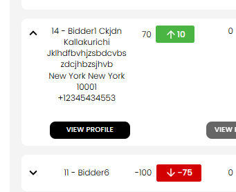
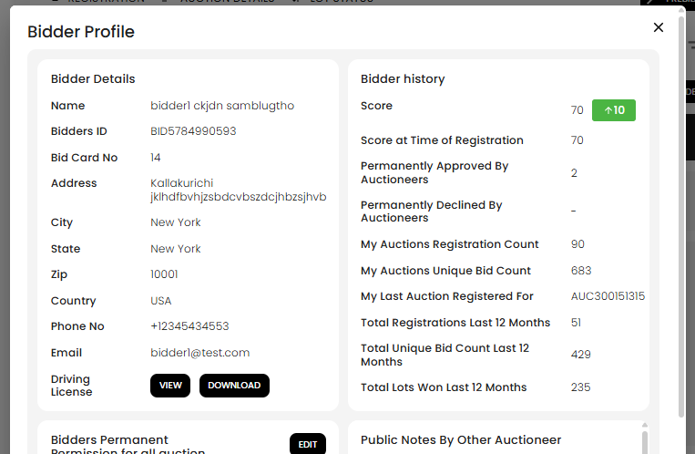
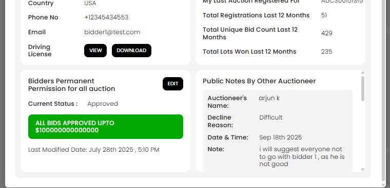

[Auction](./index.md) · [Auction Journal](../index.md)

# How to view details of a bidder registered in my auction?

*Last modified: 2026-06-01*

After someone registers for your auction, you can open a full **Bidder Profile** from the **Registration** tab. It shows contact and ID information, activity history, your standing **bid permission** for that customer, and **public notes** other auctioneers chose to share when they declined that bidder.

**Start here:** [How to see all bidders registered in my auction?](view-registrations.md)

---

## Open the Bidder Profile

1. In the **Auctioneer Dashboard**, go to **Auctions** → **Dashboard** for your auction.
2. Open the **Registration** tab.
3. Find the bidder in the table (use **Search** by name or bid card number if needed).
4. Click the **chevron** on the left of their row to **expand** it.
5. Select **VIEW PROFILE**.

The **Bidder Profile** window opens. A short summary (address and phone) also appears in the expanded row without opening the popup.

---

## What the Bidder Profile shows

The popup has four areas.

### Bidder Details (top left)

| Field | What you see |
|-------|----------------|
| **Name** | First and last name from their Auction Journal bidder account |
| **Bidders ID** | Platform bidder ID (for example `BID5784990593`) |
| **Bid Card No** | Bid card number for **this auction** registration |
| **Address** | Street, city, state, ZIP, country |
| **Phone No** / **Email** | Contact on file |
| **Driving License** | **VIEW** opens front/back ID images in a carousel; **DOWNLOAD** saves both images |

### Bidder history (top right)

Activity and trust signals to help you decide whether to approve or monitor this bidder:

| Field | Meaning |
|-------|---------|
| **Score** | Current bidder score, with a green or red badge for the latest change |
| **Score at Time of Registration** | Score when they registered for **this** auction |
| **Permanently Approved By Auctioneers** | How many auctioneers have set **Approved all bids** on their customer profile |
| **Permanently Declined By Auctioneers** | How many auctioneers have set **Decline all bids** on their customer profile |
| **My Auctions Registration Count** | How many of **your** auctions they have registered for |
| **My Auctions Unique Bid Count** | Distinct bids they placed on **your** auctions |
| **My Last Auction Registered For** | Auction ID of their most recent registration with you |
| **Total Registrations Last 12 Months** | Platform-wide registrations in the last year |
| **Total Unique Bid Count Last 12 Months** | Platform-wide distinct bids in the last year |
| **Total Lots Won Last 12 Months** | Lots they won anywhere on Auction Journal in the last year |

### Bidders Permanent Permission for all auction (bottom left)

This is your **customer-level bid permission** for this person (applies across **your** auctions, not only this sale). It comes from their **client** record linked to their bidder email.

| What you see | Meaning |
|--------------|---------|
| **Current Status** | **Approved**, **Declined**, or **Default** |
| Green banner | **All bids approved upto $…** when status is **Approved** |
| Red banner | **Declined All bids** plus **Decline Reason** when status is **Declined** |
| Gray banner | **Default Bid Permission Of Auction** when you use normal auction rules |
| **Last Modified Date** | When permission was last saved |
| **EDIT** | Change permission, cap, decline reason, and **public** / **private** notes (private notes are for your account only—they do not appear in the public-notes panel) |

For what each permission choice does at registration time, see [Set bid permission for a customer](../auctioneer-client/bid-permission.md).

### Public Notes By Other Auctioneer (bottom right)

Other auction companies on Auction Journal can leave a **public note** when they **decline** that bidder (on a registration or on their own customer record). Those shared notes appear here so you can review them before approving someone for your sale.

Each note card can show:

| Field | Content |
|-------|---------|
| **Auctioneer's Name** | Who left the note |
| **Decline Reason** | Reason they selected when declining |
| **Date & Time** | When the note was recorded |
| **Note** | The public comment they entered |

If no other auctioneer has shared a declined registration or client note for this bidder, you see **No public notes available.**

**Privacy:** Notes from **your** company are not listed in this panel (only **other** auctioneers). **Private** permission notes stay on the customer record and are not shown to other auctioneers.

---

## Edit permission from the profile

1. In **Bidders Permanent Permission for all auction**, select **EDIT**.
2. Set **Approved**, **Declined**, or **Default**, the bid cap, decline reason, and optional public/private notes (same fields as [Bid Permission on a customer](../auctioneer-client/bid-permission.md)).
3. Select **Save**.

Saving updates the linked **customer** profile and refreshes the registration list. **EDIT** may be disabled after the auction end date or when your dashboard locks registration edits.

To change approval for **this auction only** (without changing permanent customer permission), use **View Permission Status** on the expanded registration row instead. See [Registration acceptance](registration-acceptance.md).

---

## Related

- [See all bidders registered in my auction](view-registrations.md)  
- [Registration acceptance — approve or decline](registration-acceptance.md)  
- [Set bid permission on a customer](../auctioneer-client/bid-permission.md)  
- [Bidder vs customer](../auctioneer-client/bidder-relationship.md)  
- [Auction Dashboard — Registration tab](auction-dashboard.md#registration-tab)
