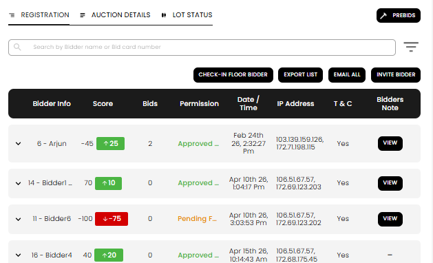
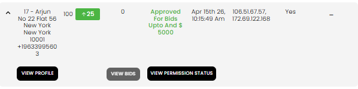

[Auction](./index.md) · [Auction Journal](../index.md)

# How do I see which bidders registered for my auction?

Use the **Registration** tab on that auction’s **Auction Dashboard**. Every online registration (and floor check-ins you record) appears in one searchable table.

---

## Open the registration list

1. In the **Auctioneer Dashboard**, go to **Auctions**.
2. Find your auction and select **Dashboard** (available after the auction is **published**).
3. Open the **Registration** tab.

The **Registration Count** on the summary cards at the top of the dashboard matches the number of registrants for this sale.

---

## Find a specific bidder

| Tool | What it does |
|------|----------------|
| **Search** | Type a **bidder name** or **bid card number** (for example `6` or `Arjun`). |
| **Sort** | Order by name (A–Z or Z–A), registration date, or bidder score. |

Results load in pages; use pagination at the bottom of the table when many bidders have registered.

---

## What each column shows

| Column | Meaning |
|--------|---------|
| **Bidder info** | Bid card number and name (for example `17 - Arjun`). Expand the row (chevron) to see address and phone. |
| **Score** | Current bidder score, with a badge for the latest change. |
| **Bids** | How many bids they have placed in **this** auction so far. |
| **Permission** | Whether they are **approved**, **pending**, or **declined** for this auction, and the bid cap when approved. Green = approved, orange = pending, red = declined. |
| **Date / time** | When they registered. |
| **IP address** | IP captured at registration (one or more values may appear). |
| **T & C** | **Yes** if they accepted your auction terms on the registration form. |
| **Bidders note** | **View** opens their optional **special note to auctioneer**; a dash means they left none. |

To change approval status or caps, use **View Permission Status** after expanding the row. See [Registration acceptance](registration-acceptance.md).

---

## Expand a row for more detail

Click the **chevron** on the left of a row to expand it.

| Action | Use |
|--------|---------|
| **View Profile** | Full bidder details, score history, and permanent bid permission across your auctions. |
| **View Bids** | All bids this person placed on lots in this auction (disabled if bid count is 0). |
| **View Permission Status** | Current approval for **this auction** only; **EDIT** to approve or decline. |

---

## Other actions on this tab

| Button | When to use |
|--------|-------------|
| **Check-in floor bidder** | **Onsite With Live Webcast** only — [check in a floor bidder](floor-bidder-check-in.md) |
| **Export list** | Download a spreadsheet of all registrants for check-in or offline review. |
| **Email all** | Send one message to every registrant’s email on file. |
| **Invite bidder** | Invite a known bidder to register (before auction end). |

More on the full dashboard: [How do I use the Auction Dashboard?](auction-dashboard.md#registration-tab).

---

## Tips

- Check the **Permission** column before bidding opens so **pending** rows are reviewed.
- Use **bid card number** in search when checking in bidders by card at an onsite sale.
- **Registration Count** on the dashboard summary is a quick total; the tab is the full list with detail.

---

## Related

- [Registration acceptance — approve or decline](registration-acceptance.md)
- [Auction Dashboard](auction-dashboard.md)
- [Invite bidders to an auction](invite-bidders.md)
- [Check in a floor bidder](floor-bidder-check-in.md)
