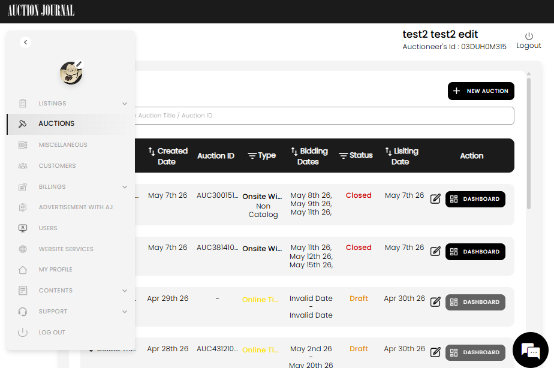

[Auctioneer](./index.md) · [Auction Journal](../../index.md)

# How do I use the Auctioneer Dashboard?

The **Auctioneer Dashboard** is where you sign in to **create and run** your sales on Auction Journal—listings, auctions, customers, billing, and account setup. Bidders use a **different** site and login; this guide is only for auctioneers.

If you are new to the platform, read [Who is an auctioneer?](role.md) first, then [register](registration.md) and complete [initial setup](initial-setup.md) under **Miscellaneous** and **Customers** before your first **New Auction**.

---

## Sign in

1. Open the auctioneer sign-in page for Auction Journal (not the bidder login).
2. Enter the **email** and **password** you used when you registered.
3. After sign-in, you land in the dashboard with the **sidebar** on the left and your work area on the right.

The top of the screen shows your **name**, **Auctioneer’s Id**, and **Logout**.

---

## Layout at a glance

| Area | What it is for |
|------|----------------|
| **Sidebar (left)** | Main menu: listings, auctions, setup, customers, billing, and more. Hover or expand the sidebar to read full menu labels. |
| **Profile photo (top of sidebar)** | Select the pencil icon to change your company photo. |
| **Main panel (right)** | The page for the menu item you chose—for example the **Auctions** list. |
| **Chat icon (bottom right)** | Quick access to help on many pages. |



*Example: **Auctions** is selected in the sidebar. The main area lists your auctions, with **+ NEW AUCTION** and a search box.*

---

## Sidebar menu — where to go

| Menu | What you do there |
|------|-------------------|
| **Listings** ▾ | **Create** a listing, **Manage** existing listings, or use **Free Listing** if your account qualifies. |
| **Auctions** | See all your auctions (draft, live, closed). Search by title or auction ID. Select **+ NEW AUCTION** to start a sale. Open **DASHBOARD** on a row to manage one auction in depth. |
| **Miscellaneous** | Business setup: accounts, formulas, Stripe Connect, invoice details, templates (terms, notices, email, bid increments). See [formulas](../auctioneer-misc/formulas.md), [invoice details](../auctioneer-misc/invoice-details.md), [templates](../auctioneer-misc/templates.md), [Stripe Connect](stripe-connect.md). |
| **Customers** | Your sellers, buyers, floor bidders, and mailing lists. |
| **Billings** ▾ | **Payment Method** — card on file for platform fees (listings, ads). **Payment History** — past charges to Auction Journal. |
| **Advertisement with AJ** | Create paid promotions on Auction Journal. |
| **Users** | Invite and manage assistant users who can help in the dashboard. |
| **Website Services** | Opens Auction Journal business services on the public site (new browser tab). |
| **MY PROFILE** | Edit company profile, password, and contact details ([profile](profile.md)). |
| **Contents** ▾ | **ADD Content** — blogs and videos. **View Content** — manage what you published. |
| **Support** ▾ | **GET HELP** — callback or email support. **FAQ** and **Listing Policy**. |
| **LOG OUT** | End your session. |

---

## Auctions — common tasks

The **Auctions** screen is often your home base after setup.

1. **Find an auction** — Use **Search by Auction Title / Auction ID**.
2. **Create** — Select **+ NEW AUCTION**, choose auction type, and complete the build steps (details, lots, registration rules, and so on). Prerequisites (Stripe Connect, formulas, invoice details, at least one seller) must be in place first.
3. **Understand status** — Examples you may see:
   - **Draft** — Still being built; not live for bidders.
   - **Closed** — Sale has ended (wording and colors may vary).
4. **Open one auction** — Use **DASHBOARD** on that row (when available) for lot management, clerking, settlement, reports, and related tools for that sale only.
5. **Edit** — Use the edit control on the row to change auction settings where the product still allows edits.

Draft auctions may show **DASHBOARD** disabled until the auction is far enough along to open the per-auction workspace.

---

## Suggested order for new auctioneers

```text
Register → MY PROFILE → Miscellaneous setup → Customers (sellers) →
Listings (optional) → + NEW AUCTION → per-auction DASHBOARD → clerking / settlement
```

| Step | Menu | Why |
|------|------|-----|
| 1 | **MY PROFILE** | Correct company name and contact info on public pages and documents. |
| 2 | **Miscellaneous** | Formulas, invoice details, Stripe Connect, templates—required for most new auctions. |
| 3 | **Customers** | Add at least one **seller** (and other clients as needed). |
| 4 | **Billings → Payment Method** | Card for listing or ad fees when applicable ([payment method](payment-method.md)). |
| 5 | **Auctions → + NEW AUCTION** | Build and publish your sale. |
| 6 | **DASHBOARD** (on one auction) | Run the event: lots, registration, clerking, settlement. |

---

## Public site vs dashboard

| Auction Journal area | Who uses it |
|---------------------|-------------|
| **Public website** | Bidders browse, register, and bid; your auctions and listings appear here. |
| **Auctioneer Dashboard** | You configure and operate sales; nothing here replaces what bidders see on the public site. |

---

## Related guides

- [Who is an auctioneer?](role.md)
- [Registration](registration.md)
- [Forgot password](forgot-password.md)
- [Help and Support](../help-and-support/index.md)
- Auction build and clerking topics in [sample questions](../sample_questions.md) (as more pages are added)
