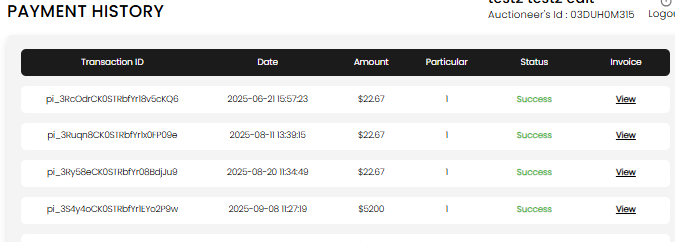
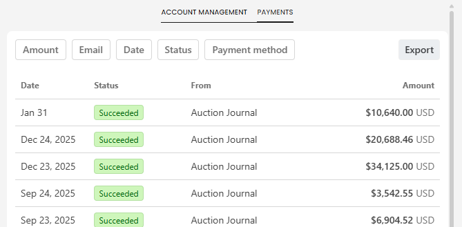

[Auction Journal](../../index.md)

# How do I view my payment invoices as an auctioneer?

You can view your payment invoices from **Billings -> Payment History** in the Auctioneer Dashboard.

## Prerequisite

Set up **Stripe Connect** first from:

- `/dashboard/miscellaneous/payment/setup`

Payment history in this area shows Stripe payment records and invoice/receipt links.

## Steps to view invoices

1. Open your dashboard and go to **Billings -> Payment History**.
2. Direct URL: `/dashboard/billings/payment-history`
3. Review each row for:
   - Transaction ID
   - Date
   - Amount
   - Status
   - Invoice (**View** link)
4. Select **View** in the Invoice column to open that payment receipt/invoice.

*Payment History screen with invoice view links for each transaction.*

## What you can see on this screen

- Successful and in-progress/failed payment statuses.
- Stripe transaction entries tied to your auctioneer account.
- Paginated history when there are many records.

*Payments table showing date, status, source, and amount details.*

## If no invoice is visible

- Complete Stripe Connect setup first (`/dashboard/miscellaneous/payment/setup`).
- Confirm you are checking the correct auctioneer account.
- If there are no completed transactions yet, the list can be empty.
