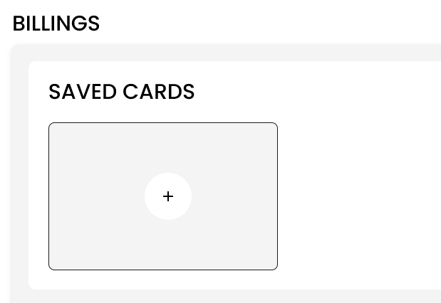
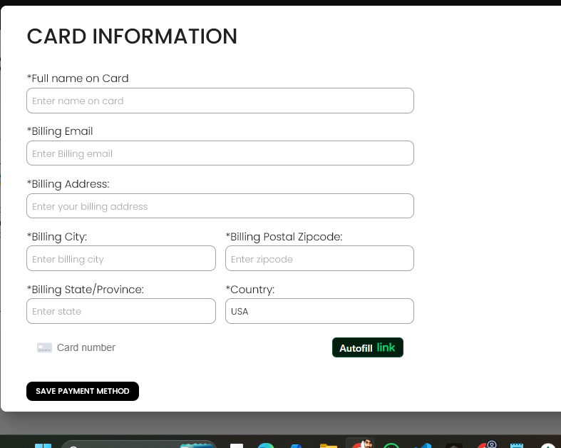

[Auctioneer](./index.md) · [Auction Journal](../../index.md)

# Why should I add card details? How do I add them? Is it safe?

You should save a **payment card** in Auction Journal so the platform can charge you for services such as **publishing listings** and **advertisements**. This card pays **Auction Journal**—it is not used for money you receive from bidders. For receiving bidder payments, set up [Stripe Connect](stripe-connect.md) separately.

---

## Why add a card?

- **Listing fees** — When you publish a listing, checkout uses your saved card (or prompts you to add one).
- **Advertisements** — Paid ad placements go through the same billing flow.
- **Faster checkout** — After a card is saved under **Billings**, you can pay without re-entering full card details each time.

You need at least **one** saved card on file for these platform payments. The system will not let you remove your only card until you add another.

---

## How to add a card

### Step 1 — Open Payment Method

1. Sign in to the **Auctioneer Dashboard**.
2. In the sidebar, open **Billings**.
3. Select **Payment Method**.

The page title is **BILLINGS**. You will see **SAVED CARDS**.

*If you have no card yet, you may see a message to add one; if you already have cards, use the **+** tile to add another.*

### Step 2 — Start adding a card

- **No card on file:** Select **Add New Card** (you may first see a short message that no payment method is set up).
- **Already have a card:** Under **SAVED CARDS**, select the **+** (plus) tile to add another card.

### Step 3 — Enter card and billing details

Fill in **CARD INFORMATION** (all fields marked with **\*** are required):

1. **Full name on Card**
2. **Billing Email** (use lowercase email if the form asks for it)
3. **Billing Address**
4. **Billing City** and **Billing Postal Zipcode** (entering a valid U.S. zip may fill city and state for you)
5. **Billing State/Province**
6. **Country** (typically **USA**, read-only)
7. **Card number** — use the secure card field powered by Stripe (you may see **Autofill link** from Stripe Link)

### Step 4 — Save

1. Select **SAVE PAYMENT METHOD**.
2. Wait for confirmation. Your card appears under **SAVED CARDS** with the last four digits and expiry.

---

## Managing saved cards

After your first card is saved:

| Action | How |
|--------|-----|
| **View** | **Billings → Payment Method** — each card shows name, email, address, and masked number. |
| **Update billing** | On a card, select **Update Card** — change billing name, email, or address (not the card number in this flow). |
| **Add another** | Use the **+** tile under **SAVED CARDS**. |
| **Delete** | **Delete Card** — allowed only if you have **more than one** card saved. |

---

## Is it safe?

**Yes, for standard online payment practice.**

- Your **card number and security code** are entered in **Stripe’s secure card field**, not stored as plain text on Auction Journal servers.
- Auction Journal keeps a Stripe **customer** reference linked to your account so charges can be made for listings and ads you approve.
- Stripe is widely used for payment processing and follows industry security standards (including PCI DSS for card data handling).

Use a card you are authorized to use, and keep your dashboard login secure.

---

## Stripe Connect vs payment card

| | **Payment card (this guide)** | **[Stripe Connect](stripe-connect.md)** |
|--|-------------------------------|----------------------------------------|
| **Purpose** | Pay Auction Journal (listings, ads) | Receive money from bidders |
| **Where** | Billings → Payment Method | Miscellaneous → Stripe Connect |
| **Required for** | Platform checkout | Creating most auctions |

---

## Related topics

- [Stripe Connect](stripe-connect.md)
- [Auctioneer registration](registration.md)
- Payment history and invoices — see [sample questions](../sample_questions.md) (guides pending)
