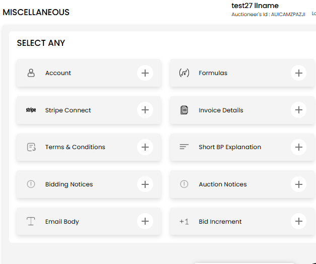
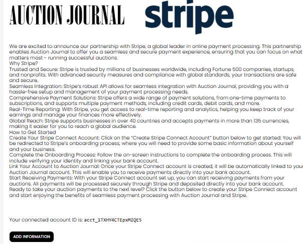
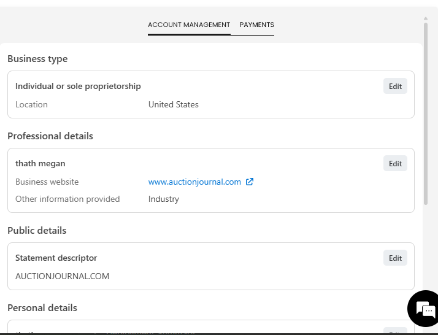

[Auctioneer](./index.md) · [Auction Journal](../../index.md)

# Should I set up Stripe Connect? How do I set it up? What is it used for?

**Yes.** As an auctioneer you should set up **Stripe Connect** in Auction Journal. It is **required** before you can create most auctions and receive money from bidders. Payments from your auctions are sent to **your** Stripe account and then to your linked bank—not to a generic Auction Journal balance.

This is separate from **adding a payment card** to pay Auction Journal for listings or other platform fees. Stripe Connect is for **money you receive** from bidders.

---

## What Stripe Connect is used for

- **Receive auction payments** — When bidders pay (including after settlement), funds go to your connected Stripe account.
- **Manage your payout account** — After setup you can view and update business, bank, and profile details Stripe needs.
- **View payment activity** — Use the **Payments** tab inside Stripe Connect in the dashboard to see charges and related activity tied to your connected account.

---

## Before you start

- You need access to the **Auctioneer Dashboard** (Miscellaneous section).
- Stripe onboarding asks for **business and personal details** and a **bank account** for payouts (U.S. Connect accounts are used in the product today).
- Have your **business website**, tax/identity details, and bank information ready—the exact fields appear on Stripe’s screens when you select **Add information**.

---

## Step 1 — Open Stripe Connect

1. Sign in to the **Auctioneer Dashboard**.
2. Open **Miscellaneous** from the main navigation.
3. On the **SELECT ANY** screen, select **Stripe Connect**.

*Miscellaneous hub — choose **Stripe Connect**.*

You can also use **Back to Miscellaneous** from the Stripe page to return to this menu.

---

## Step 2 — Create your connected account

1. On the Stripe Connect welcome page, read the overview (Auction Journal and Stripe logos and “How to Get Started”).
2. If you do **not** yet have a connected account id on screen, select **Create an account!**
3. Wait until the page shows **Your connected account ID is:** followed by an id starting with `acct_`.

*After creation you see your connected account id and the **Add information** button.*

---

## Step 3 — Complete Stripe onboarding

1. Select **Add information**.
2. A **new browser tab** opens with Stripe’s onboarding (business type, professional details, bank account, identity verification, and similar fields).
3. Follow Stripe’s instructions until onboarding is finished.
4. Close the tab and return to Auction Journal. Open **Miscellaneous → Stripe Connect** again if the dashboard does not update right away.

Until Stripe marks your account as able to charge and pay out, Auction Journal will keep showing the welcome / **Add information** flow instead of account management.

---

## Step 4 — Manage your account and payments

When onboarding is complete, the same **Stripe Connect** page shows two tabs:

1. **Account Management** — Business type, professional and public details, personal details, bank accounts, and related settings (with **Edit** where Stripe allows).
2. **Payments** — Payment activity on your connected account.

*Example: **Account Management** with business and professional details.*

Switch between **Account Management** and **Payments** using the toggle at the top of the section.

---

## Creating auctions

For most auction types, Auction Journal checks that Stripe Connect is **fully set up** before you can create a new auction. If something is still missing, **New Auction** may show **Requirements Missing**, including:

- **Stripe Connect** — Complete setup from **Miscellaneous → Stripe Connect** as above.
- Other items (invoice details, sellers, formulas) — configure those from **Miscellaneous** and **Clients** as described in other guides.

**Absentee Bidding** auctions follow different rules and may not require Stripe Connect; other auction types do.

---

## If you are stuck

- If **Add information** does not open a tab, check pop-up blockers and try again.
- If you finished Stripe onboarding but still see **Add information**, wait a few minutes and refresh **Stripe Connect**; Stripe must enable charges and payouts on your account.
- For login or account access issues, use [Forgot password](forgot-password.md) or Help and Support.

---

## Related topics

- [Forgot password](forgot-password.md)
- [Auctioneer registration](registration.md)
- [Payment card on file](payment-method.md) — pay Auction Journal for listings and ads
