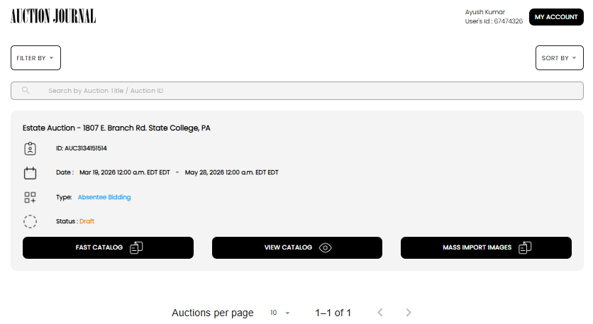

[Auction Journal](../../index.md)

# Auctioneer Assistants

## Who is a user (assistant)?

A **user (assistant)** is a helper account created under an auctioneer team.

Assistants support the auctioneer by doing catalog preparation work, especially lot creation and image upload, so auctions can be prepared faster.

## How can a user help an auctioneer?

Assistants help the auctioneer by handling day-to-day lot-building tasks:

1. Open the user app: [Lot-AI](https://catalog.auctionjournal.com/).
2. View auctions that belong to their auctioneer.
3. Create and add lots to the selected auction.
4. Capture and upload lot images from the field.
5. Organize lot details so the auctioneer can review and publish efficiently.

*Example: an assistant viewing auction cards and lot actions in Lot-AI.*

In short, assistants reduce the auctioneer's workload by preparing lots and images quickly and accurately.

## User onboarding

- [How do I onboard a user?](onboard-user.md)
- [How do I manage existing users and user invitations?](manage-users-and-invitations.md)
- [How does a user self-register from the invitation email sent by an auctioneer?](self-register-from-invite.md)
