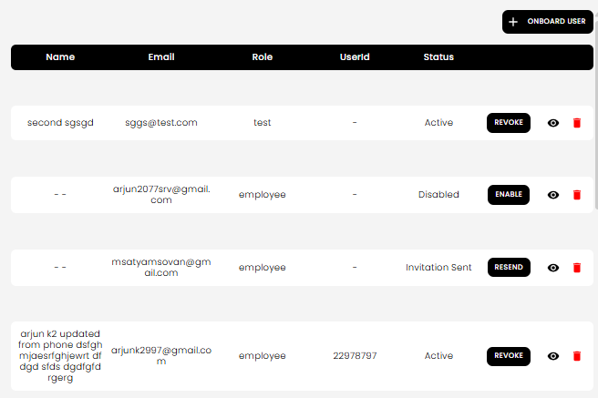

[Auction Journal](../../index.md)

# How do I manage existing users and user invitations?

You can manage all users and invitations from the **Users** list in your Auctioneer Dashboard.

## What you can do

- Invite a new user by email (**Onboard User**).
- Resend an invitation email for pending invites (**Resend**).
- Revoke an active user (**Revoke**).
- Cancel a sent invitation (**Revoke** on an unregistered user).
- Enable a disabled user or canceled invitation (**Enable**).
- Delete a user/invitation row (trash icon).

*Users list showing status and actions like Onboard User, Resend, Revoke, Enable, and Delete.*

## Step-by-step: common actions

### Invite a new user

1. Select **Onboard User**.
2. Enter email and send invite.
3. User receives self-registration email.

### Resend invitation

1. Find the row with status **Invitation Sent**.
2. Select **Resend**.

### Revoke a user or invitation

1. Find the target row.
2. Select **Revoke**.
3. Status changes:
   - Registered user -> **Disabled**
   - Pending invite -> **Invitation Canceled**

### Enable again

1. For a **Disabled** or **Invitation Canceled** row, select **Enable**.

### Delete a row

1. Select the **Delete** (trash) icon.
2. The record is removed from the list.

## Status meaning

- **Invitation Sent**: Invite email sent; registration still pending.
- **Invitation Canceled**: Invite was revoked before registration.
- **Active**: Registered user with access.
- **Disabled**: Registered user exists but access is revoked.

Related:
- [How do I onboard a user?](onboard-user.md)
- [How does a user self-register from the invitation email sent by an auctioneer?](self-register-from-invite.md)
