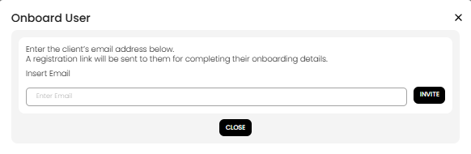

[Auction Journal](../../index.md)

# How do I onboard a user?

To onboard a user (assistant), you invite them by email from your Auctioneer Dashboard. They then complete self-registration from the link sent to their inbox.

## Step 1: Send the invite from Auctioneer Dashboard

1. Open **Users** in your dashboard.
2. Select **Onboard User**.
3. Enter the user's email address.
4. Select **Invite**.

What happens next:

- Auction Journal sends a self-registration email to that address.
- The link is time-limited (invite links expire).

*Invite modal where the auctioneer enters the user's email and sends the registration link.*

## Step 2: User opens the registration link

The invited user opens the email and selects the registration link (catalog app).

On the onboarding page, they complete:

- Email (pre-filled from invite link)
- First Name
- Last Name
- Phone (US format: `+1` and 10 digits)
- Password
- Confirm Password

Then they select **Confirm**.

*Self-registration form opened from the invitation link in the catalog app.*

## Step 3: User signs in

After successful confirmation, the user account is created and they can sign in with their email and password.

## If something goes wrong

- **Invite expired**: resend the invite from Users.
- **Already registered**: ask the user to sign in instead of re-registering.
- **Wrong email used**: send a fresh invite to the correct email.
