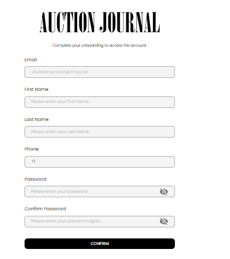

[Auction Journal](../../index.md)

# How does a user self-register from the invitation email sent by an auctioneer?

When an auctioneer invites a user, the user receives an email with a **Join the Team** button. That button opens the registration page where the user completes account setup.

## Step 1: Open the invitation email

1. Open the invitation email sent from Auction Journal.
2. Select **Join the Team**.

This opens the user registration page automatically.

## Step 2: Complete the registration form

On the registration page, fill:

- Email (usually pre-filled from the invitation link)
- First Name
- Last Name
- Phone (`+1` and 10 digits)
- Password
- Confirm Password

Then select **Confirm**.

*Self-registration form reached from the email invite link.*

## Step 3: Start using the account

After successful confirmation, the account is created. The user can then sign in with their email and password.

## If the user cannot self-register

- **Link expired**: ask the auctioneer to resend the invitation.
- **Already registered**: sign in directly instead of registering again.
- **Link/email mismatch**: use the latest invite email and open that link.

Related: [How do I onboard a user?](onboard-user.md)
