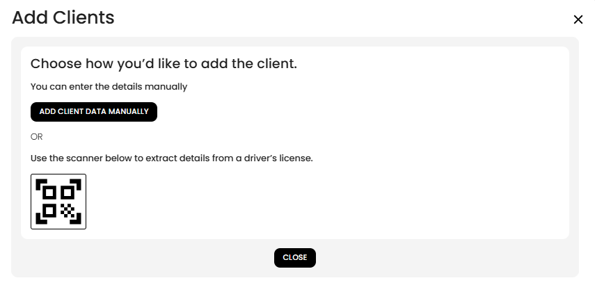
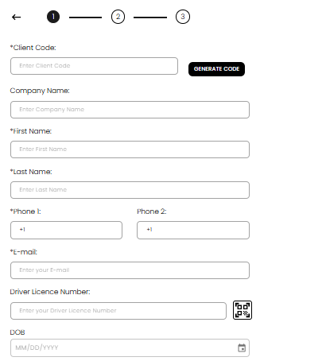
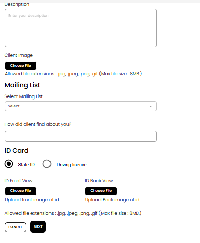
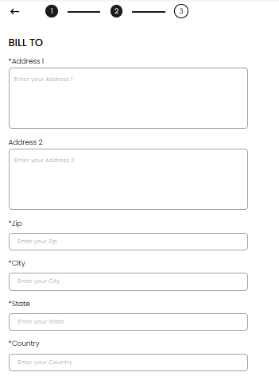
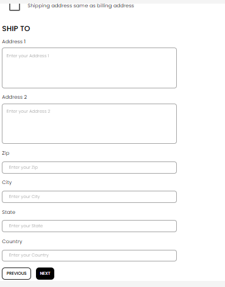

[Auctioneer Client](./index.md) · [Auction Journal](../../index.md)

# Who is a customer of an auctioneer? What customer types exist? How do I add a customer?

In the Auctioneer Dashboard, your **customers** are called **clients**. They are people or companies **you** work with on **your auctions**—not the same thing as a random visitor on the public Auction Journal site.

Each client profile is **yours only** (your auction company). You use it for registration, clerking, settlement, taxes, commissions, and mailing lists tied to **your** sales.

---

## Who is a customer (client)?

A **customer** is someone your auction business deals with in Auction Journal, for example:

- Someone who **buys** at your auctions  
- Someone who **sells** (consigns) through you  
- Someone who does **both**  
- A **floor bidder** who bids in the room and may not use the public bidder website  

Customers exist so Auction Journal can track **their** contact details, addresses, tax status, bid cards, commissions, and auction history **under your account**.

---

## Customer types

| Type | What it means in practice |
|------|---------------------------|
| **Buyer** | Purchases lots at your auctions. You can set a **reserved bid card number**, tax status (taxable or tax exempt), **bid permission**, and **buyer’s premium** rules for them. |
| **Consigner (seller)** | Sells property through your auctions. You can use your **default commission** or a **specific commission** for that client. |
| **Buyer and consigner** | Same person or company both buys and consigns. You configure **Buyer** and **Consigner** sections on the last step of the add-client form. |
| **Floor bidder** | An on-site buyer for your auctions. In the product, a floor bidder is treated as a **buyer**; they are added with **Onboard Floor Bidder** (separate from the standard “Add Client” wizard). They must **not** already be a registered Auction Journal bidder with the same email. |

If the client’s **email** already belongs to a **bidder** on Auction Journal, the system can **link** that bidder to the client record when you save.

---

## How do I add a customer?

### Open the Customers area

1. Sign in to the **Auctioneer Dashboard**.  
2. In the left menu, select **Customers**.  
3. Use the control to **add** a client (wording may show as add client / plus icon).

---

### Choose how to add

The **Add Clients** window offers two paths:

1. **Add Client Data Manually** — full form you fill in yourself.  
2. **Driver’s licence scanner** — scan a licence to pre-fill name, address, and related fields, then continue on the create form.

Select **Close** when you want to leave without adding anyone.

---

### Manual add — Step 1 of 3 (contact and identity)

After **Add Client Data Manually**, you see a **3-step** progress bar.

**Required** fields are marked with **\***.

1. **Client Code** — enter a code or select **Generate code**.  
2. **Company name** — optional.  
3. **First name** and **Last name**.  
4. **Phone 1** (required; use **+1** and a 10-digit US number). **Phone 2** is optional.  
5. **E-mail** (required).  
6. **Driver licence number** — optional; you can use the **scanner** icon beside the field.  
7. **DOB** — optional date.  
8. **Description**, **client image**, **mailing list**, **How did client find about you?**, and **ID card** (State ID or Driving licence, front/back uploads) — optional but useful for your records.

Select **Next** when step 1 is complete.

---

### Step 2 of 3 — addresses

**Bill to** (billing address):

- **Address 1**, **Zip**, **City**, **State**, and **Country** are required.  
- **Address 2** is optional.

**Ship to** (shipping address):

- Check **Shipping address same as billing address** if both are identical.  
- Otherwise fill **Ship to** the same way as billing.

Select **Previous** or **Next**.

---

### Step 3 of 3 — buyer and consigner settings

Expand **Buyer** and/or **Consigner** to match how this person will work with your auctions.

For a full guide (what each setting does at registration, on consigned lots, and at settlement), see [Configure customer as buyer and seller](customer-preferences.md).

**Buyer** (purchaser) — reserved bid card, tax, buyer’s premium; see [bid permission](bid-permission.md) for registration approve/decline rules.

**Consigner** (seller) — default or specific commission and seller tax.

Select **Submit** to save. You return to the **Customers** list when the client is created successfully.

---

### Floor bidder (separate path)

For someone bidding **on the floor** at your sale:

1. On **Customers**, choose **Onboard Floor Bidder** (not the standard Add Clients manual path).  
2. Complete that wizard (similar contact, address, and buyer settings).  
3. Use a **real email** only if they do not already have a bidder account on Auction Journal with that email.

See [Who is a floor bidder? How do I onboard one?](floor-bidder/index.md).

---

## After you add a customer

- Open the client from the list to **view** or **edit** details.  
- Use them when registering people for **auctions**, **clerking**, and **settlement**.  
- Add them to **mailing lists** from step 1 or from mailing-list tools under Customers.

---

## Related

- [In what ways are customers created for an auctioneer?](creation.md)  
- [Auctioneer Dashboard](../auctioneeer/dashboard.md) — **Customers** menu  
- [Who is an auctioneer?](../auctioneeer/role.md)
