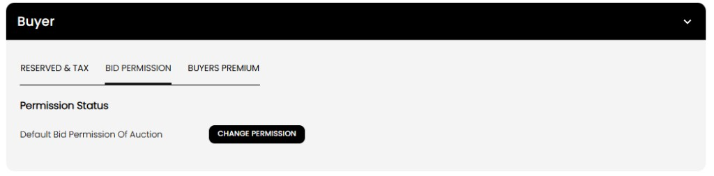
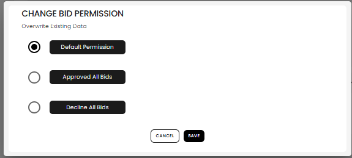
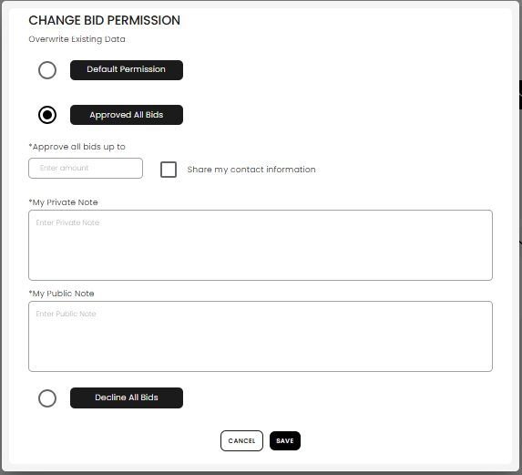
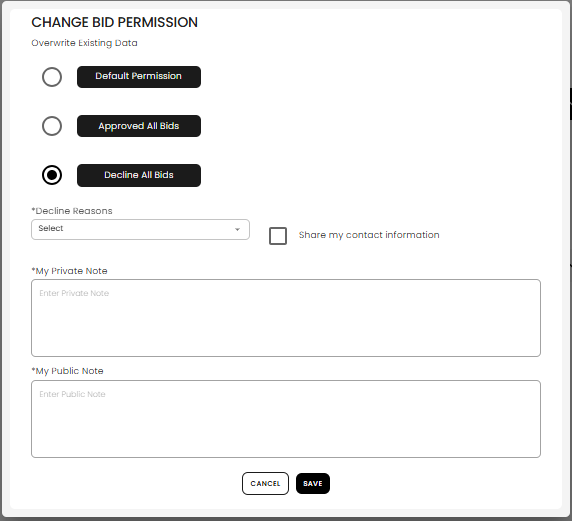

[Auctioneer Client](./index.md) · [Auction Journal](../../index.md)

# How do I set bid permission for a customer so their registrations for my auctions are handled automatically?

**Bid permission** tells Auction Journal what to do when this **customer** registers for **any of your auctions**—approve them up to a spending limit, decline them, or follow your normal auction rules. You set it once on their profile; each new registration for your sales uses that choice.

This applies when the person registers as a **bidder** linked to your customer record (see [Bidder vs customer](bidder-relationship.md)). It does not replace auction-wide registration settings for everyone else.

For other buyer settings (bid card, tax, buyer’s premium), see [Configure customer as buyer and seller](customer-preferences.md).

---

## Why use it

| Situation | Example setting |
|-----------|-----------------|
| Trusted buyer — always approve with a high cap | **Approved all bids** up to $50,000 |
| Problem buyer — block registration | **Decline all bids** with a reason |
| Normal handling — use auction default and bidder score | **Default permission** |

When they register online for your auction, Auction Journal creates or updates their **client** profile under your account and applies the permission you saved here.

---

## Where to set it

1. **Customers** → **Add Clients** (manual) or open an existing customer → **Edit**.  
2. Complete steps 1 (contact) and 2 (addresses) if creating new.  
3. On **step 3**, expand **Buyer**.  
4. Open the **Bid Permission** tab.  
5. Select **Change Permission**.

6. Choose an option, fill in required fields, and select **Save**.  
7. Select **Submit** on step 3 to save the whole customer (create or edit).

You can review saved permission later on the client **view** page under **Buyer → Bid Permission** (read-only).

---

## Permission options

### Default permission

Use your **auction’s normal registration rules** and the bidder’s **bidder score** (for example, low score may leave registration **pending** for your review).

Select **Default Permission** → **Save**.

**When they register:** Registration is **approved** or **pending** like other bidders unless you have set a stricter rule on this profile. The spending cap comes from the **auction’s default bid permission**, not a custom amount on this customer.

---

### Approved all bids

Automatically **approve** this customer’s registration for your auctions, with a **maximum bid amount** you choose.

1. Select **Approved All Bids**.  
2. Enter **Approve all bids up to** (dollar amount).  
3. Enter **My private note** (required) — for your staff only.  
4. Enter **My public note** (required) — can be shown in registration context.  
5. Optionally check **Share my contact information**.  
6. Select **Save**, then **Submit** on step 3.

**When they register:** Registration status is **permanently approved** for your sales, and their registration uses **your cap** as their bid permission limit (unless a separate auction invitation set a different invited cap).

---

### Decline all bids

Automatically **decline** this customer’s registration for your auctions.

1. Select **Decline All Bids**.  
2. Choose a **Decline reason** (for example Non-paying, Bad check, No show, Other).  
3. Enter **My private note** and **My public note** (both required).  
4. Optionally check **Share my contact information**.  
5. Select **Save**, then **Submit** on step 3.

**When they register:** Registration is **permanently declined** for your auctions. The decline reason and notes you entered are stored on the registration record.

If this customer is linked to a **bidder account** on Auction Journal, changing permission to declined may also affect their bidder score and trigger notification email from the system.

---

## What happens at registration (summary)

| You set | Typical registration outcome for your auctions |
|---------|-----------------------------------------------|
| **Default permission** | Follows auction default cap; may be **pending** if bidder score is low |
| **Approved all bids** | **Approved** with your dollar cap |
| **Decline all bids** | **Declined** with your reason and notes |

Private and public notes from the customer profile are copied onto the registration when they sign up.

---

## Tips

- Set permission **before** they register for an upcoming sale if you already know how you want them treated.  
- Use **Approved** for repeat buyers you trust; use **Decline** for accounts you do not want bidding at your events.  
- **Default** is best when you only need the auction-wide rules and score-based review.  
- To change permission later, **Edit** the customer → step 3 → **Bid Permission** → **Change Permission** again.

---

## Related

- [Configure customer as buyer and seller](customer-preferences.md)  
- [Bidder vs customer](bidder-relationship.md)  
- [Who is a customer? How do I add one?](add-customer.md)
