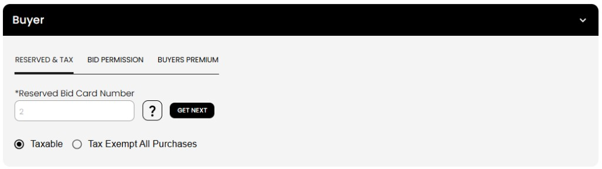
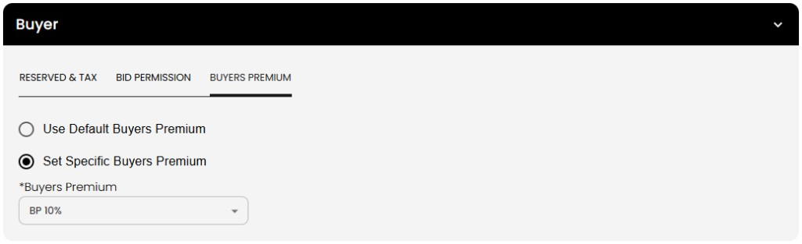
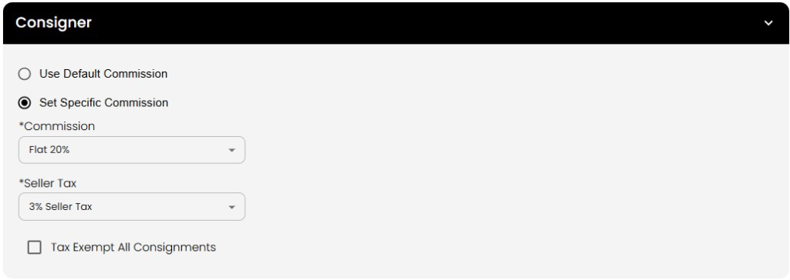

[Auctioneer Client](./index.md) · [Auction Journal](../../index.md)

# How can an auctioneer configure each customer according to their preferences as a seller and as a buyer?

When you add or edit a customer, **step 3 of 3** is where you set how Auction Journal treats them as a **buyer** (purchaser) and as a **consigner (seller)** during your auctions. These choices affect **auction registration**, **their consigned lots**, and **settlement**—not just the contact card on file.

You configure this in the **Buyer** and **Consigner** sections on the last step of [Add Clients](add-customer.md), or when you **edit** an existing customer (**Customers** → open client → **Edit** → step 3).

Formula dropdowns (commission, seller tax, buyer’s premium) use rules you created under **Miscellaneous → Formulas**. See [Formulas](../../auctioneer-misc/formulas.md) if you need new options.

---

## Overview

| Section | Use when the customer… | Affects |
|---------|-------------------------|---------|
| **Buyer** | Buys or may buy at your auctions | Bid card at registration, tax on purchases, buyer’s premium on won lots, bid approval |
| **Consigner** | Sells (consigns) property through you | Commission and seller tax on **their** lots in an auction |

Expand only the section you need, or both if they buy and sell.

---

## Where to open step 3

1. **New customer:** **Customers** → **Add Clients** → manual path → complete steps 1 (contact) and 2 (addresses) → **Next** to step 3.  
2. **Existing customer:** **Customers** → select the client → **Edit** → go to step 3.

Select **Previous** to change earlier steps, **Submit** on step 3 to save.

---

## Buyer settings

Expand the **Buyer** panel. Three tabs are available: **Reserved & Tax**, **Bid Permission**, and **Buyers Premium**.

### Reserved & Tax

Use this when they will register or bid as a purchaser.

| Setting | What it does |
|---------|----------------|
| **Reserved bid card number** | A permanent bid card number for this customer across your auctions. Select **GET NEXT** to assign the next available number. |
| **Taxable** | Sales tax rules from the lot/auction apply to their purchases at settlement. |
| **Tax exempt all purchases** | They are treated as tax-exempt on purchases; enter **Tax exempt #** and **Expires** when exempt. |

**At auction time:** When they register for a sale, Auction Journal uses this reserved card when set. Otherwise they receive the next free bid card number for that auction.

### Bid Permission

Controls how this customer’s **auction registrations** are approved or declined for **your** sales. See the full guide: [Set bid permission for a customer](bid-permission.md).

Open **Bid Permission** → **Change Permission** to choose **Default permission**, **Approved all bids** (with a dollar cap and notes), or **Decline all bids** (with a reason and notes).

### Buyers Premium

Use this when they buy and you need a **buyer’s premium** different from the auction default.

| Option | Meaning |
|--------|---------|
| **Use default buyers premium** | Won lots use the buyer’s premium formula set on the auction/lot. |
| **Set specific buyers premium** | Choose a formula (e.g. **BP 10%**) from your Miscellaneous formulas. |

**At settlement:** When you settle lots this customer won, buyer’s premium (and related buyer charges) follow this setting when it is specific; otherwise the auction/lot default applies.

---

## Consigner (seller) settings

Expand the **Consigner** panel when they will **consign items** to your auctions.

| Option | Meaning |
|--------|---------|
| **Use default commission** | Their lots use your auction’s standard commission formula. |
| **Set specific commission** | Choose **Commission** and **Seller tax** formulas for this customer only. |
| **Tax exempt all consignments** | Seller tax is not applied to their consignments; you can set a **tax ID expiration date**. |

**On their lots:** When you build or run auctions with this customer as seller, lot commission and seller tax pull from these client settings when “specific” is selected; otherwise auction defaults apply.

---

## After you save

| Role | What to do next |
|------|------------------|
| **Buyer** | Register them for auctions (or they register online if linked to a bidder). Settlement uses buyer tax and premium from this profile. |
| **Consigner** | Assign them as seller on lots in auction setup. |
| **Both** | Configure both panels; they can consign and purchase on the same profile. |

Customers created by **import** or **seller invite** may still need step-3-style settings opened via **Edit** if you did not set accounting during onboarding.

---

## Quick reference

| I want to… | Configure… |
|------------|------------|
| Same bid card every sale | Buyer → **Reserved & Tax** → **GET NEXT** or assigned number |
| No sales tax on their purchases | Buyer → **Tax exempt all purchases** |
| Custom buyer’s premium on wins | Buyer → **Buyers Premium** → specific formula |
| Custom commission on their consignments | Consigner → **Set specific commission** |
| No seller tax on their consignments | Consigner → **Tax exempt all consignments** |

---

## Related

- [Seller client vs buyer client](seller-vs-buyer-client.md) — when to use each role  
- [Who is a customer? How do I add one?](add-customer.md) — full 3-step create flow  
- [Formulas](../../auctioneer-misc/formulas.md) — create commission, tax, and premium formulas  
- [Bidder vs customer](bidder-relationship.md) — online bidders and your customer record
