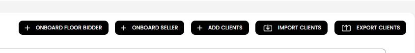
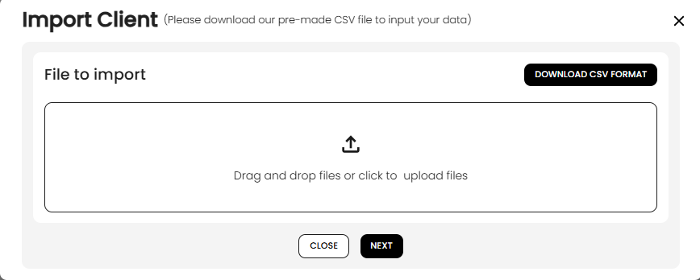
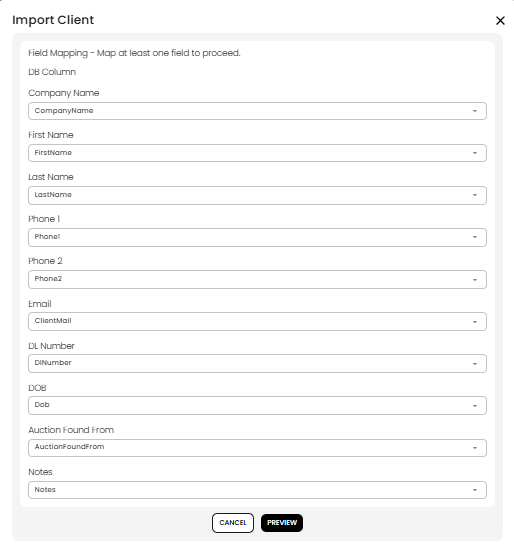
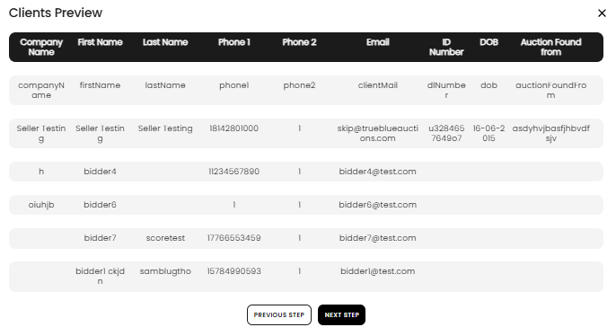
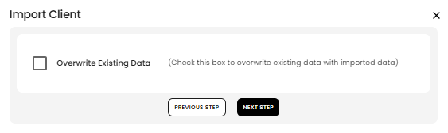

[Auctioneer Client](./index.md) · [Auction Journal](../../index.md)

# For an auctioneer new to Auction Journal with many existing customers, how can they add them as customers in Auction Journal?

If you already have a large contact list outside Auction Journal (spreadsheet, old software, paper roll), you do **not** need to type each person in by hand. Use **Import Clients** on the **Customers** page to upload a **CSV file** and add many customers at once to **your** auction company account.

You can also **download a CSV format** file from Auction Journal to see the expected columns, or **export** your current customers to use as a template.

For adding one person at a time, see [Who is a customer? How do I add a customer?](add-customer.md). For all ways customers are created, see [In what ways are customers created?](creation.md).

---

## Before you start

- Sign in to the **Auctioneer Dashboard** and open **Customers** in the left menu.
- Prepare your list as a **CSV** file (comma-separated). If your data is in Excel, use **Save As** → **CSV**.
- Each row should be one customer. The first row should be **column headers** (names of your fields).
- You will **map** your column headers to Auction Journal fields in the import wizard—your headers do not have to match ours exactly.

---

## Step 1 — Open Import Clients

On **Customers**, use the action buttons at the top. Select **Import Clients**.

*You can use **Export Clients** anytime to download everyone already in your list—helpful as a reference or backup.*

---

## Step 2 — Download the CSV format (recommended)

The **Import Client** window opens.

1. Select **Download CSV format** (top right of the upload area).  
   This downloads Auction Journal’s sample file (`my_AJ_Clients.csv`) with the correct column layout.
2. Copy your customer data into that file, **or** keep your own file and map columns in a later step.

3. **Drag and drop** your CSV into the upload area, or **click** the upload icon to choose the file.
4. Select **Next**.

---

## Step 3 — Map your columns

Auction Journal shows **Field Mapping**. For each Auction Journal field, choose which **column from your file** contains that data (dropdown lists your CSV header names).

Map at least the fields you have data for. Typical mappings:

| Auction Journal field | Your file might call it |
|----------------------|-------------------------|
| Company Name | Company, Business name |
| First Name | FirstName, Given name |
| Last Name | LastName, Surname |
| Phone 1 | Phone, Mobile |
| Email | Email, ClientMail |
| DL Number | License, ID |
| DOB | Birth date |
| Auction Found From | Referral, Source |
| Notes | Comments |

Select **Preview** when mapping looks correct.

---

## Step 4 — Review the preview

Check the **Clients Preview** table. Confirm names, phones, and emails look right for several rows.

- The first line in the file is treated as headers and is not imported as a customer.
- If something looks wrong, select **Previous Step**, fix your file or mapping, and try again.

Select **Next Step**.

---

## Step 5 — Overwrite existing data (optional)

If some customers might **already** exist in your Auction Journal list (same client code), choose whether to update them:

| Option | What it does |
|--------|----------------|
| **Overwrite Existing Data** unchecked | New rows are added; existing matches are handled per validation (duplicates may fail). |
| **Overwrite Existing Data** checked | Rows that match an existing **client code** on your account can be **updated** with the imported data. |

Select **Next Step**. The system processes the file (button may show **Processing...**).

---

## Step 6 — Results and error report

When processing finishes, you see a **CSV Update** summary, for example:

- **Rows Processed** — how many data rows were read  
- **Rows Updated** — how many were inserted or updated  
- **New Users** — new client records added  
- **Warnings** / **Errors** — rows that could not be imported  

If there are errors, select **Download Report** to get a CSV listing problem rows and messages. Fix those rows in your spreadsheet and run **Import Clients** again.

---

## Export clients (reference or backup)

On **Customers**, select **Export Clients**. A CSV file downloads with your current customers. Use it to:

- Back up your list  
- See the column format Auction Journal expects  
- Edit and re-import after adding new rows (use **Import Clients** and map columns again)

---

## Tips

| Tip | Why |
|-----|-----|
| Start with a **small test file** (5–10 rows) | Confirms mapping before a large upload |
| Keep **client codes** unique in your file | The system uses client code to match existing records when overwriting |
| Use a valid **email** per row | Email is required and must be unique per customer on your account |
| Fill **company name**, **first name**, **last name**, and **phone 1** | These are required for import validation |
| After import, open a customer profile | Set buyer/consigner accounting, addresses, and bid permissions as needed—import does not replace the full manual setup for every field |

Imported customers are set up in the system as both **buyer** and **consigner** so you can use them in auctions; adjust roles and accounting on each profile when you are ready.

---

## Related

- [In what ways are customers created?](creation.md)  
- [Who is a customer? How do I add one?](add-customer.md)  
- [Auctioneer Dashboard — Customers](../auctioneeer/dashboard.md)
