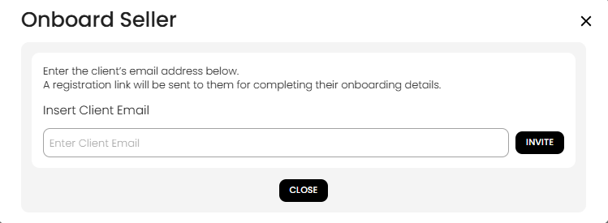

[Auctioneer Client](./index.md) · [Auction Journal](../../index.md)

# How can an auctioneer invite a seller to self-register as their customer?

Use **Onboard Seller** when you want a **seller (consigner)** to enter their own contact and address details instead of you typing everything in the **Add Clients** form. Auction Journal sends them an email with a **registration link**. They complete the form on the public site; only then do they appear in your **Customers** list.

For the seller’s steps after they receive the email, see [How does a seller self-register from the invitation email?](seller-self-register.md).

---

## When to use this

| Situation | Use Onboard Seller |
|-----------|-------------------|
| A consigner should fill in licence, address, and contact info themselves | Yes |
| You are at the desk and have all details ready | Use [Add Clients](add-customer.md) (manual) instead |
| You have dozens of sellers in a spreadsheet | Use [Import Clients](import-clients.md) instead |

---

## Step 1 — Open Customers

1. Sign in to the **Auctioneer Dashboard**.  
2. In the left menu, select **Customers**.

---

## Step 2 — Start Onboard Seller

On the **Customers** page, select **Onboard Seller** (top action bar).

*Other actions on this bar include Add Clients, Import Clients, and Onboard Floor Bidder.*

---

## Step 3 — Enter the seller’s email and send the invite

The **Onboard Seller** window opens.

1. Read the note: a registration link will be emailed so they can complete onboarding.  
2. In **Insert Client Email**, enter the seller’s email address in **lowercase** (the form does not accept uppercase letters in the email field).  
3. Select **Invite**.

4. If the invite succeeds, you see **Invite Sent Successfully!!** The message states the onboarding link **expires in 24 hours** (use the same window’s **Close** when finished).  
5. If the email is **already a customer** on your account with that address, the system shows an error and does not send another invite—open their existing profile instead.

Select **Close** to return to **Customers**.

---

## What happens next

| Stage | What you see |
|-------|----------------|
| Right after invite | Seller is **not** in your customer list yet—only the email was sent |
| Seller completes the link | They submit the 2-step onboarding form (see [seller self-register](seller-self-register.md)) |
| After they submit | They appear in **Customers**; you can open the profile to set **consigner** commission and any **buyer** settings |

The email subject is along the lines of **Invitation to Join [Your Company Name] on Auction Journal**. It explains they are invited to register as a **seller** so your company can conduct auctions on their behalf.

If the link expires before they finish, send a **new invite** to the same email (as long as they are not already your client).

---

## Tips

- Confirm the spelling of the email before **Invite**—they cannot change the invited address on the form (it is fixed to what you entered).  
- Tell the seller to check spam if they do not see the message within a few minutes.  
- After they register, review their profile under **Customers** for consigner accounting and auction use.

---

## Related

- [How does a seller self-register from the invitation email?](seller-self-register.md) — for the person receiving the invite  
- [In what ways are customers created?](creation.md)  
- [Who is a customer? How do I add one?](add-customer.md)
