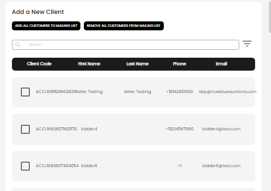
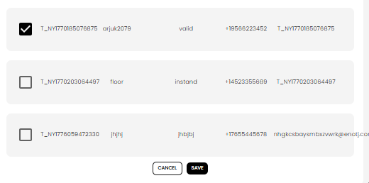

[Auctioneer Client](./index.md) · [Auction Journal](../../index.md)

# How do I manage customers in a mailing list?

Use the **mailing list view** to see who is in a list and to **add or remove** customers (clients). Changes apply only to **that list**—removing someone from a list does **not** delete them from **Customers**.

For what mailing lists are for and how to create one, see [How can an auctioneer use the mailing list in Customers? What is the benefit?](mailing-list.md).

---

## Open the list

1. Sign in to the **Auctioneer Dashboard**.  
2. Open **Customers** → switch to **MAILING LIST**.  
3. Find your list and select **View**.  

You are on the list detail screen (`/dashboard/clients/mailinglists/view`). It shows:

- **List name**, **description**, and **created date**  
- **Edit List** — change name or description (not available for the system **Subscribed From Website** list)  
- A table of **members** already in the list (client code, name, phone, email)

---

## Add customers to the list

1. On the list view, select **Add Client**.  
2. The **Add a New Client** window opens.

### Bulk actions

At the top of the dialog:

| Button | What it does |
|--------|----------------|
| **Add All Customers to Mailing List** | Checks every customer in your company for this list (you still must **Save**) |
| **Remove All Customers from Mailing List** | Clears every check for this list (you still must **Save**) |

After **Add All** or **Remove All**, a message reminds you to **Save** so the list actually updates.

### Pick individual customers

1. Use **search** (and **sort** if shown) to find people by name or client code.  
2. Each row has a **checkbox** next to the client code:
   - **Checked** = in this mailing list  
   - **Unchecked** = not in this mailing list  
3. Check or uncheck rows as needed.

4. Select **Save** to apply.  
5. Select **Cancel** to close without saving changes.

The member table on the list view refreshes after a successful save.

---

## Remove one customer from the list

On the main list view (not inside **Add Client**):

1. Find the member row.  
2. Use the **delete** control on that row.  

That customer is removed from **this mailing list only**. Their client record remains under **Customers**.

---

## Other ways membership can change

| Method | Where |
|--------|--------|
| **Add Client** dialog above | List **View** → **Add Client** |
| **When creating/editing a client** | Client form → **Select Mailing List** on step 1 |
| **Export** | List home or list view → **Export** (download CSV; does not change membership) |

---

## Subscribed From Website list

- Members may include full **clients** and **email-only** rows (not yet clients).  
- You can review members; **Edit List** / delete list may be limited compared with lists you created yourself.

---

## Tips

- Save after bulk add/remove in the dialog—until you **Save**, checks are not final.  
- Search before a large mail merge export so the exported CSV matches who you expect.  
- Floor bidders and normal clients appear in the same picker if they exist in **Customers**.

---

## Related questions

- [How can an auctioneer use the mailing list in Customers? What is the benefit?](mailing-list.md)  
- [Who is a customer of an auctioneer? What customer types exist? How do I add a customer?](add-customer.md)  
- [Auctioneer Dashboard — Customers](../auctioneeer/dashboard.md)
