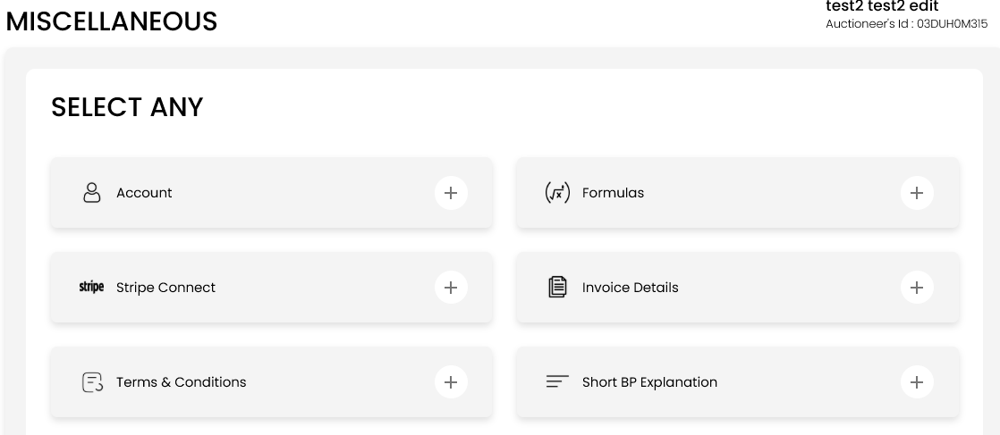
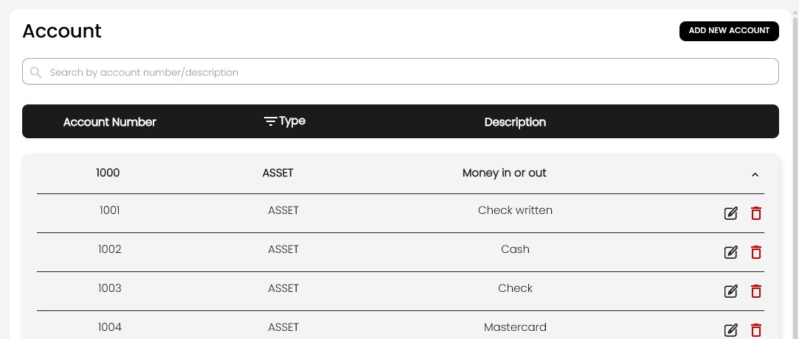
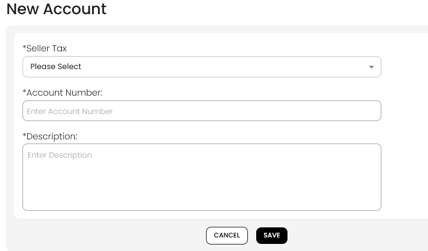

[Auctioneer Misc](./index.md) · [Auction Journal](../../index.md)

# What is the Account section in Miscellaneous for? How do I manage it?

The **Account** section is your **chart of accounts** for auctions. Auction Journal provides **fixed parent account categories** (such as assets, income, and expenses). Under each category you add **your own sub-accounts** with descriptions—for example “Cash,” “Check,” or “Shipping & handling.”

Those accounts are used when you work on **auctions**—expenses, lot accounting, settlement, adjustments, and similar screens ask you to pick an account from this list.

---

## What are parent accounts vs sub-accounts?

| | **Parent account (predefined)** | **Sub-account (you add)** |
|--|--------------------------------|---------------------------|
| **Who creates it** | Built into Auction Journal | You (or default setup at registration) |
| **Examples** | `1000` Money in or out, `4500` Buyer's premium | `1001` Check written, `1002` Cash |
| **Account number** | Fixed (1000, 1500, 2000, …) | Auto-generated under the parent you choose |
| **Type** | ASSET, LIABILITY, INCOME, or EXPENSE | Same type as its parent |

You cannot create new parent categories—only **sub-accounts** under the existing parents.

---

## How to open Account

1. Sign in to the **Auctioneer Dashboard**.
2. Open **Miscellaneous**.
3. Select **Account**.

---

## How to view and search accounts

1. On the **Account** page, you see parent rows (account number, **Type**, description).
2. Use **Search by account number/description** to filter the list.
3. On larger screens, use the **Type** filter icon to show or hide ASSET, LIABILITY, INCOME, or EXPENSE parents.
4. **Expand** a parent row (click the row) to see all **sub-accounts** under that parent—defaults from setup plus any you added.

---

## How to add a sub-account

1. Select **ADD NEW ACCOUNT** (top right).
2. In **New Account**, open the first dropdown (labeled **Seller Tax** in the UI) and choose the **parent** you want—for example `1000 : Money in or out`.
3. Wait a moment: **Account Number** fills in automatically from Auction Journal (read-only). It is the next available number under that parent.
4. Enter a **Description** (required). Use a clear name you will recognize in auctions (e.g. “Wire transfer,” “Out-of-state tax”).
5. If the parent is **6000 : Adjustments**, also choose **Used For**: **Discounts** or **Surcharges**.
6. Select **SAVE**.

**Tips**

- Pick the parent that matches how the money is used (income vs expense, buyer vs seller, etc.).
- Do not reuse the same description under the same parent—the system rejects duplicates.
- You cannot change the parent or account number when editing; only the description (and **Used For** on Adjustments).

---

## How to edit or delete a sub-account

1. Expand the correct **parent** row.
2. Find the sub-account in the list.
3. **Edit** (pencil) — change **Description** or **Used For** (Adjustments only), then save.
4. **Delete** (trash) — removes that sub-account. Do not delete accounts already used in live auction data unless you understand the impact.

Default sub-accounts (such as Cash, Check, Visa under **Money in or out**) are created when your auctioneer account is set up. You can add more at any time.

---

## How this connects to auctions

When you configure **auction expenses**, **lot accounting**, **settlement** lines, or related charges, dropdowns offer accounts from this list. Setting up accounts **before** you build auctions keeps checkout and settlement consistent.

This is separate from:

- **[Stripe Connect](../auctioneeer/stripe-connect.md)** — receiving bidder payments.
- **[Payment card on file](../auctioneeer/payment-method.md)** — paying Auction Journal for listings or ads.
- **Formulas** — commission and tax calculations (another Miscellaneous item).

---

## Related topics

- [Stripe Connect](../auctioneeer/stripe-connect.md)
- [Invoice details](index.md) (guide pending — Miscellaneous question 6)
- [Formulas](index.md) (guide pending)
