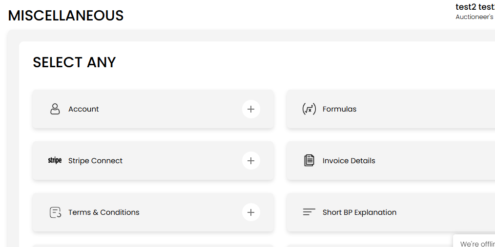
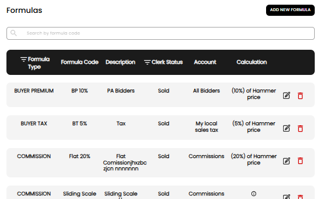
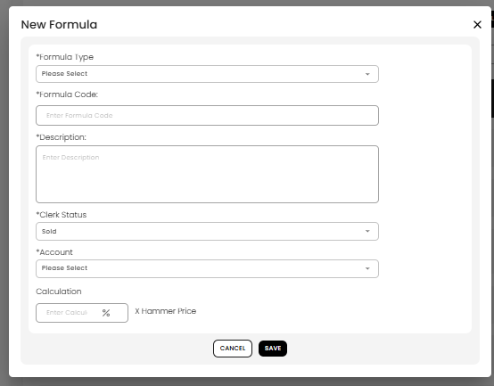
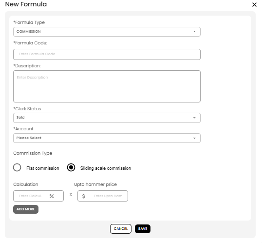

[Auctioneer Misc](./index.md) · [Auction Journal](../../index.md)

# What is a formula? Why should I create formulas in advance?

A **formula** is a saved calculation rule in Auction Journal. It tells the system how to compute charges such as **buyer premium**, **buyer tax**, **seller tax**, and **commission** when you run an **auction**—during clerking, lot setup, settlement, and related screens.

You define formulas once under **Miscellaneous → Formulas**, then **select them** wherever the auction workflow asks for that charge type.

---

## Why create formulas in advance?

| Benefit | What it means for you |
|---------|------------------------|
| **Faster auction setup** | Dropdowns are ready when you build lots, defaults, and settlements. |
| **Consistent math** | The same code (e.g. `BP 10%`) always applies the same percentage and account. |
| **Required for new auctions** | Before you can create most auctions, Auction Journal expects formulas for **Commission**, **Buyer Premium**, **Buyer Tax**, and **Seller Tax**. |
| **Complex commission** | **Sliding scale commission** tiers are defined once and reused on every lot that uses that formula. |

Formulas work together with **[Accounts](account.md)** (where money is booked) and other Miscellaneous setup (invoice details, Stripe Connect, etc.).

---

## Formula types you can create

| Formula type | Typical use |
|--------------|-------------|
| **BUYER PREMIUM** | Extra % buyers pay on hammer price |
| **BUYER TAX** | Tax on the buyer side |
| **SELLER TAX** | Tax on the seller side |
| **COMMISSION** | Your commission on sold lots (flat or sliding scale) |
| **SALESPERSON COMMISSION** | % of auctioneer commission (not hammer price) |

Each formula also uses:

- **Clerk Status** — usually **Sold** (applied when a lot sells).
- **Account** — which sub-account from [Accounts](account.md) receives the amount (options depend on formula type).

---

## How to open Formulas

1. Sign in to the **Auctioneer Dashboard**.
2. Open **Miscellaneous**.
3. Select **Formulas**.

4. The **Formulas** page lists your saved rules. Use **Search by formula code** and the **Type** / **Clerk Status** filters to narrow the list.

---

## How to add a formula (flat percentage)

1. Select **ADD NEW FORMULA**.
2. Fill in **New Formula**:
   - **Formula Type** — e.g. BUYER PREMIUM or COMMISSION.
   - **Formula Code** — short name you will recognize (e.g. `BP 10%`).
   - **Description** — notes (e.g. “PA Bidders”, “My local sales tax”).
   - **Clerk Status** — typically **Sold**.
   - **Account** — pick a sub-account (create accounts first if the list is empty).
3. For most types, under **Calculation** enter a **percentage** and confirm it applies to **X Hammer Price** (salesperson commission uses **Auctioneers commission** instead).
4. For **COMMISSION** only, leave **Flat commission** selected (default).
5. Select **SAVE**.

---

## Sliding scale commission

Use a **sliding scale** when commission **changes by hammer price band** (for example, a higher % on the first $1,000 and a lower % above that).

1. Create a formula with **Formula Type** = **COMMISSION**.
2. Under **Commission Type**, select **Sliding scale commission**.
3. For each tier, enter:
   - **Calculation** — commission **percentage** for that band.
   - **Upto hammer price** — maximum hammer price ($) for that tier.
4. Select **ADD MORE** to add the next tier. Enter tiers in **ascending** order of “upto” price (lowest band first).
5. Select **SAVE**.

**Example (two tiers)**

| % | Upto hammer price |
|---|-------------------|
| 15% | $1,000 |
| 10% | $5,000 |

At settlement, Auction Journal picks the tier that matches the lot’s hammer price.

On the formulas list, sliding scale rows show an **information (i)** icon in the **Calculation** column—hover or tap to see each tier (e.g. `15% upto $1000`).

---

## How to manage existing formulas

- **Edit** (pencil) — change fields in **Edit Formula**; save when done.
- **Delete** (trash) — removes the formula. Avoid deleting formulas already tied to live auction data unless you understand the impact.

Changing a formula that is already used in an auction may affect calculations—see Miscellaneous question 3 in [sample questions](../sample_questions.md) when that guide is available.

---

## How formulas connect to auctions

After formulas exist, you assign them when you:

- Set **lot defaults** or **lot accounting** on auctions.
- Run **clerking** and **settlement**.
- Configure **client** or **floor bidder** accounting.

Without the core formula types in place, **New Auction** may show **Requirements Missing** for commission or tax formulas—complete them here first.

---

## Related topics

- [Account section](account.md)
- [Stripe Connect](../auctioneeer/stripe-connect.md)
- [Payment card on file](../auctioneeer/payment-method.md)
